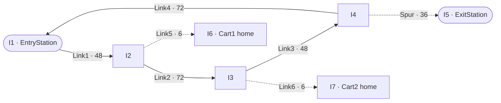
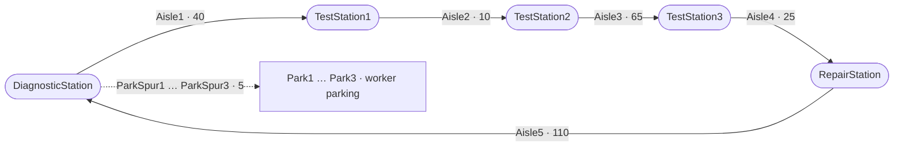
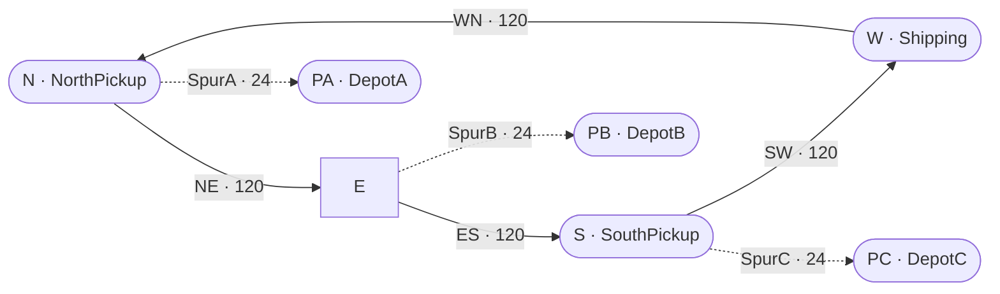
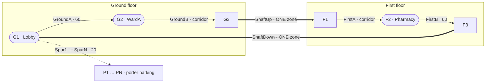

# Vehicles in KSL — a tutorial through the examples

*Ten worked cases.* Each one states a **problem**, describes the **model** with a
figure of the layout, gives **the whole of its code** with an explanation of every
part, shows what it **produced**, and says what that is evidence **for**. Every
figure on this page came from running the example named beside it; none is recalled
or estimated, and the code is the example's own, quoted whole rather than
summarised.

**You should not have to open anything to follow this page.**

If you have not met the four transport subsystems, read
[`ksl-transport`](ksl-transport.md) first — it is one page and it is the map
this tutorial walks over.

---

## How to read this tutorial

The examples are ordered so that each one needs only what came before it.

| # | Case | Run it with |
|---|---|---|
| 1 | [A simple AGV shop](#1-a-simple-agv-shop) | `:KSLExamples:simpleAgvExample` |
| 2 | [The same shop, both paradigms](#2-the-same-shop-modelled-both-ways) | `:KSLExamples:twoParadigmsExample` |
| 3 | [Free path against guide path](#3-free-path-against-guide-path) | *(a model class; see below)* |
| 4 | [Six dispatching rules](#4-six-dispatching-rules) | `:KSLExamples:dispatchingRuleComparison` |
| 5 | [Turning a cart round](#5-turning-a-cart-round) | `:KSLExamples:retaskingExample` |
| 6 | [A hospital on two floors](#6-a-hospital-on-two-floors) | `:KSLExamples:multiFloorHospitalExample` |
| 7 | [A two-lane warehouse](#7-a-two-lane-warehouse) | `:KSLExamples:twoLaneWarehouseExample` |
| 8 | [A dispatcher with no aisles](#8-a-dispatcher-with-no-aisles) | `:KSLExamples:freePathFleetExample` |
| 9 | [What the engine costs](#9-what-the-engine-costs) | `:KSLExamples:guidedPathBenchmark` |
| 10 | [What deciding costs](#10-what-deciding-costs) | `:KSLExamples:agvBenchmark` |

**A note on the output.** Several examples print warnings above their tables —
horizon diagnostics, and in two cases deadlock reports logged at ERROR. Those
are the audit doing its job, not a fault. Read the tables last.

**Reading the code.** Each case has a **The code** section that reproduces the
example **in full**, broken into numbered parts, each part followed by an
explanation of what it does and why it is written that way. Nothing is
paraphrased and nothing load-bearing is left out. Two things are omitted and it is
worth knowing which:

- **The files' own documentation comments**, because this page replaces them. The
  short comments *inside* the code are kept — several of them record a mistake that
  was actually made.
- **The import lists**, except in case 1, which explains them once. They are
  mechanical, and an IDE writes them for you.

A test — `KSLExamples/src/test/kotlin/ksl/examples/general/doc/TransportTutorialCodeTest.kt`
— reads this page and checks that every line of every code block is still in the
file its case names. If an example is edited and this page is not, the build says
so.

**Reading the figures.** Every case that models a network has a figure of it,
drawn from the code that builds it. The figures are **topological**: an arrow is
a link, and a number on it is that link's *declared length*, which is what
routing reads. Nothing is to scale, and no figure carries coordinates — except
case 8, which is not a guide path at all and where the coordinates *are* the
model.

| In the figures | Means |
|---|---|
| `A ──▶ B` | a one-way link — vehicles travel A to B and never B to A |
| a **dotted** arrow | a **spur**: two-way, one vehicle at a time, and a dead end |
| a **thick** arrow | a lift shaft, which is an ordinary link of exactly one zone |
| a rounded node | an intersection carrying a named **station** |
| a plain node | a bare intersection |
| a line with **no** arrowhead | not a link at all — case 8 is a plane, and its lines only say what is reachable |

Two figures are drawn as **plans** rather than graphs: the warehouse in case 7
and the benchmark grid in case 9. An automatic graph layout draws a rectangular
grid as a diagonal cascade, and in those two cases the shape of the building is
part of the point. Both carry their own key in their captions.

---

## 1. A simple AGV shop

`ksl.examples.general.guidedpath.SimpleAGVExample`

### The problem

Two carts carry parts from an entry station to an exit station in a small shop.
This is the smallest layout that is worth building, and the point of it is that
**the layout is the model**.

### The model



*Figure 1 — the shop. Because the loop turns one way only, entry to exit is 204
feet the long way round while exit back to entry is 108. Loop zones are 12 feet;
the two home spurs get 6.*

A one-way loop with a spur down to the exit station and a parking spur for each
cart. Four properties of that description are load-bearing:

- **The main loop runs one way.** Two carts can queue behind one another but can
  never face each other, so head-on deadlock is impossible rather than merely
  unlikely.
- **The exit station is on a spur.** A spur admits one cart. The second cart
  sent there waits at the mouth, out on the loop, rather than following the
  first in and facing it with neither able to reverse.
- **Each cart has a parking spur of its own.** A stopped cart goes on holding
  the zones it stands on.
- **Zone sizes differ between links.** The loop is discretised at twelve feet so
  two six-foot carts cannot close to less than six; the home spurs are six feet
  and get a zone size of their own. Zone size belongs to a *link* precisely so
  that this is expressible.

### The code

`SimpleAGVExample.kt` in full, in the order the file declares it, with nothing
left out but the file's own documentation comments — which this page replaces. The
file is 218 lines including those comments; what follows is the rest of it. Every
later case is presented the same way, so if you read one walk-through closely,
read this one.

#### 1. Imports

```kotlin
package ksl.examples.general.guidedpath

import ksl.modeling.entity.ProcessModel
import ksl.modeling.guidedpath.GuidedPathNetwork
import ksl.modeling.guidedpath.GuidedPathTransportSystem
import ksl.modeling.guidedpath.GuidedTransporter
import ksl.modeling.guidedpath.GuidedTransporterPoolWithQ
import ksl.modeling.guidedpath.LinkType
import ksl.modeling.guidedpath.TransporterPlacement
import ksl.modeling.guidedpath.rules.ClosestByNetworkDistanceRule
import ksl.modeling.guidedpath.rules.EndOfZoneControl
import ksl.modeling.guidedpath.rules.ParkInPlaceRule
import ksl.modeling.guidedpath.rules.ReturnToHomeBaseRule
import ksl.modeling.variable.Counter
import ksl.modeling.variable.Response
import ksl.simulation.Model
import ksl.simulation.ModelElement
import ksl.utilities.random.rvariable.ConstantRV
import ksl.utilities.random.rvariable.ExponentialRV
```

Worth reading once, because they say what a guide-path model is assembled from
and you will not see them again in this tutorial.

- `ProcessModel` is the base class for a model whose entities are written as
  suspending processes. `ModelElement` and `Model` are the framework: everything
  in a KSL model is a `ModelElement` in a tree, and `Model` is the root you
  simulate.
- The `guidedpath` package is the substrate: a `GuidedPathNetwork` is the layout,
  a `GuidedPathTransportSystem` runs vehicles over it, a `GuidedTransporter` is a
  vehicle, and a `GuidedTransporterPoolWithQ` is a group of them that entities
  queue for. `LinkType` and `TransporterPlacement` are small enumerations used
  below.
- The three `rules` imports are **policies**, and they are the whole experiment:
  `ClosestByNetworkDistanceRule` chooses which cart comes,
  `ReturnToHomeBaseRule` and `ParkInPlaceRule` say what an idle cart does.
  `EndOfZoneControl` is a *zone control* rule, which decides at what point a
  moving vehicle releases the zone behind it.
- `Response` and `Counter` are the two statistic types: a `Response` collects
  observations of a quantity (time in system), a `Counter` counts events (parts
  delivered).
- `ConstantRV` and `ExponentialRV` are random variables. A constant one is still
  a random variable, which is how a fixed velocity is supplied where a
  distribution is expected.

#### 2. The object, and the names the model is written in

```kotlin
object SimpleAGVExample {

    const val LOOP_ZONE_LENGTH: Double = 12.0
    const val HOME_SPUR_ZONE_LENGTH: Double = 6.0
    const val ENTRY_STATION: String = "EntryStation"
    const val EXIT_STATION: String = "ExitStation"
    const val AGV1_HOME: String = "I6"
    const val AGV2_HOME: String = "I7"
```

An `object` rather than a class because this file is a runnable study, not a
component: there is one of it. The six constants are the vocabulary of everything
below.

The two zone lengths are the interesting pair. **A zone is the unit of exclusion
on a guide path — one zone holds one vehicle** — so choosing 12 for the loop says
that two carts on the loop can never be closer than one zone apart, which for
six-foot carts is the physical minimum. The home spurs are six feet long
altogether: one cart, one zone. A single network-wide zone size could not express
both, which is the argument for `zoneLength` being an argument of `link`, as it is
in part 3.

`AGV1_HOME` and `AGV2_HOME` are intersection names (`I6`, `I7`) rather than
station names, and that is legal: anywhere the model asks for a place, an
intersection name will do. A station is a *named* intersection, nothing more.

#### 3. The layout

```kotlin
    fun createNetwork(networkName: String = "SimpleAgvNetwork"): GuidedPathNetwork =
        GuidedPathNetwork.builder(networkName)
            .intersection("I1", x = 0.0, y = 72.0)
            .intersection("I2", x = 48.0, y = 72.0)
            .intersection("I3", x = 48.0, y = 0.0)
            .intersection("I4", x = 0.0, y = 0.0)
            .intersection("I5", x = 0.0, y = -36.0)
            .intersection("I6", x = 54.0, y = 72.0)
            .intersection("I7", x = 54.0, y = 0.0)
            .link("Link1", "I1", "I2", length = 48.0, zoneLength = LOOP_ZONE_LENGTH, beginDirection = 0.0)
            .link("Link2", "I2", "I3", length = 72.0, zoneLength = LOOP_ZONE_LENGTH, beginDirection = 270.0)
            .link("Link3", "I3", "I4", length = 48.0, zoneLength = LOOP_ZONE_LENGTH, beginDirection = 180.0)
            .link("Link4", "I4", "I1", length = 72.0, zoneLength = LOOP_ZONE_LENGTH, beginDirection = 90.0)
            .link(
                "Spur", "I4", "I5", length = 36.0, zoneLength = LOOP_ZONE_LENGTH,
                type = LinkType.SPUR, beginDirection = 270.0
            )
            .link(
                "Link5", "I2", "I6", length = 6.0, zoneLength = HOME_SPUR_ZONE_LENGTH,
                type = LinkType.SPUR, beginDirection = 0.0
            )
            .link(
                "Link6", "I3", "I7", length = 6.0, zoneLength = HOME_SPUR_ZONE_LENGTH,
                type = LinkType.SPUR, beginDirection = 0.0
            )
            .station(ENTRY_STATION, "I1")
            .station(EXIT_STATION, "I5")
            .build()
```

This is the whole network — the thing Figure 1 draws — and it is worth reading
line by line because every argument does something.

**`intersection(name, x, y)`** declares a node. The coordinates are for drawing
and animation **only**. Routing never reads them; it reads the declared link
lengths in the calls beneath. That separation is what lets case 6 put a hospital
on two floors without the network knowing what a floor is.

**`link(name, from, to, length, zoneLength, beginDirection)`** declares a
one-way aisle from `from` to `to`. Four things to notice:

- `length` is the **routing** distance. Nothing checks it against the
  coordinates, and nothing should: an aisle that bends, or that runs up a shaft,
  is longer than the straight line between its ends.
- `zoneLength` cuts the link into zones. `Link1` is 48 long at 12 a zone, so it
  is four zones and holds up to four carts nose to tail. `Link5` is 6 long at 6 a
  zone: one zone, one cart.
- `beginDirection` is a compass bearing in degrees used for animation and for
  deciding a vehicle's initial heading on the link. It is not routing either.
- The four loop links form a **cycle**, `I1 → I2 → I3 → I4 → I1`, all one way.
  There is no link in the other direction anywhere on the loop, which is what
  makes a head-on meeting impossible rather than merely unlikely.

**`type = LinkType.SPUR`** is the other kind of link. A spur is a dead end: a
vehicle enters from the junction end, and leaves the way it came. Because a spur
admits one vehicle at a time, the second cart sent to the exit station waits at
the mouth — out on the loop — rather than following the first in and facing it
with neither able to reverse. The three spurs here are the exit station and one
parking place per cart.

**`station(name, intersection)`** attaches a name a process can ask for.
`ENTRY_STATION` is `I1`, `EXIT_STATION` is `I5` at the end of the spur.

**`build()`** returns an immutable `GuidedPathNetwork`. Because the loop is one
way the distances it computes are not symmetric: entry to exit is 204 (48 + 72 +
48 + 36, the long way round), and exit back to entry is 108 (36 back up the spur,
then `Link4`'s 72). A routing rule that scored a cart's proximity by straight-line
distance would get both of those wrong.

#### 4. The model class, and the line that makes locations mean something

```kotlin
    class AgvShop(
        parent: ModelElement,
        sendCartsHome: Boolean = true,
        timeBtwArrivals: Double = 20.0
    ) : ProcessModel(parent, "AgvShop") {

        val network: GuidedPathNetwork = createNetwork()

        init {
            // The parts travel on the guide path, so it is their spatial model too.
            spatialModel = network
        }

        val system = GuidedPathTransportSystem(this, network, name = "AgvSystem")
```

`AgvShop` extends `ProcessModel`, which is what allows the `Part` class further
down to be written as a suspending process. `parent: ModelElement` is the KSL
convention: every element is constructed into a tree under the `Model`.

`sendCartsHome` is the experimental factor, and `timeBtwArrivals` is the load. Both
are constructor parameters with defaults, so a study varies them by calling rather
than by editing.

Three declarations then put the shop on the guide path:

- `network` is built by the function in part 3.
- **`spatialModel = network`** is the easily-missed one. It tells the framework
  that this model's entities live in that network's space, which is what makes
  `currentLocation` in part 7 mean *a junction on this network*. Leave it out and
  a part has no meaningful position for a transporter to be sent to.
- `system` is the runtime. The network is geometry; `GuidedPathTransportSystem`
  is the object that owns zone occupancy, moves vehicles, detects blocking and
  reports the statistics the table below reads.

#### 5. The carts, and the one line the experiment turns on

```kotlin
        val cart1 = GuidedTransporter(
            system, TransporterPlacement.At(AGV1_HOME), ConstantRV(10.0), 1, EndOfZoneControl(), "Cart1"
        ).apply { homeBase = AGV1_HOME }

        val cart2 = GuidedTransporter(
            system, TransporterPlacement.At(AGV2_HOME), ConstantRV(10.0), 1, EndOfZoneControl(), "Cart2"
        ).apply { homeBase = AGV2_HOME }

        val carts = GuidedTransporterPoolWithQ(
            this, system, listOf(cart1, cart2),
            ClosestByNetworkDistanceRule(),
            if (sendCartsHome) ReturnToHomeBaseRule() else ParkInPlaceRule(),
            "Carts"
        )
```

A `GuidedTransporter` takes, in order: the system it belongs to, where it starts,
how fast it goes, how many zones long it is, its zone-control rule, and its name.

- `TransporterPlacement.At(AGV1_HOME)` starts the cart on its own parking spur.
  Starting both carts at the same place would be an error on a guide path — one
  zone, one vehicle — and this is the first of several points in this tutorial
  where a fleet needs somewhere of its own to stand.
- `ConstantRV(10.0)` is the velocity. A distribution would be equally acceptable
  here; a constant makes this example's arithmetic checkable.
- `1` is the vehicle's **length in zones**. A cart occupying two zones would
  claim two, and could not fit on a one-zone spur at all.
- `EndOfZoneControl()` says the cart releases the zone behind it when it has
  fully left it — the conservative choice, and the one that models a physical
  vehicle rather than a point.
- `.apply { homeBase = ... }` names where "home" is for the idle rule below.

Then the pool, which is what the parts actually ask:

- `listOf(cart1, cart2)` — its members.
- `ClosestByNetworkDistanceRule()` — **which cart comes** when one is wanted,
  scored by distance *along the network*, not straight line. On a one-way loop
  those differ enormously, and the network distance is the honest one.
- `if (sendCartsHome) ReturnToHomeBaseRule() else ParkInPlaceRule()` — **what an
  idle cart does**, and the entire difference between the two runs in the table
  below. Everything else, `homeBase` included, is declared identically either
  way; what changes is whether anything ever reads it.

#### 6. The statistics, and the arrival process

```kotlin
        val timeInSystem = Response(this, "TimeInSystem")
        val completed = Counter(this, "PartsDelivered")

        @Suppress("unused")
        private val generator = EntityGenerator(
            ::Part, ExponentialRV(timeBtwArrivals, streamNum = 1),
            ExponentialRV(timeBtwArrivals, streamNum = 1)
        )
```

`Response(this, "TimeInSystem")` collects one observation per part; the framework
computes the within- and across-replication statistics from it. `Counter` counts.
Naming them matters: those names appear in the output report and are how a study
looks a result up afterwards.

`EntityGenerator(::Part, timeUntilFirst, timeBtwEvents)` is the standard arrival
process. It takes a **constructor reference** — `::Part` — and calls it on a
schedule, activating each new entity's default process. The two random variables
are the time until the first arrival and the time between subsequent ones; both
are exponential with the same mean here, which makes the arrivals a Poisson
process in steady state.

`streamNum = 1` pins the random number stream. Two configurations that name the
same stream see **the same arrivals at the same instants**, which is what makes
the comparison below a comparison of parking rules rather than of luck.

#### 7. The part, which is the whole of the passive paradigm

```kotlin
        inner class Part : Entity() {
            @Suppress("unused")
            val delivery = process(isDefaultProcess = true) {
                val arrived = time
                currentLocation = network.requireLocation(ENTRY_STATION)
                guidedTransport(
                    carts,
                    destination = EXIT_STATION,
                    pickupLocation = ENTRY_STATION,
                    loadingDelay = ConstantRV(0.5),
                    unLoadingDelay = ConstantRV(0.5)
                )
                timeInSystem.value = time - arrived
                completed.increment()
            }
        }
```

Everything a part does, in twelve lines.

`process(isDefaultProcess = true)` declares the entity's behaviour as a coroutine
and marks it the one the generator activates. Inside it:

- `val arrived = time` — `time` is the current simulated time, readable anywhere
  inside a process.
- `currentLocation = network.requireLocation(ENTRY_STATION)` — the part states
  where it is standing. This is **required** on a guide path and it is the API
  surfacing a physical fact: a transporter is summoned to a named junction, so
  the part must say which one it is at. `requireLocation` throws on a name the
  network does not know, which turns a typo into an immediate failure rather than
  a mysterious one.
- **`guidedTransport(...)` is the entire journey and it suspends.** The pool
  chooses a cart; the cart drives to `ENTRY_STATION`, claiming each zone ahead of
  it and possibly waiting for one that is occupied; it is loaded for half a
  minute; it carries the part round the loop and down the exit spur; it is
  unloaded. Only then does the next line run. The part never sees a cart, never
  chooses one, and cannot tell which came.
- The last two lines record the result.

**That the choice of cart is made here, inside the asking part's own process, at
the instant it happens to ask, over whatever is free at that instant, is what
"passive" means.** There is nowhere else it could be made, because no other
object is running. Case 2 is the same shop with that decision moved somewhere
else.

#### 8. Running it

```kotlin
    fun run(sendCartsHome: Boolean): AgvShop {
        val m = Model(if (sendCartsHome) "SimpleAGVExample" else "SimpleAGVExampleParked")
        val shop = AgvShop(m, sendCartsHome = sendCartsHome)
        m.numberOfReplications = 10
        m.lengthOfReplication = 8_000.0
        m.lengthOfReplicationWarmUp = 1_000.0
        m.simulate()
        return shop
    }
```

`Model` is the root. Constructing `AgvShop(m, ...)` attaches the shop to it, and
`m.simulate()` runs it.

The three settings are the experiment design: ten replications, each 8,000 time
units long, of which the first 1,000 are discarded as warm-up so that the
statistics describe steady state rather than the empty shop at time zero. **Both
configurations get identical settings** — that is the point of them being written
once in a function that takes the factor as its only parameter. A study that
varied the horizon alongside the parking rule would produce a difference it could
not attribute.

#### 9. The study, and how a result is read back

```kotlin
    @JvmStatic
    fun main(args: Array<String>) {
        val designed = run(sendCartsHome = true)
        val parked = run(sendCartsHome = false)

        println()
        println("Simple AGV shop - where an idle cart waits, and what it costs")
        println()
        println("                        carts sent home    carts left in place")
        println(
            "  parts delivered  %20.1f %22.1f".format(
                designed.completed.acrossReplicationStatistic.average,
                parked.completed.acrossReplicationStatistic.average
            )
        )
        println(
            "  time in system   %20.2f %22.2f".format(
                designed.timeInSystem.acrossReplicationStatistic.average,
                parked.timeInSystem.acrossReplicationStatistic.average
            )
        )
        println(
            "  obstructions     %20.1f %22.1f".format(
                designed.system.numObstructionsDetected.acrossReplicationStatistic.average,
                parked.system.numObstructionsDetected.acrossReplicationStatistic.average
            )
        )
        println(
            "  fraction blocked %20.4f %22.4f".format(
                designed.system.numTransportersBlocked.acrossReplicationStatistic.average / 2.0,
                parked.system.numTransportersBlocked.acrossReplicationStatistic.average / 2.0
            )
        )
        println()
        println("  Neither run fails and neither reports an error. The obstruction count is the")
        println("  only thing that distinguishes them, and it is why the condition is counted into")
        println("  the standard report rather than only written to a log: it is a design defect")
        println("  that a run is perfectly capable of hiding.")
    }
```

`main` runs both configurations and prints them side by side.

The pattern `x.acrossReplicationStatistic.average` is how any KSL statistic is
read after a run: each replication produces one within-replication summary, and
the across-replication statistic is computed over those ten numbers. It is the
number a confidence interval would be built around.

Three of the four rows come from the model's own `Response` and `Counter`. The
other two come from the **transport system**, not from the shop:
`system.numObstructionsDetected` and `system.numTransportersBlocked`. Those are
statistics the substrate keeps about itself — how often a vehicle found the space
it wanted held by something that was not going to move, and how much of the fleet
was stopped — and they are the two that separate the runs. The division by 2.0 in
the last row converts "how many of the two carts were blocked, on average" into a
fraction of the fleet.

The closing `println` block is the example telling you what to make of its own
output, which is the habit this tutorial is trying to spread.

### What it shows

The example ships a second run, `runWithoutHomeBases()`, which changes one thing
— the carts are left where they stop — and produces this:

| | carts sent home | carts left in place |
|---|---|---|
| parts delivered | 349.9 | 349.8 |
| time in system | 61.76 | 62.96 |
| **obstructions detected** | **0.0** | **40.5** |
| fraction of fleet blocked | 0.0052 | 0.0742 |

### What to learn

**Neither run fails, and throughput is identical.** This shop is arrival-limited,
so the damage does not reach the headline number. The *only* clear signal is the
obstruction count — which is why that condition is counted into the standard
report rather than merely logged.

> **A destination is a resource.** A transporter that stops goes on holding its
> zones for the rest of the run. Any model in which two vehicles finish in the
> same place will have the first arrival block the second — and the second is not
> delayed, it waits for ever.

This is the single most likely way for a working-looking guide-path model to be
quietly wrong. Watch `numObstructionsDetected`; a positive value means something
in your layout is standing in the way.

---

## 2. The same shop, modelled both ways

`ksl.examples.general.agv.TwoParadigmsExample` — **read this one first if you
read only one.**

### The problem

KSL can model the same vehicles two ways. Under the **passive** paradigm an
entity seizes a cart from a pool; under the **active** paradigm a dispatcher
decides. Are these two models of one world, or two different worlds?

### The model


*Figure 2 — case 1's loop with one cart and one depot. This figure is the whole
physical model, and it is **the same figure for both runs**: the passive shop and
the active shop are built from this one network.*

One shop, built twice. The physical world is identical in both runs — same guide
path, same zones, same routing, same blocking rules — and every line that differs
is a line about *who decides*:

```kotlin
guidedTransport(carts, destination = EXIT, pickupLocation = ENTRY)   // passive
transportByFleet(agv,  destination = EXIT, origin = ENTRY)           // active
```

The two lines look similar and mean something quite different. Under the passive
paradigm the choice of *which* cart is made inside the part's own process, at
the instant it happens to ask, over whatever is free then. There is nowhere else
it could be made, because no other object is running.

### The code

`TwoParadigmsExample.kt` in full, minus its documentation comments. It contains
**two complete models** of the same shop, and the exercise is to read them
against each other: everything they share is the world, and everything they do
not is the paradigm.

#### 1. Names, and the layout both shops use

```kotlin
object TwoParadigmsExample {

    const val ENTRY: String = "EntryStation"
    const val EXIT: String = "ExitStation"
    const val DEPOT: String = "CartDepot"
```

Three station names, and then one function that builds the network:

```kotlin
    fun createNetwork(): GuidedPathNetwork = GuidedPathNetwork.builder("ShopFloor")
        .intersection("I1", x = 0.0, y = 72.0)
        .intersection("I2", x = 48.0, y = 72.0)
        .intersection("I3", x = 48.0, y = 0.0)
        .intersection("I4", x = 0.0, y = 0.0)
        .intersection("I5", x = 0.0, y = -36.0)
        .intersection("I6", x = 54.0, y = 72.0)
        .link("Link1", "I1", "I2", length = 48.0, zoneLength = 12.0, beginDirection = 0.0)
        .link("Link2", "I2", "I3", length = 72.0, zoneLength = 12.0, beginDirection = 270.0)
        .link("Link3", "I3", "I4", length = 48.0, zoneLength = 12.0, beginDirection = 180.0)
        .link("Link4", "I4", "I1", length = 72.0, zoneLength = 12.0, beginDirection = 90.0)
        .link("ExitSpur", "I4", "I5", length = 36.0, zoneLength = 12.0,
            type = LinkType.SPUR, beginDirection = 270.0)
        .link("DepotSpur", "I2", "I6", length = 6.0, zoneLength = 6.0,
            type = LinkType.SPUR, beginDirection = 0.0)
        .station(ENTRY, "I1")
        .station(EXIT, "I5")
        .station(DEPOT, "I6")
        .build()
```

This is case 1's loop with one cart's depot instead of two — the same four one-way
links, the same exit spur, the same zone size of 12 on the loop and 6 on the depot
spur. Part 1 of case 1 explains every argument; nothing new is happening here.

**What matters is that it is one function, called by both models.** Not a copied
builder, not two networks that ought to agree: if the layouts could drift apart,
the comparison below would be measuring the drift and reporting it as a paradigm
difference.

#### 2. The load, common to both

```kotlin
    private const val MEAN_TIME_BETWEEN_ARRIVALS = 40.0
    private const val ARRIVAL_STREAM = 1
    private const val NUM_ARRIVALS = 400
    private const val CART_SPEED = 10.0
```

Four constants that fix the workload. `ARRIVAL_STREAM = 1` is the important one:
both models name **the same random number stream**, so both see the same 400
arrivals at the same instants. Without that the two runs could agree to three
digits and differ in the fourth, and nobody could say whether that was the
paradigm or the sampling.

#### 3. The passive shop, in full

```kotlin
    /** The part steers the cart: ask for one, be collected, be carried, hand it back. */
    class PassiveShop(parent: ModelElement) : ProcessModel(parent, "PassiveShop") {

        val network = createNetwork()

        init {
            spatialModel = network
        }

        val space = GuidedPathTransportSystem(this, network, name = "Space")

        val cart = GuidedTransporter(
            space, TransporterPlacement.At(DEPOT), ConstantRV(CART_SPEED), name = "Cart"
        ).apply { homeBase = DEPOT }

        val carts = GuidedTransporterPoolWithQ(
            this, space, listOf(cart), ClosestByNetworkDistanceRule(), ReturnToHomeBaseRule(), "Carts"
        )

        val timeInSystem = Response(this, "PassiveShop:TimeInSystem")
        val delivered = Counter(this, "PassiveShop:Delivered")

        private val timeBetweenArrivals = ExponentialRV(MEAN_TIME_BETWEEN_ARRIVALS, ARRIVAL_STREAM)

        inner class Part : Entity() {
            val production = process(isDefaultProcess = true) {
                val arrived = time
                currentLocation = network.requireLocation(ENTRY)
                guidedTransport(carts, destination = EXIT, pickupLocation = ENTRY)
                timeInSystem.value = time - arrived
                delivered.increment()
            }
        }

        inner class Source : Entity() {
            val arrivals = process(isDefaultProcess = true) {
                repeat(NUM_ARRIVALS) {
                    delay(timeBetweenArrivals)
                    activate(Part().production)
                }
            }
        }

        override fun initialize() {
            activate(Source().arrivals)
        }
    }
```

Read it top to bottom.

`GuidedPathTransportSystem` is the substrate's runtime. `GuidedTransporter` is one
vehicle, placed at the depot at ten units of velocity. `GuidedTransporterPoolWithQ`
is the group the parts will ask, with its two rules —
`ClosestByNetworkDistanceRule` for which cart comes, `ReturnToHomeBaseRule` for
what an idle cart does.

The part's process is four lines of work:

- `currentLocation = network.requireLocation(ENTRY)` states where the part is
  standing, because a transporter is summoned to a named junction.
- `guidedTransport(carts, destination = EXIT, pickupLocation = ENTRY)` is the
  whole journey and it suspends until the part has been set down at the exit.
- The remaining two lines record the result.

`Source` is an alternative to case 1's `EntityGenerator`: an entity whose entire
process is a loop that delays and activates parts. It is more code and it is worth
knowing, because a generator can only produce identical entities on a schedule
while a source can decide what to make and when — case 4 uses exactly that freedom
to alternate its pickup points.

`override fun initialize()` runs at the start of every replication. Activating the
source there rather than in a constructor is what makes replication two start
fresh; anything set up once at construction would persist across replications, and
that class of mistake is the subject of a note in case 6.

**Nothing in this class holds a commitment.** The pool is a container of
candidates. The choice of which cart comes is made inside `guidedTransport`, in
the asking part's own process, at the instant it asks, over whatever is free at
that instant. There is nowhere else it could be made, because no other object is
running.

#### 4. The active shop, in full

```kotlin
    /** The part states what it needs and suspends. A dispatcher and a vehicle do the rest. */
    class ActiveShop(parent: ModelElement) : ProcessModel(parent, "ActiveShop") {

        val network = createNetwork()

        init {
            spatialModel = network
        }

        val agv = AgvSystem(this, network, name = "Agv")

        val cart = AgvVehicle(
            agv, TransporterPlacement.At(DEPOT), ConstantRV(CART_SPEED), name = "Cart"
        ).apply { homeBase = DEPOT }

        val timeInSystem = Response(this, "ActiveShop:TimeInSystem")
        val delivered = Counter(this, "ActiveShop:Delivered")

        private val timeBetweenArrivals = ExponentialRV(MEAN_TIME_BETWEEN_ARRIVALS, ARRIVAL_STREAM)

        inner class Part : Entity() {
            val production = process(isDefaultProcess = true) {
                val arrived = time
                currentLocation = network.requireLocation(ENTRY)
                transportByFleet(agv, destination = EXIT, origin = ENTRY)
                timeInSystem.value = time - arrived
                delivered.increment()
            }
        }

        inner class Source : Entity() {
            val arrivals = process(isDefaultProcess = true) {
                repeat(NUM_ARRIVALS) {
                    delay(timeBetweenArrivals)
                    activate(Part().production)
                }
            }
        }

        override fun initialize() {
            activate(Source().arrivals)
        }
    }
```

Now the same shop with the decision moved out of the part.

**The declarations are shorter.** There is no pool and no rules object, because an
`AgvSystem` **is** the fleet and the dispatcher: vehicles are constructed into it,
and its assignment policy is a constructor argument that defaults to
`NearestVehiclePolicy()`. The vehicle is an `AgvVehicle` rather than a
`GuidedTransporter`, but the arguments are word for word the same — the same
`TransporterPlacement.At(DEPOT)`, the same `ConstantRV(CART_SPEED)`, the same
`homeBase`.

**One line inside the process differs:**

- passive — `guidedTransport(carts, destination = EXIT, pickupLocation = ENTRY)`
- active — `transportByFleet(agv, destination = EXIT, origin = ENTRY)`

Read the receivers. The passive call names `carts`, a **pool**, which the part is
choosing from at this instant. The active call names `agv`, a **system**, which
will decide on the part's behalf — possibly later, possibly after weighing work
this part cannot see. The rename from `pickupLocation` to `origin` says the same
thing from the other end: the part is no longer arranging its own collection, it
is stating where its load is.

Everything else — the `Source`, the `initialize`, the statistics, the arrival
stream — is identical to the passive shop, line for line.

#### 5. Running both

```kotlin
    private const val REPLICATIONS = 20
    private const val HORIZON = 8_000.0
    private const val WARM_UP = 1_000.0

    fun runPassive(): PassiveShop {
        val m = Model("TwoParadigms-Passive")
        val shop = PassiveShop(m)
        m.numberOfReplications = REPLICATIONS
        m.lengthOfReplication = HORIZON
        m.lengthOfReplicationWarmUp = WARM_UP
        m.simulate()
        return shop
    }

    fun runActive(): ActiveShop {
        val m = Model("TwoParadigms-Active")
        val shop = ActiveShop(m)
        m.numberOfReplications = REPLICATIONS
        m.lengthOfReplication = HORIZON
        m.lengthOfReplicationWarmUp = WARM_UP
        m.simulate()
        return shop
    }
```

Twenty replications of 8,000 with a 1,000 warm-up, and the two functions are
copies of each other but for the class they construct. That is deliberate: a
single parameterised runner would have to take the model as a parameter, and the
two models have no common supertype worth inventing for a two-line function.

#### 6. The comparison, and what only one side can answer

```kotlin
    @JvmStatic
    fun main(args: Array<String>) {
        val passive = runPassive()
        val active = runActive()

        println()
        println("One shop, modelled two ways - the same world, decided by different objects")
        println()
        println("                              passive               active")
        println(
            "  parts delivered    %18.2f %20.2f".format(
                passive.delivered.acrossReplicationStatistic.average,
                active.delivered.acrossReplicationStatistic.average
            )
        )
        println(
            "  time in system     %18.4f %20.4f".format(
                passive.timeInSystem.acrossReplicationStatistic.average,
                active.timeInSystem.acrossReplicationStatistic.average
            )
        )
        println(
            "  cart transporting  %18.4f %20.4f".format(
                passive.cart.fracTimeTransporting.acrossReplicationStatistic.average,
                active.cart.fracTimeTransporting.acrossReplicationStatistic.average
            )
        )
        println(
            "  cart moving empty  %18.4f %20.4f".format(
                passive.cart.fracTimeMovingEmpty.acrossReplicationStatistic.average,
                active.cart.fracTimeMovingEmpty.acrossReplicationStatistic.average
            )
        )
        println()
        println("  With one cart, \"closest idle transporter\" and \"nearest vehicle\" are the same")
        println("  rule, so the two models should agree - and they do, to the digit rather than")
        println("  within a confidence interval. That is what makes the active subsystem a second")
        println("  way of modelling this world rather than a different world.")
        println()
        println("What only the active model can report")
        println()
        println(
            "  waited to be assigned %15.4f".format(
                active.agv.dispatcher.waitForAssignment.acrossReplicationStatistic.average
            )
        )
        println(
            "  waited in the queue   %15.4f".format(
                active.agv.dispatcher.taskQ.timeInQ.acrossReplicationStatistic.average
            )
        )
        println(
            "  time aboard a vehicle %15.4f".format(
                active.agv.timeAboard.acrossReplicationStatistic.average
            )
        )
        println(
            "  fraction on task      %15.4f".format(
                active.cart.fracTimeOnTask.acrossReplicationStatistic.average
            )
        )
        println()
        println("  A passive pool has no object that holds a commitment, so nothing there could")
        println("  separate \"how long until someone was assigned\" from \"how long until it arrived\".")
        println("  Here a dispatcher decides at one instant and a vehicle arrives at another, so the")
        println("  two are different questions with different answers.")
        println()
        println("  \"On task\" is not the same as \"moving\", and neither contains the other: a cart is")
        println("  on task while it stands still being loaded, and it is moving but not on task while")
        println("  it returns to its depot. Only the active model has an object that could tell the")
        println("  difference, because only there is there something that holds a commitment.")
        println()
        println("  The warnings above the table are the horizon diagnostics doing their job, not a")
        println("  fault. Each replication ends with a cart mid-delivery and a load still waiting,")
        println("  which is exactly what a busy shop looks like when the clock stops. They are worth")
        println("  reading rather than silencing: the statistics are computed over the loads that")
        println("  were served, so a run that served far less than it was asked to would report")
        println("  perfectly healthy averages and say so only here.")
    }
```

The first table reads four quantities from both models.
`delivered` and `timeInSystem` are the shop's own statistics; `fracTimeTransporting`
and `fracTimeMovingEmpty` are the **vehicle's**, and both subsystems keep them
because both have a vehicle that knows whether it is carrying something.

The second table has no passive column, and that is the point of the example
rather than an omission:

- `agv.dispatcher.waitForAssignment` — from the instant a load asked to the
  instant somebody committed a vehicle to it. **A passive pool has no object that
  holds a commitment**, so there is no instant to measure from.
- `agv.dispatcher.taskQ.timeInQ` — the dispatcher's own queue of outstanding
  tasks, which likewise only exists because something other than the load is
  keeping the board.
- `agv.timeAboard` and `cart.fracTimeOnTask` — "on task" is not "moving", and
  neither contains the other: a cart is on task while standing still being
  loaded, and moving but not on task while returning to its depot. Distinguishing
  them requires an object that holds a commitment.

The closing paragraphs are the example reading its own output, including the
horizon warnings printed above the table. Those are not a fault: each replication
ends with a cart mid-delivery and a load still waiting, which is what a busy shop
looks like when the clock stops. They are worth reading rather than silencing,
because a run that served far less work than it was asked to would report
perfectly healthy averages and say so only there.

### What it shows

With one cart, "closest idle transporter" and "nearest vehicle" are the same
rule — there is only ever one candidate — so the models should agree. They do:

| | passive | active |
|---|---|---|
| parts delivered | 174.90 | 174.90 |
| time in system | 88.2894 | 88.2894 |
| cart transporting | 0.5096 | 0.5096 |
| cart moving empty | 0.3636 | 0.3636 |

**Exactly, to the digit** — not within a confidence interval.

### What to learn

That agreement is the load-bearing result of the whole subsystem. Had the
answers differed, this would not be a second way of modelling one world; it
would be a different world, and every comparison a researcher wanted to make
between paradigms would be confounded by the modelling choice itself.

The example then prints what **only** the active model can report — the wait
split into *waiting to be assigned* and *waiting for arrival*. A passive pool
has no object that holds a commitment, so there is no instant at which a
decision was made to measure from.

---

## 3. Free path against guide path

`ksl.examples.book.chapter8.TestAndRepairShopWithGuidedTransporters`

This is a model class rather than a runnable study: it is the guide-path twin of
`TestAndRepairShopWithMovableResources`, built so the two can be compared.

### The problem

When does it matter that vehicles must follow aisles?

### The model



*Figure 3 — the aisle the workers walk, zoned at 5, with a parking spur per
worker. The free-path twin of this model holds a **direct** distance for every
pair of stations: TestStation3 to TestStation1 is 80 there and 175 here, because
on this aisle a worker must go round through repair and diagnostics.*

Chapter 8's test-and-repair shop, with its three transport workers moved off a
distance model onto a guide path. **Everything about the work is identical** —
the same four test plans with the same probabilities, the same processing-time
distributions, the same repair times, the same arrival process, the same five
stations, the same three transporters, the same walking speed. Only the *space*
changes.

The leg lengths are taken from the free-path model's own distances along the
cycle, so the two models agree about how far apart things are and disagree only
about what a worker must do to get between them.

### The code

This is the largest model in the tutorial and the only one taken from the
textbook, so it is worth the space: `TestAndRepairShopWithGuidedTransporters.kt`
in full, minus its documentation comments and its import list (case 1's part 1
covers the imports; the additional ones here are `ResourceWithQ`, `RandomVariable`
and the distributions).

**Read it as a shop that happens to have transport in it.** Four of the eight
parts below have nothing to do with vehicles at all — they are the work — and that
is the point: everything about the work is identical to the free-path twin, and
only the space changes.

#### 1. The class, and everything a study might want to vary

```kotlin
class TestAndRepairShopWithGuidedTransporters @JvmOverloads constructor(
    parent: ModelElement,
    numTransporters: Int = 3,
    timeBtwArrivals: Double = 20.0,
    name: String? = null,
    aisleNetwork: GuidedPathNetwork? = null,
    transporterVelocity: RVariableIfc? = null,
    transporterHomes: List<String>? = null,
    transporterPhysicalLength: Double? = null,
    zoneControlRule: ZoneControlRuleIfc = EndOfZoneControl(),
    idleDispositionRule: IdleDispositionRuleIfc = ReturnToHomeBaseRule()
) : ProcessModel(parent, name) {
```

Eleven parameters, all but the first with defaults. `numTransporters` is the one
the study in the table below sweeps. The rest exist so that a comparison is a call
rather than an edit:

- **`aisleNetwork`** lets a caller supply a different layout. This is how the same
  shop is run over another guide path without touching the model.
- `transporterVelocity`, `transporterHomes`, `transporterPhysicalLength` describe
  the fleet.
- `zoneControlRule` decides when a moving vehicle releases the zone behind it;
  `idleDispositionRule` decides where an idle one goes.

`@JvmOverloads` generates the overloads a Java caller would need. `ProcessModel` is
the base class because the part below is written as a suspending process.

#### 2. The work: fifteen random variables

```kotlin
    // test plan 1, distribution j
    private val t11 = RandomVariable(this, LognormalRV(20.0, 4.1 * 4.1))
    private val t12 = RandomVariable(this, LognormalRV(12.0, 4.2 * 4.2))
    private val t13 = RandomVariable(this, LognormalRV(18.0, 4.3 * 4.3))
    private val t14 = RandomVariable(this, LognormalRV(16.0, 4.0 * 4.0))

    // test plan 2, distribution j
    private val t21 = RandomVariable(this, LognormalRV(12.0, 4.0 * 4.0))
    private val t22 = RandomVariable(this, LognormalRV(15.0, 4.0 * 4.0))

    // test plan 3, distribution j
    private val t31 = RandomVariable(this, LognormalRV(18.0, 4.2 * 4.2))
    private val t32 = RandomVariable(this, LognormalRV(14.0, 4.4 * 4.4))
    private val t33 = RandomVariable(this, LognormalRV(12.0, 4.3 * 4.3))

    // test plan 4, distribution j
    private val t41 = RandomVariable(this, LognormalRV(24.0, 4.0 * 4.0))
    private val t42 = RandomVariable(this, LognormalRV(30.0, 4.0 * 4.0))

    private val r1 = RandomVariable(this, TriangularRV(30.0, 60.0, 80.0))
    private val r2 = RandomVariable(this, TriangularRV(45.0, 55.0, 70.0))
    private val r3 = RandomVariable(this, TriangularRV(30.0, 40.0, 60.0))
    private val r4 = RandomVariable(this, TriangularRV(35.0, 65.0, 75.0))

    private val diagnosticTime = RandomVariable(this, ExponentialRV(30.0))

    // The same walking speed as the free-path model, in meters per minute. Sharing it is what makes
    // the comparison about the space rather than about how fast anybody walks.
    private val myWalkingSpeedRV = TriangularRV(22.86, 45.72, 52.5)
```

Nothing here is about transport. Four test plans of two to four steps, each step
with its own lognormal processing time; four triangular repair times, one per plan;
an exponential diagnostic time; and a triangular walking speed.

`RandomVariable(this, ...)` wraps a distribution as a **model element**, which is
what gives it a stream that resets between replications and a name in the report.
`myWalkingSpeedRV` is *not* wrapped, because it is handed to the transporters
rather than sampled here.

These fifteen lines are copied from `TestAndRepairShopWithMovableResources.kt`
unchanged. That is the load-bearing property of this whole case: if any of them
differed, the comparison below would be comparing two shops rather than two
spaces.

#### 3. The station names and the aisle

```kotlin
    /** Station names, which double as the guide path's addresses. */
    companion object {
        const val DIAGNOSTIC: String = "DiagnosticStation"
        const val TEST1: String = "TestStation1"
        const val TEST2: String = "TestStation2"
        const val TEST3: String = "TestStation3"
        const val REPAIR: String = "RepairStation"

        /** The aisle is discretized at five meters, which divides every leg of the loop exactly. */
        const val ZONE_LENGTH: Double = 5.0

        /**
         *  The one-way aisle through the five stations, plus a parking spur per transporter.
         *
         *  Leg lengths are the free-path model's own distances along this cycle, so the two models
         *  place the stations the same distance apart. What differs is that here a worker can only
         *  travel one way round, and can be held up by another worker in front of it.
         */
        fun createNetwork(numSpurs: Int, networkName: String = "ShopAisle"): GuidedPathNetwork {
            var b = GuidedPathNetwork.builder(networkName)
                .intersection(DIAGNOSTIC, x = 0.0, y = 0.0)
                .intersection(TEST1, x = 40.0, y = 0.0)
                .intersection(TEST2, x = 50.0, y = 0.0)
                .intersection(TEST3, x = 50.0, y = -65.0)
                .intersection(REPAIR, x = 25.0, y = -65.0)
                .link("Aisle1", DIAGNOSTIC, TEST1, length = 40.0, zoneLength = ZONE_LENGTH, beginDirection = 0.0)
                .link("Aisle2", TEST1, TEST2, length = 10.0, zoneLength = ZONE_LENGTH, beginDirection = 0.0)
                .link("Aisle3", TEST2, TEST3, length = 65.0, zoneLength = ZONE_LENGTH, beginDirection = 270.0)
                .link("Aisle4", TEST3, REPAIR, length = 25.0, zoneLength = ZONE_LENGTH, beginDirection = 180.0)
                .link("Aisle5", REPAIR, DIAGNOSTIC, length = 110.0, zoneLength = ZONE_LENGTH, beginDirection = 90.0)
            // A parking spur per transporter, off the diagnostic end of the aisle. An idle worker
            // left standing in the aisle would block everything behind it, with no error and a run
            // that finishes looking entirely reasonable.
            for (i in 1..numSpurs) {
                b = b.intersection("Park$i", x = -10.0, y = -10.0 * i)
                b = b.link(
                    "ParkSpur$i", DIAGNOSTIC, "Park$i", length = ZONE_LENGTH, zoneLength = ZONE_LENGTH,
                    type = LinkType.SPUR, beginDirection = 180.0
                )
            }
            return b.build()
        }
    }
```

The five station names are `const val`s in a companion object so that a caller —
including the free-path twin — can address the same places.

`createNetwork` builds the cycle Figure 3 draws: five links, one way round,
`DIAGNOSTIC → TEST1 → TEST2 → TEST3 → REPAIR → DIAGNOSTIC`. **The five leg lengths
are the free-path model's own distances between those pairs**, which is what makes
the two models agree about how far apart things are.

What they do *not* agree about is everything else. The free-path model holds a
distance for **every** pair — TestStation3 to TestStation1 is 80 there — while here
a worker at TEST3 must go round through REPAIR and DIAGNOSTIC to reach TEST1, which
is 25 + 110 + 40 = 175. Nothing in the free-path model could report that, and
nothing in this one could fail to.

The loop of spurs at the end is case 1's lesson applied before it can bite: one
parking place per worker, off the diagnostic end. Without them the first worker to
finish would stop wherever it happened to be, and everything behind it would stop
too — with no error and a run that looks entirely reasonable.

#### 4. Wiring the shop onto the aisle

```kotlin
    /**
     *  The aisle the workers walk. Defaults to this chapter's own layout; a caller may supply
     *  another, which is how the same shop is compared against the guided-path model of the same
     *  system built in the reference implementation. The process below is untouched by the choice:
     *  what changes is the
     *  space, which is the whole point of comparing.
     */
    val network: GuidedPathNetwork = aisleNetwork ?: createNetwork(numTransporters)

    init {
        spatialModel = network
    }

    val transportSystem = GuidedPathTransportSystem(this, network, name = "ShopTransport")

    /** Where each worker starts, and returns to when the idle rule says so. */
    private val homes: List<String> =
        transporterHomes ?: (1..numTransporters).map { "Park$it" }

    init {
        require(homes.size == numTransporters) {
            "There are $numTransporters transporters but ${homes.size} home locations were given."
        }
    }

    private val carts: List<GuidedTransporter> = (1..numTransporters).map { i ->
        GuidedTransporter(
            transportSystem, TransporterPlacement.At(homes[i - 1]),
            transporterVelocity ?: myWalkingSpeedRV, 1, zoneControlRule, name = "Worker$i",
            physicalLength = transporterPhysicalLength
        ).apply { homeBase = homes[i - 1] }
    }

    /** The fleet, asked for by the group rather than by name, as in the free-path model. */
    val transportWorkers = GuidedTransporterPoolWithQ(
        this, transportSystem, carts,
        ClosestByNetworkDistanceRule(), idleDispositionRule, "TransportWorkerPool"
    )
```

`aisleNetwork ?: createNetwork(numTransporters)` is the substitution point part 1
promised: supply a layout or get this one.

`spatialModel = network` is what makes `currentLocation` in part 8 mean a junction
on this aisle. `GuidedPathTransportSystem` is the runtime that owns zone occupancy
and moves the workers.

The `require` on `homes.size` is worth copying as a habit. A caller who supplied
three home names for four transporters would otherwise get a model that ran and was
quietly wrong — one worker parked somewhere it should not be.

Each worker is a `GuidedTransporter` placed at its own home, with the walking-speed
distribution as its velocity, a length of one zone, and the caller's zone-control
rule. `physicalLength` is optional and describes the vehicle's real extent, used for
animation and for spacing.

`GuidedTransporterPoolWithQ` is the group. **The parts ask the pool, not a worker
by name** — exactly as they do in the free-path twin — which is the second property
that makes these two models comparable.

#### 5. The stations themselves

```kotlin
    private val diagnosticWorkers: ResourceWithQ = ResourceWithQ(this, "DiagnosticWorkers", capacity = 2)
    private val myTest1: ResourceWithQ = ResourceWithQ(this, "Test1")
    private val myTest2: ResourceWithQ = ResourceWithQ(this, "Test2")
    private val myTest3: ResourceWithQ = ResourceWithQ(this, "Test3")
    private val repairWorkers: ResourceWithQ = ResourceWithQ(this, "RepairWorkers", capacity = 3)

    // Readable so that a study can ask what each station cost, which a model whose resources are
    // all private cannot be asked at all.
    val diagnostics: ResourceCIfc get() = diagnosticWorkers
    val test1: ResourceCIfc get() = myTest1
    val test2: ResourceCIfc get() = myTest2
    val test3: ResourceCIfc get() = myTest3
    val repair: ResourceCIfc get() = repairWorkers

    val diagnosticsQ: QueueCIfc<ProcessModel.Entity.Request> get() = diagnosticWorkers.waitingQ
    val test1Q: QueueCIfc<ProcessModel.Entity.Request> get() = myTest1.waitingQ
    val test2Q: QueueCIfc<ProcessModel.Entity.Request> get() = myTest2.waitingQ
    val test3Q: QueueCIfc<ProcessModel.Entity.Request> get() = myTest3.waitingQ
    val repairQ: QueueCIfc<ProcessModel.Entity.Request> get() = repairWorkers.waitingQ
```

Five ordinary `ResourceWithQ`s: two diagnostic workers, one machine at each of the
three test stations, three repair workers. Nothing about them is transport-aware;
a part seizes them with `use` in part 8.

The nineteen lines of accessors below them are a deliberate habit rather than
ceremony. The resources are `private` so nothing outside can seize them, but a
study needs to *ask* what each station cost — utilisation, queue length, time in
queue. Exposing each as a read-only `ResourceCIfc` and its queue as a `QueueCIfc`
gives a caller the questions without the verbs. **A model whose resources are all
private cannot be asked anything at all**, which is a common and frustrating way to
find that a run has to be repeated.

#### 6. The test plans

```kotlin
    /** One step of a test plan: which machine, how long, and where it is on the aisle. */
    inner class TestPlanStep(
        val testMachine: ResourceWithQ,
        val processTime: RandomVariable,
        val testStation: String
    )

    private val testPlan1 = listOf(
        TestPlanStep(myTest2, t11, TEST2), TestPlanStep(myTest3, t12, TEST3),
        TestPlanStep(myTest2, t13, TEST2), TestPlanStep(myTest1, t14, TEST1)
    )
    private val testPlan2 = listOf(
        TestPlanStep(myTest3, t21, TEST3),
        TestPlanStep(myTest1, t22, TEST1)
    )
    private val testPlan3 = listOf(
        TestPlanStep(myTest1, t31, TEST1), TestPlanStep(myTest3, t32, TEST3),
        TestPlanStep(myTest1, t33, TEST1)
    )
    private val testPlan4 = listOf(
        TestPlanStep(myTest2, t41, TEST2),
        TestPlanStep(myTest3, t42, TEST3)
    )

    private val repairTimes = mapOf(
        testPlan1 to r1,
        testPlan2 to r2,
        testPlan3 to r3,
        testPlan4 to r4
    )

    private val sequences = listOf(testPlan1, testPlan2, testPlan3, testPlan4)
    private val planCDf = doubleArrayOf(0.25, 0.375, 0.75, 1.0)
    private val planList = REmpiricalList<List<TestPlanStep>>(this, sequences, planCDf)
```

`TestPlanStep` binds three things: which machine, how long it takes, and **where it
is on the aisle**. That third field is the only transport-aware thing in this part,
and it exists because a part must be carried to a named place.

The four plans are the routes: plan 1 visits test 2, test 3, test 2 again, then test
1 — four legs, and on a one-way loop "test 2 again" means going the whole way round.
`repairTimes` maps a plan to its repair distribution.

`REmpiricalList(this, sequences, planCDf)` draws a plan from an empirical
distribution with the cumulative probabilities `0.25, 0.375, 0.75, 1.0` — so plan 1
with probability 0.25, plan 2 with 0.125, plan 3 with 0.375, plan 4 with 0.25. Every
one of those numbers is the textbook's.

#### 7. Arrivals, and six statistics

```kotlin
    private val tba = ExponentialRV(timeBtwArrivals)
    private val myArrivalGenerator = EntityGenerator(::Part, tba, tba)
    val generator: EventGeneratorRVCIfc
        get() = myArrivalGenerator

    private val wip: TWResponse = TWResponse(this, "NumInSystem")
    val numInSystem: TWResponseCIfc
        get() = wip
    private val timeInSystem: Response = Response(this, "TimeInSystem")
    val systemTime: ResponseCIfc
        get() = timeInSystem
    private val myContractLimit: IndicatorResponse =
        IndicatorResponse({ x -> x <= 480.0 }, timeInSystem, "ProbWithinLimit")
    val probWithinLimit: ResponseCIfc
        get() = myContractLimit

    /**
     *  How long a part spent aboard a worker, summed over its journeys: from the instant a worker
     *  was allocated to it until it was set down, which is what the reference implementation books
     *  as an entity's transfer
     *  time. The wait *for* a worker is not part of it -- that is queueing, and is measured by the
     *  transport pool's own queue.
     */
    private val myTransferTime: Response = Response(this, "TransferTime")
    val transferTime: ResponseCIfc
        get() = myTransferTime

    private val myNumberIn: Counter = Counter(this, "NumberIn")
    val numberIn: CounterCIfc
        get() = myNumberIn
    private val myNumberOut: Counter = Counter(this, "NumberOut")
    val numberOut: CounterCIfc
        get() = myNumberOut
```

`EntityGenerator(::Part, tba, tba)` is the arrival process, exponential with the
constructor's mean.

The statistics are worth naming individually because they are the model's whole
output:

- `wip` is a **`TWResponse`** — time-weighted — because "number in system" is a
  quantity that exists continuously and must be averaged over *time*, not over
  observations. Using a plain `Response` here would average the values without
  regard to how long each one held, and would be wrong.
- `timeInSystem` is an ordinary `Response`: one observation per part.
- `myContractLimit` is an **`IndicatorResponse`**, which observes another response
  through a predicate — here `x <= 480.0` — and reports the *fraction* of
  observations that satisfied it. That is a service-level statistic written in one
  line rather than a counter and a division.
- `myTransferTime` is the time a part spent in a transporter's hands, accumulated
  in part 8.
- `myNumberIn` and `myNumberOut` are counters, and the gap between them is the
  work still in the shop when the clock stopped.

Each private statistic has a public read-only accessor, for the reason given in
part 5.

#### 8. The part, and the one line the guide path forces

```kotlin
    private inner class Part : Entity() {
        val plan: List<TestPlanStep> = planList.randomElement

        val testAndRepairProcess: KSLProcess = process(isDefaultProcess = true) {
            // Where the part is has to be tracked explicitly: a transporter is asked to come to a
            // named junction, and the part is not carried from wherever it happens to be but from
            // the station it is standing at.
            var at = DIAGNOSTIC
            var carried = 0.0
            currentLocation = network.requireLocation(DIAGNOSTIC)
            wip.increment()
            myNumberIn.increment()
            timeStamp = time
            use(diagnosticWorkers, delayDuration = diagnosticTime)
            for (tp in plan) {
                val leg = guidedTransport(
                    transportWorkers, destination = tp.testStation, pickupLocation = at
                )
                carried += leg.approachTime + leg.rideTime
                at = tp.testStation
                use(tp.testMachine, delayDuration = tp.processTime)
            }
            val lastLeg = guidedTransport(transportWorkers, destination = REPAIR, pickupLocation = at)
            carried += lastLeg.approachTime + lastLeg.rideTime
            use(repairWorkers, delayDuration = repairTimes[plan]!!)
            myTransferTime.value = carried
            timeInSystem.value = time - timeStamp
            myNumberOut.increment()
            wip.decrement()
        }
    }
```

The part's whole life. Draw a test plan, go to diagnostics, walk the plan, go to
repair, leave.

Two lines are about the guide path and the rest is the shop:

```kotlin
var at = DIAGNOSTIC
```

and, in the loop,

```kotlin
val leg = guidedTransport(
    transportWorkers, destination = tp.testStation, pickupLocation = at
)
```

**`var at` is the whole difference between this model and its twin.** On a distance
model a worker walks to wherever the part *is*, so the part never has to say where
that is. On a guide path a transporter is summoned to a **named junction**, so the
process must track which station the part is standing at and hand it over as
`pickupLocation`. Here is the whole of the same process in chapter 8's
`TestAndRepairShopWithMovableResources.kt`:

```kotlin
        val testAndRepairProcess: KSLProcess = process(isDefaultProcess = true) {
            currentLocation = diagnosticStation
            wip.increment()
            timeStamp = time
            //every part goes to diagnostics
            use(diagnosticWorkers, delayDuration = diagnosticTime)
            // get the iterator
            val itr = plan.iterator()
            // iterate through the plan
            while (itr.hasNext()) {
                val tp = itr.next()
                // goto the location
                transportWith(transportWorkers, toLoc = tp.testStation)
                // use the tester
                use(tp.testMachine, delayDuration = tp.processTime)
            }
            // visit repair
            transportWith(transportWorkers, toLoc = repairStation)
            use(repairWorkers, delayDuration = repairTimes[plan]!! )
            timeInSystem.value = time - timeStamp
            wip.decrement()
        }
```

That is the twin's process in full. Its transport is one line —
`transportWith(transportWorkers, toLoc = tp.testStation)` — where the guided model
needs four, and there is no `at` to maintain, because a distance model sends a
worker to wherever the part already is. Everything else in the two processes is
the same shop doing the same work.

The other detail worth taking is what gets added into transfer time:

```kotlin
carried += leg.approachTime + leg.rideTime
```

`guidedTransport` returns a result rather than nothing. `approachTime` is the empty
run to fetch the part, `rideTime` is the loaded run, and their sum is what the
textbook books as transfer time. **The wait *for* a worker is deliberately not in
it** — that is queueing, it is already measured by the transport pool's own queue,
and folding it in here would count it twice.

`use(resource, delayDuration = ...)` is seize-delay-release in one call, which is
why the four station visits are one line each.

### What it shows

Run on a comparable haul as the fleet grows (the table in
[`ksl-guidedpath` §1](ksl-guidedpath.md#1-what-this-package-is-for)):

| carts | free-path completions | guided | free-path time in system | guided |
|---|---|---|---|---|
| 1 | 64 | 64 | 878.4 | 878.4 |
| 2 | 128 | 128 | 752.4 | 754.6 |
| 4 | 255 | 236 | 498.5 | 538.6 |
| 6 | 380 | **236** | 248.4 | **538.6** |
| 8 | 492 | **236** | 31.0 | **538.6** |

### What to learn

At one and two carts the two models agree — **that is a real range**, and inside
it a free-path model is a fair approximation. Beyond it they part company. The
guide path stops improving at four carts because the exit spur admits one cart
at a time and no size of fleet can put two of them down it. The distance model
has no such notion, so it goes on rewarding every cart added, for ever.

A study that sized this fleet from the free-path answer would buy eight carts,
expect thirty-one minutes, and get five hundred and thirty-eight.

> **The point is not that the free-path number is wrong.** It is that nothing in
> a free-path model is *capable* of being wrong here: there is no statistic it
> could report, however carefully read, that would reveal the aisle it does not
> represent.

---

## 4. Six dispatching rules

`ksl.examples.general.agv.DispatchingRuleComparison`

### The problem

Does the dispatching rule matter, and how would you know?

### The model



*Figure 4 — a one-way ring of four legs of 120, zoned at 12, with a depot spur
for each of the three carts. Note the **two** pickup stations, at opposite
corners.*

One shop, three carts, six rules, common random numbers throughout. Because
deciding is a substitutable object, the study changes the rule and nothing else.

Two pickup points, deliberately: on a single-origin layout every task costs a
given vehicle the same, so rules that rank *tasks* differently cannot be told
apart — the comparison would be unfalsifiable and would quietly report that the
choice does not matter.

### The code

`DispatchingRuleComparison.kt` in full, minus documentation comments and imports.
It is a **one-factor experiment**: one model class, six values of one constructor
argument, and common random numbers throughout.

#### 1. The places, and the ring

```kotlin
object DispatchingRuleComparison {

    const val NORTH_PICKUP: String = "NorthPickup"
    const val SOUTH_PICKUP: String = "SouthPickup"
    const val SHIPPING: String = "Shipping"
    const val DEPOT_A: String = "DepotA"
    const val DEPOT_B: String = "DepotB"
    const val DEPOT_C: String = "DepotC"
```

Six names: two pickup points, one shipping point, three depots.

```kotlin
    fun createNetwork(): GuidedPathNetwork = GuidedPathNetwork.builder("RingShop")
        .intersection("N", x = 0.0, y = 100.0)
        .intersection("E", x = 100.0, y = 0.0)
        .intersection("S", x = 0.0, y = -100.0)
        .intersection("W", x = -100.0, y = 0.0)
        .intersection("PA", x = 0.0, y = 150.0)
        .intersection("PB", x = 150.0, y = 0.0)
        .intersection("PC", x = 0.0, y = -150.0)
        .link("NE", "N", "E", length = 120.0, zoneLength = 12.0, beginDirection = 315.0)
        .link("ES", "E", "S", length = 120.0, zoneLength = 12.0, beginDirection = 225.0)
        .link("SW", "S", "W", length = 120.0, zoneLength = 12.0, beginDirection = 135.0)
        .link("WN", "W", "N", length = 120.0, zoneLength = 12.0, beginDirection = 45.0)
        .link("SpurA", "N", "PA", length = 24.0, zoneLength = 24.0,
            type = LinkType.SPUR, beginDirection = 90.0)
        .link("SpurB", "E", "PB", length = 24.0, zoneLength = 24.0,
            type = LinkType.SPUR, beginDirection = 0.0)
        .link("SpurC", "S", "PC", length = 24.0, zoneLength = 24.0,
            type = LinkType.SPUR, beginDirection = 270.0)
        .station(NORTH_PICKUP, "N")
        .station(SOUTH_PICKUP, "S")
        .station(SHIPPING, "W")
        .station(DEPOT_A, "PA")
        .station(DEPOT_B, "PB")
        .station(DEPOT_C, "PC")
        .build()
```

Figure 4's ring, one way round, four legs of 120 cut into zones of 12 — ten zones
a leg, so ten carts could in principle queue on one. Three spurs of 24, one per
cart, off `N`, `E` and `S`.

**The two pickup stations are the design decision in this layout.** `NORTH_PICKUP`
is at `N` and `SOUTH_PICKUP` at `S`, diagonally opposite. On a single-origin
layout every waiting task costs a given vehicle the same, so any rule that ranks
*tasks* rather than vehicles would be indistinguishable from any other, and the
comparison would quietly report that the choice of rule does not matter. That
would be an artefact of the layout, not a finding.

#### 2. The load

```kotlin
    private const val MEAN_TIME_BETWEEN_ARRIVALS = 26.0
    private const val ARRIVAL_STREAM = 1
    private const val NUM_ARRIVALS = 600
```

600 loads, exponential with mean 26, **stream 1**. Every one of the six runs names
the same stream, which is what "common random numbers" means here: all six see the
same arrivals at the same instants, so a difference between them cannot be
sampling noise in the arrivals.

#### 3. The shop, with the rule as a parameter

```kotlin
    class Shop(parent: ModelElement, policy: AssignmentPolicyIfc) : ProcessModel(parent, "Shop") {

        val network = createNetwork()

        init {
            spatialModel = network
        }

        val agv = AgvSystem(this, network, assignmentPolicy = policy, name = "Agv")

        val fleet = listOf(DEPOT_A, DEPOT_B, DEPOT_C).mapIndexed { i, depot ->
            AgvVehicle(agv, TransporterPlacement.At(depot), ConstantRV(12.0), name = "Cart${i + 1}")
                .apply { homeBase = depot }
        }

        val waitForVehicle = Response(this, "Shop:WaitForVehicle")
        val timeInSystem = Response(this, "Shop:TimeInSystem")
        val delivered = Counter(this, "Shop:Delivered")

        /** Largest minus smallest per-vehicle completions: how unevenly the work fell. Observed at
         *  the horizon, so a Response rather than a Counter -- it is one measurement of the finished
         *  replication, not a total that accumulated during it. */
        val fleetImbalance = Response(this, "Shop:FleetImbalance")

        private val timeBetweenArrivals = ExponentialRV(MEAN_TIME_BETWEEN_ARRIVALS, ARRIVAL_STREAM)
```

`policy: AssignmentPolicyIfc` is the substitution point, and it is passed straight
through to `AgvSystem`. That interface is the seam: a policy is handed the board —
the outstanding tasks and the fleet — and answers which vehicle should take which
task, however it likes, **including by taking simulated time to decide**. Nothing
else in this class knows which rule is running.

Three carts, one per depot, created by mapping over the depot names so that adding
a fourth would be a one-word change.

Four statistics. Three are ordinary. The fourth,
`fleetImbalance`, is worth stopping on: it is a `Response` and not a `Counter`
because it is **one observation of a finished replication**, not a total that
accumulates during one. Part 6 computes it.

#### 4. The load's process, and the wait split in two

```kotlin
        inner class Load(private val from: String) : Entity() {
            val production = process(isDefaultProcess = true) {
                val arrived = time
                currentLocation = network.requireLocation(from)
                val result = transportByFleet(agv, destination = SHIPPING, origin = from)
                waitForVehicle.value = result.waitForAssignment + result.waitForArrival
                timeInSystem.value = time - arrived
                delivered.increment()
            }
        }
```

```kotlin
val result = transportByFleet(agv, destination = SHIPPING, origin = from)
waitForVehicle.value = result.waitForAssignment + result.waitForArrival
```

`transportByFleet` returns a `FleetTransportResult`, and the two fields added here
are **two different clocks**:

- `waitForAssignment` — from the instant the load asked to the instant a
  dispatcher committed a vehicle to it.
- `waitForArrival` — from that commitment to the vehicle actually arriving.

The batched row in the results table is almost entirely the first of these. A model
that reported only their sum would show the cost without showing where it came
from, and a passive pool could not report the split at all, because there is no
object in it that holds a commitment.

#### 5. The source, and why the origin alternates

```kotlin
        inner class Source : Entity() {
            val arrivals = process(isDefaultProcess = true) {
                repeat(NUM_ARRIVALS) {
                    delay(timeBetweenArrivals)
                    // Alternating origins, so that which task is nearest genuinely varies.
                    val from = if (it % 2 == 0) NORTH_PICKUP else SOUTH_PICKUP
                    activate(Load(from).production)
                }
            }
        }

        override fun initialize() {
            activate(Source().arrivals)
        }
```

A `Source` entity rather than an `EntityGenerator`, because a generator produces
identical entities on a schedule and this study needs the origin to alternate.
`it` is the repeat index, so even-numbered loads come from the north and odd from
the south — which is what gives the rules something to disagree about, per part 1.

#### 6. Imbalance, measured when the replication ends

```kotlin
        override fun replicationEnded() {
            super.replicationEnded()
            val counts = fleet.map { it.numTasksCompleted.value }
            fleetImbalance.value = counts.max() - counts.min()
        }
```

`replicationEnded()` is called once per replication, after the run and before the
statistics are collected. `numTasksCompleted` is a statistic the **vehicle** keeps
about itself, so largest minus smallest is how unevenly the work fell across the
fleet.

This is the natural home for any quantity that is a property of the finished run
rather than of an event during it, and putting it anywhere else — a counter
incremented as tasks complete, say — would produce a number with no meaning.

#### 7. Running one configuration

```kotlin
    private const val REPLICATIONS = 15
    private const val HORIZON = 10_000.0
    private const val WARM_UP = 1_500.0

    fun run(label: String, policy: AssignmentPolicyIfc): Shop {
        val m = Model("DispatchRules-$label")
        val shop = Shop(m, policy)
        m.numberOfReplications = REPLICATIONS
        m.lengthOfReplication = HORIZON
        m.lengthOfReplicationWarmUp = WARM_UP
        m.simulate()
        return shop
    }
```

Fifteen replications of 10,000 with a 1,500 warm-up. `label` only names the model,
and `policy` is the entire difference between the six runs.

#### 8. The six rules, and reading the table

```kotlin
    @JvmStatic
    fun main(args: Array<String>) {
        val rules = listOf(
            "nearest vehicle" to NearestVehiclePolicy(),
            "furthest vehicle" to FurthestVehiclePolicy(),
            "least used" to LeastUsedVehiclePolicy(),
            "batched (window 30)" to BatchedAssignmentPolicy(30.0),
            "contract net (instant)" to ContractNetAssignmentPolicy(0.0),
            "contract net (deadline 5)" to ContractNetAssignmentPolicy(5.0)
        )

        val results = rules.map { (label, policy) -> label to run(label.filter { c -> c.isLetter() }, policy) }

        println()
        println("Three carts, one ring, six dispatching rules - common random numbers throughout")
        println()
        println("  %-26s %10s %12s %12s %11s".format("rule", "delivered", "wait", "in system", "imbalance"))
        for ((label, shop) in results) {
            println(
                "  %-26s %10.1f %12.2f %12.2f %11.2f".format(
                    label,
                    shop.delivered.acrossReplicationStatistic.average,
                    shop.waitForVehicle.acrossReplicationStatistic.average,
                    shop.timeInSystem.acrossReplicationStatistic.average,
                    shop.fleetImbalance.acrossReplicationStatistic.average
                )
            )
        }
```

The six policies, in the order the table prints them:

- **`NearestVehiclePolicy`** — the obvious rule, and the baseline.
- **`FurthestVehiclePolicy`** — deliberately poor. It exists so that "nearest is
  better" can be a *finding* rather than an assertion: without a rule that should
  do badly, a table in which everything performs similarly is uninterpretable.
- **`LeastUsedVehiclePolicy`** — balances wear rather than time.
- **`BatchedAssignmentPolicy(30.0)`** — holds decisions open for thirty time units
  and then allocates over everything that accumulated. **This is the rule that
  cannot exist under the passive paradigm**, because it consumes simulated time
  before answering.
- **`ContractNetAssignmentPolicy(0.0)`** — an auction in which vehicles bid, with
  no deadline, so bidding is instantaneous.
- **`ContractNetAssignmentPolicy(5.0)`** — the same auction with a five-unit
  deadline, so negotiating is charged for.

`label.filter { c -> c.isLetter() }` strips the punctuation out of the label before
it becomes a model name. That is not cosmetic: **a model element's name cannot
contain a `.`**, and a name built from a swept numeric value is a well-known way to
get a result table full of `NaN`.

#### 9. The example reading its own output

```kotlin
        val byLabel = results.toMap()
        val nearest = byLabel.getValue("nearest vehicle")
        val leastUsed = byLabel.getValue("least used")
        val batched = byLabel.getValue("batched (window 30)")
        val instantAuction = byLabel.getValue("contract net (instant)")

        val unbatched = results.filterNot { it.first.startsWith("batched") }
            .map { it.second.delivered.acrossReplicationStatistic.average }
        val unbatchedSpread = unbatched.max() - unbatched.min()
        val batchedLoss = nearest.delivered.acrossReplicationStatistic.average -
                batched.delivered.acrossReplicationStatistic.average

        println()
        println("  Five of the six rules deliver within %.1f loads of one another.".format(unbatchedSpread))
        println("  With a fleet this size the guide path is the constraint, not the decision, so a")
        println("  study that measured throughput alone would conclude that dispatching does not")
        println("  matter here - and would be wrong about everything except throughput.")
        println()
        println("  What the rule changes is who waits and how evenly the fleet is worn.")
        println(
            "  Least-used leaves an imbalance of %.2f against nearest-vehicle's %.2f, at throughput".format(
                leastUsed.fleetImbalance.acrossReplicationStatistic.average,
                nearest.fleetImbalance.acrossReplicationStatistic.average
            )
        )
        println("  that differs in the second decimal place. Nearest-vehicle concentrates work on")
        println("  whichever cart is closest to the busy part of the layout, which on a one-way ring")
        println("  is persistently the same cart. Whether that matters depends on whether the cost")
        println("  being managed is time or wear - a modelling question, not a library one.")
        println()
        println("  Batching is the exception, and instructively so. It costs %.1f loads and".format(batchedLoss))
        println(
            "  %.0f time units of waiting against nearest-vehicle's %.0f.".format(
                batched.waitForVehicle.acrossReplicationStatistic.average,
                nearest.waitForVehicle.acrossReplicationStatistic.average
            )
        )
        println("  A window pays for itself when a fleet has slack and the board has choices to weigh")
        println("  up. This fleet is saturated: the window delays every decision, the queue never")
        println("  drains, and the delay compounds. The rule is not broken - it is being asked to do")
        println("  the one thing it is worst at, which is the sort of thing a comparison is for.")
        println()
        println(
            "  Note also that the instant auction reproduces nearest-vehicle almost exactly (%.2f".format(
                instantAuction.waitForVehicle.acrossReplicationStatistic.average
            )
        )
        println("  against %.2f). That is a check rather than a coincidence: with distance bidding".format(
            nearest.waitForVehicle.acrossReplicationStatistic.average))
        println("  the vehicles quote what the rule would have computed, so the negotiation machinery")
        println("  is shown not to be changing the answer by itself. The deadline row shows what it")
        println("  costs once negotiating is charged for, which is the honest way to model it.")
    }
```

The rest of `main` computes three things from the results and then says what they
mean: the spread across the five unbatched rules, what batching cost against
nearest-vehicle, and the imbalance gap between least-used and nearest.

It is worth noticing *what* is compared. `unbatchedSpread` is computed rather than
quoted, so the sentence "five of the six rules deliver within N loads of one
another" is true of the run in front of you rather than of the run that was in
front of the author. That is the habit this tutorial is trying to spread: a
narrative that recomputes itself cannot go stale.

### What it shows

```
  rule                        delivered         wait    in system   imbalance
  nearest vehicle                 323.6        11.49        31.51       69.93
  furthest vehicle                323.6        26.54        46.57       46.60
  least used                      323.9        20.53        40.57        1.00
  batched (window 30)             283.8       820.02       860.96        1.13
  contract net (instant)          323.6        11.50        31.53       70.40
  contract net (deadline 5)       323.6        21.33        41.47       50.93
```

### What to learn

**Five of the six deliver within 0.3 loads of one another.** With a fleet this
size the guide path is the constraint, not the decision — so a study that
measured throughput alone would conclude that dispatching does not matter here,
and would be wrong about everything except throughput.

What the rule changes is **who waits and how evenly the fleet is worn**.
Least-used leaves an imbalance of 1.00 against nearest-vehicle's 69.93, at
throughput differing in the second decimal place. Whether that matters depends
on whether the cost being managed is time or wear — a modelling question, not a
library one.

**Batching is the exception, instructively.** It costs 39.8 loads and 820 time
units of waiting against nearest-vehicle's 11. A window pays for itself when a
fleet has slack and the board has choices to weigh; this fleet is saturated, so
the window delays every decision and the delay compounds. The rule is not broken
— it is being asked to do the thing it is worst at, which is what a comparison
is for.

**And one check rather than a coincidence:** the instant auction reproduces
nearest-vehicle almost exactly, 11.50 against 11.49. With distance bidding the
vehicles quote what the rule would have computed, so the negotiation machinery
is shown not to be changing the answer by itself. The deadline row then shows
what it costs once negotiating is charged for.

**`FurthestVehiclePolicy` is deliberately poor** and exists so that "nearest is
better" can be a finding rather than an assertion.

---

## 5. Turning a cart round

`ksl.examples.general.agv.RetaskingInFlightExample`

### The problem

A cart is on its way to a far pickup when a nearer job appears. Should it turn
round — and what stops a fleet that can from doing it constantly?

### The model


*Figure 5 — a one-way ring of four legs of 100, zoned at 10, with the cart
parked on a spur of 20 off N. The arithmetic below is in the picture: because
the ring runs one way, from N the near pickup at E is one leg ahead and the far
pickup at W is three.*

A one-way ring of four legs of 100 with the cart parked on a spur. The
arithmetic is made unambiguous: at **t = 2** the cart has travelled 20 and
stands at a junction; its own pickup is 300 ahead, the new one 100. The swap
saves 200.

Three runs: no re-tasking; re-tasking with the near job at t = 2; and
re-tasking with the near job at t = 15, by which point the swap would *cost*
200.

### The code

`RetaskingInFlightExample.kt` in full, minus documentation comments and imports.
It is the shortest model in the tutorial — 179 lines with the comments — because
what it demonstrates is a **rule**, and demonstrating a rule needs no randomness,
no arrival process and no warm-up.

#### 1. Four places and a ring

```kotlin
object RetaskingInFlightExample {

    const val NEAR_PICKUP: String = "NearStation"
    const val FAR_PICKUP: String = "FarStation"
    const val SHIPPING: String = "Shipping"
    const val DEPOT: String = "Depot"

    fun createNetwork(): GuidedPathNetwork = GuidedPathNetwork.builder("Ring")
        .intersection("N", x = 0.0, y = 100.0)
        .intersection("E", x = 100.0, y = 0.0)
        .intersection("S", x = 0.0, y = -100.0)
        .intersection("W", x = -100.0, y = 0.0)
        .intersection("Park", x = 0.0, y = 140.0)
        .link("NE", "N", "E", length = 100.0, zoneLength = 10.0, beginDirection = 315.0)
        .link("ES", "E", "S", length = 100.0, zoneLength = 10.0, beginDirection = 225.0)
        .link("SW", "S", "W", length = 100.0, zoneLength = 10.0, beginDirection = 135.0)
        .link("WN", "W", "N", length = 100.0, zoneLength = 10.0, beginDirection = 45.0)
        .link("ParkSpur", "N", "Park", length = 20.0, zoneLength = 20.0,
            type = LinkType.SPUR, beginDirection = 90.0)
        .station(NEAR_PICKUP, "E")
        .station(FAR_PICKUP, "W")
        .station(SHIPPING, "S")
        .station(DEPOT, "Park")
```

Figure 5's ring: four legs of 100, one way round `N → E → S → W → N`, cut at 10 so
each leg is ten zones. A parking spur of 20 off `N`, which is one zone.

The three stations sit at three of the four corners: the near pickup at `E`, the
far pickup at `W`, shipping at `S`. **Because the ring runs one way, those three
positions are not interchangeable**, and the arithmetic of the whole example comes
out of that. From `N`, the near pickup is one leg ahead and the far pickup is
three.

#### 2. The shop

```kotlin
    class Shop(
        parent: ModelElement,
        policy: AssignmentPolicyIfc,
        private val nearArrivesAt: Double
    ) : ProcessModel(parent, "Shop") {

        val network = createNetwork()

        init {
            spatialModel = network
        }

        val agv = AgvSystem(this, network, assignmentPolicy = policy, name = "Agv")

        val cart = AgvVehicle(
            agv, TransporterPlacement.At(DEPOT), ConstantRV(10.0), name = "Cart"
        ).apply { homeBase = DEPOT }

        val delivered = linkedMapOf<String, FleetTransportResult>()

        inner class Load(private val label: String, private val from: String) : Entity(label) {
            val production = process(isDefaultProcess = true) {
                currentLocation = network.requireLocation(from)
                delivered[label] = transportByFleet(agv, destination = SHIPPING, origin = from)
            }
        }

        override fun initialize() {
            delivered.clear()
            activate(Load("far", FAR_PICKUP).production)
            activate(Load("near", NEAR_PICKUP).production, timeUntilActivation = nearArrivesAt)
        }
```

One cart at `ConstantRV(10.0)`, the assignment policy taken as a parameter, and no
arrival process at all.

`delivered` is a `LinkedHashMap` keyed by label, holding the **result object** each
transport returned rather than a summary of it. `linkedMapOf` preserves insertion
order, so the report prints the loads in the order they were delivered — which for
this example is a result in itself, since the middle run delivers them in the
opposite order to the third.

`initialize()` is the whole scenario:

- `delivered.clear()` — state that must not survive a replication. There is only
  one replication here, but writing it correctly costs nothing and the opposite
  habit is a real and recurring source of quietly wrong second replications.
- The far load is activated at time zero.
- The near load is activated at `nearArrivesAt`, using `timeUntilActivation`.

That parameter is the experiment. Everything else is held fixed.

#### 3. Running one scenario

```kotlin
    fun run(policy: AssignmentPolicyIfc, nearArrivesAt: Double): Shop {
        val m = Model("Retasking")
        val shop = Shop(m, policy, nearArrivesAt)
        m.numberOfReplications = 1
        m.lengthOfReplication = 2_000.0
        m.simulate()
        return shop
    }
```

**One replication, no warm-up, and that is the right design here.** The claim being
made is not "re-tasking is better on average" — it is "at t = 2 the swap saves
exactly 200 and the rule takes it; at t = 15 it costs exactly 200 and the rule
refuses". Those are arithmetic facts about a deterministic model, and a confidence
interval would obscure them rather than support them.

The 2,000-unit horizon is simply long enough for two deliveries on a 400-unit ring.

#### 4. The report

```kotlin
    private fun report(title: String, shop: Shop) {
        println("  $title")
        for ((label, r) in shop.delivered) {
            println(
                "    %-6s delivered at %7.1f   waited %6.1f   reassignments %d".format(
                    label, r.totalTime, r.waitForAssignment + r.waitForArrival, r.numReassignments
                )
            )
        }
        println(
            "    revocations: %.0f".format(
                shop.agv.dispatcher.numAssignmentsRevoked.value
            )
        )
        println()
    }
```

Per load: when it was delivered, how long it waited, and **how many times it was
reassigned**. Then, from the dispatcher, how many assignments were revoked.

`shop.agv.dispatcher.numAssignmentsRevoked` is a statistic that only exists in this
paradigm. A passive pool has no dispatcher, nothing that holds a commitment, and so
nothing that could revoke one.

#### 5. The three runs

```kotlin
    @JvmStatic
    fun main(args: Array<String>) {
        println()
        println("Re-tasking a cart in mid-journey - what the passive paradigm has no place for")
        println()

        report(
            "Without re-tasking: the cart commits at t=0 and finishes what it started.",
            run(NearestVehiclePolicy(), nearArrivesAt = 2.0)
        )
        report(
            "With re-tasking, near job at t=2 (worth 200 units): the cart is turned round.",
            run(ReassigningPolicy(improvementThreshold = 20.0), nearArrivesAt = 2.0)
        )
        report(
            "With re-tasking, near job at t=15 (would cost 200): the rule declines the swap.",
            run(ReassigningPolicy(improvementThreshold = 20.0), nearArrivesAt = 15.0)
        )

        println("  The middle case is the capability; the third is what makes it a rule rather than a")
        println("  reflex. A policy that always swapped would produce the middle result and the wrong")
        println("  third one, and on a busy floor it would churn - revoking and re-revoking as the")
        println("  board shifts, with carts spending their time changing their minds. The threshold")
        println("  is what makes a swap have to be worth making.")
        println()
        println("  The cart never reverses. A redirect takes effect at the next zone boundary,")
        println("  because something between two places cannot stop and turn round; the guide path")
        println("  decides when, and it is the same code the passive subsystem has always used.")
        println()
        println("  Note the reassignment count on the load that was put back. Its accumulated wait")
        println("  survives the swap - the task never left the queue - so a load that has been")
        println("  waiting longest still looks like one, and the fact that it was passed over is")
        println("  reported rather than absorbed.")
    }
```

Read the three calls as a designed experiment with two factors and three cells.

- **Run 1** — `NearestVehiclePolicy()`, near job at t = 2. The baseline: the cart
  commits at time zero and finishes what it started. This run exists to show what
  the layout does without any re-tasking in it, so that the second run's numbers
  have something to be different from.
- **Run 2** — `ReassigningPolicy(improvementThreshold = 20.0)`, near job at t = 2.
  At that instant the cart has travelled 20 and stands at `N`; its own pickup at
  `W` is 300 ahead and the new one at `E` is 100. The swap saves 200, comfortably
  over the threshold, and the rule takes it.
- **Run 3** — the same policy, near job at t = 15. Now the cart has travelled 150
  and is fifty units past `E`. Its own pickup at `W` is 150 ahead; the new one at
  `E` is 350, all the way back round. The swap would *cost* 200 and the rule
  declines.

**Run 3 is what makes run 2 a finding.** A policy that always swapped would produce
run 2's numbers exactly and run 3's wrongly, and on a busy floor it would churn —
revoking and re-revoking as the board shifts, with carts spending their time
changing their minds. `improvementThreshold` is what makes a swap have to be worth
making, and `ReassigningPolicy` refuses a threshold of zero at construction for
that reason.

The closing paragraphs record two facts about the mechanism that the numbers alone
would not show. **The cart never reverses**: a redirect takes effect at the next
zone boundary, because something between two places cannot stop and turn round, and
that is the same code the passive subsystem has always used. And **the put-back
load keeps its accumulated wait**, because its task never left the queue —
re-queueing it would reset the clock and make the load that had waited longest look
as though it had just arrived, corrupting both the statistic and any age-based rule
reading it.

### What it shows

```
  With re-tasking, near job at t=2 (worth 200 units): the cart is turned round.
    near   delivered at    60.0   waited   50.0   reassignments 0
    far    delivered at   102.0   waited   72.0   reassignments 1
    revocations: 1

  With re-tasking, near job at t=15 (would cost 200): the rule declines the swap.
    far    delivered at    62.0   waited   32.0   reassignments 0
    near   delivered at    87.0   waited   77.0   reassignments 0
    revocations: 0
```

### What to learn

**The middle case is the capability; the third is what makes it a rule rather
than a reflex.** A policy that always swapped would produce the middle result
and the wrong third one, and on a busy floor it would churn — revoking and
re-revoking as the board shifts, with carts spending their time changing their
minds. `ReassigningPolicy` therefore requires a positive `improvementThreshold`
and refuses zero at construction.

Two details worth noticing:

- **The cart never reverses.** A redirect takes effect at the next zone
  boundary, because something between two places cannot stop and turn. That is
  the same code the passive subsystem has always used.
- **The put-back load keeps its accumulated wait**, because the task never left
  the queue. A load that has been waiting longest still looks like one, and the
  fact that it was passed over is reported (`numReassignments`) rather than
  absorbed.

And the reason this is an *active*-paradigm example at all: it is not that the
movement machinery cannot redirect a moving transporter — it always could. It is
that under the passive paradigm a transporter belongs to the entity that seized
it, so **the decision has nowhere to live**.

---

## 6. A hospital on two floors

`ksl.examples.general.agv.MultiFloorHospitalExample`

### The problem

How do you model a lift?

### The model

You do not. A guide path routes on **declared link lengths**, never on
coordinates, so nothing in the network knows that two of its intersections are
one above the other. A lift is therefore expressible as what it physically is: a
one-way link of a single zone. The zone rule already says one zone admits one
vehicle, so the shaft excludes everybody else for the duration of a ride without
a line being written to make it do so.



*Figure 6 — one one-way circuit of 400 that happens to climb. F1 sits directly
above G3 and F3 above G1; the heights are carried for the drawing and the engine
never reads them. The two corridor legs absorb whatever the shafts do not use,
which holds the circuit at 400 across every configuration studied. The thick
links are the lifts: ordinary links whose zone length equals their length, so
each contains exactly one zone.*

A one-way circuit climbs one shaft and descends the other, so **every delivery
cycle rides each shaft exactly once**. Three studies run on it.

### The code

`MultiFloorHospitalExample.kt` in full, minus documentation comments and imports.
Three studies run on one model, and the interesting code is not the lift — the lift
is one argument — but the arithmetic that keeps the three studies comparable.

#### 1. Names and constants

```kotlin
object MultiFloorHospitalExample {

    const val PHARMACY: String = "Pharmacy"
    const val WARD: String = "WardA"
    const val LOBBY: String = "Lobby"

    /** The porters' parking spurs, one apiece. Two porters cannot stand in one zone. */
    fun parkingSpur(i: Int): String = "Park$i"

    const val SPEED: Double = 10.0

    /** The circuit is held at this length whatever the shaft costs, so the fleet studies compare. */
    const val CIRCUIT: Double = 400.0

    /** Time to make an order up at the pharmacy, which also keeps the fleet from phase-locking. */
    const val MEAN_PREPARATION: Double = 1.0

    private const val MAX_PORTERS = 8
```

`parkingSpur(i)` is a function rather than a constant because there is one per
porter and the number of porters is swept.

`CIRCUIT = 400.0` is the load-bearing constant, and part 2 shows what it buys.
`MAX_PORTERS` is how many parking spurs get built, so the network can serve any
fleet size the studies use.

#### 2. The layout, and the two lines that make it a hospital

```kotlin
    fun createNetwork(shaftLength: Double): GuidedPathNetwork {
        val corridor = (CIRCUIT - 2.0 * shaftLength - 120.0) / 2.0
        require(corridor > 0.0) { "the shafts leave no room for corridors" }
        val builder = GuidedPathNetwork.builder("Hospital")
            .intersection("G1", x = 0.0, y = 0.0)
            .intersection("G2", x = 60.0, y = 0.0)
            .intersection("G3", x = 60.0 + corridor, y = 0.0)
            // The first floor sits directly above the ground floor. Before an intersection carried
            // a height this layout had to offset the upper floor in y to be drawable at all, which
            // put the wards somewhere they are not. The heights are layout only: routing reads
            // declared link lengths and never a coordinate.
            .intersection("F1", x = 60.0 + corridor, y = 0.0, z = shaftLength)
            .intersection("F2", x = 60.0, y = 0.0, z = shaftLength)
            .intersection("F3", x = 0.0, y = 0.0, z = shaftLength)
            .link("GroundA", "G1", "G2", length = 60.0, zoneLength = 10.0, beginDirection = 0.0)
            .link("GroundB", "G2", "G3", length = corridor, zoneLength = 10.0, beginDirection = 0.0)
            // The lift: one zone, so exactly one porter may be inside it at a time.
            .link("ShaftUp", "G3", "F1", length = shaftLength, zoneLength = shaftLength, beginDirection = 90.0)
            .link("FirstA", "F1", "F2", length = corridor, zoneLength = 10.0, beginDirection = 180.0)
            .link("FirstB", "F2", "F3", length = 60.0, zoneLength = 10.0, beginDirection = 180.0)
            .link("ShaftDown", "F3", "G1", length = shaftLength, zoneLength = shaftLength, beginDirection = 270.0)
            .station(LOBBY, "G1")
            .station(WARD, "G2")
            .station(PHARMACY, "F2")
        // A spur per porter. Without one, porters "at the lobby" would be several vehicles in one
        // zone, which a guide path does not allow -- and a porter left standing on the circuit
        // would deny that space to everyone else for the rest of the run.
        for (i in 1..MAX_PORTERS) {
            builder.intersection("P$i", x = -16.0 - 6.0 * i, y = -16.0)
                .link(
                    "Spur$i", "G1", "P$i", length = 20.0, zoneLength = 20.0,
                    type = LinkType.SPUR, beginDirection = 225.0
                )
                .station(parkingSpur(i), "P$i")
        }
        return builder.build()
    }
```

Two lines here matter more than the rest.

```kotlin
val corridor = (CIRCUIT - 2.0 * shaftLength - 120.0) / 2.0
require(corridor > 0.0) { "the shafts leave no room for corridors" }
```

**The corridors absorb whatever the shafts do not use.** The circuit is 400
whatever `shaftLength` is: two shafts, two fixed 60-unit legs, and two corridors
that take up the slack. This is what makes studies 2 and 3 comparable — a single
porter travels the same 400 with a slow lift or a fast one, so it delivers at the
same rate in both, and every difference further down the two tables is about how
many porters the shaft will pass and about nothing else. The `require` catches a
sweep that pushed `shaftLength` past 140 and would otherwise build a network with
negative corridors.

```kotlin
// The lift: one zone, so exactly one porter may be inside it at a time.
.link("ShaftUp", "G3", "F1", length = shaftLength, zoneLength = shaftLength, beginDirection = 90.0)
```

**`zoneLength = shaftLength` is the whole lift.** The zone is the entire link, so
the link contains exactly one zone, so it admits exactly one vehicle. Nothing was
written to make that true — it is the general rule ("one zone, one vehicle")
applied to a link of a particular shape. There is no elevator class, no floor
attribute, no capacity semaphore, and no branch anywhere in the dispatcher or the
vehicle control loop.

The `z = shaftLength` on the first-floor intersections is a **third coordinate**,
and it is for drawing only. Before intersections carried a height this layout had
to offset the upper floor in `y` to be drawable at all, which put the wards
somewhere they are not. Routing reads the declared link lengths and never a
coordinate, which is precisely why a network can span floors.

The circuit is one way: up one shaft, along the first floor, down the other. So
**every delivery cycle rides each shaft exactly once**, which is what makes the
capacity arithmetic in the results section exact.

A spur per porter at the end, for case 1's reason.

#### 3. The hospital, and a closed population

```kotlin
    class Hospital(
        parent: ModelElement,
        val numPorters: Int,
        shaftLength: Double,
        private val ordersInCirculation: Int
    ) : ProcessModel(parent, "Hospital") {

        val network = createNetwork(shaftLength)

        init {
            spatialModel = network
        }

        val agv = AgvSystem(this, network, name = "Agv")

        val porters: List<AgvVehicle> = (1..numPorters).map { i ->
            AgvVehicle(
                agv, TransporterPlacement.At(parkingSpur(i)), ConstantRV(SPEED), name = "Porter$i"
            ).apply { homeBase = parkingSpur(i) }
        }

        val delivered = Counter(this, "Delivered")
        val cycleTime = Response(this, "CycleTime")

        private val preparation = ExponentialRV(MEAN_PREPARATION, 1)

        inner class Order : Entity() {
            val delivery: KSLProcess = process(isDefaultProcess = true) {
                val placed = time
                currentLocation = network.requireLocation(PHARMACY)
                delay(preparation)
                transportByFleet(agv, destination = WARD, origin = PHARMACY)
                cycleTime.value = time - placed
                delivered.increment()
                // The shelf is never the constraint: the next order is ready the moment this one
                // is delivered, which is what holds the outstanding work constant.
                activate(Order().delivery)
            }
        }

        override fun initialize() {
            repeat(ordersInCirculation) { activate(Order().delivery) }
        }
```

`ordersInCirculation` is the key parameter. Look at the last line of the order's
process:

```kotlin
activate(Order().delivery)
```

**An order that completes activates its own successor**, so the number of orders
outstanding never changes for the entire run. That single line is what makes this a
*closed* system, and it has two consequences worth understanding:

- **Cycle time means something.** It is a number about the hospital rather than
  about how long the run was. In an open model with a saturated fleet, waiting time
  grows without bound and the average you measure is a fact about your horizon.
- **Little's law can be checked.** Orders outstanding = throughput × cycle time,
  and the results section does exactly that arithmetic against the table.

`delay(preparation)` is the pharmacy making the order up. It is deliberately short
— mean 1 against a 400-unit circuit — so the shelf is never the constraint and the
transport system is what is being measured.

#### 4. The watcher, and two mistakes it is built to avoid

```kotlin
    class WatchedHospital(
        parent: ModelElement,
        numPorters: Int,
        shaftLength: Double,
        ordersInCirculation: Int,
        private val horizon: Double
    ) : ProcessModel(parent, "Watched") {

        private val inner = Hospital(this, numPorters, shaftLength, ordersInCirculation)

        val network get() = inner.network
        val delivered get() = inner.delivered

        /** How many of the samples found the up shaft reserved by somebody. */
        var samples: Int = 0
            private set
        var samplesHeld: Int = 0
            private set

        /** Which porters were ever seen holding it. */
        val holders: MutableSet<String> = sortedSetOf()

        /** The largest number of porters found inside the shaft at once. */
        var maxInShaft: Int = 0
            private set

        override fun initialize() {
            samples = 0
            samplesHeld = 0
            holders.clear()
            maxInShaft = 0
            var t = 0.5
            while (t < horizon) {
                schedule(::sampleShaft, t)
                t += 1.0
            }
        }

        @Suppress("UNUSED_PARAMETER")
        private fun sampleShaft(event: KSLEvent<Nothing>) {
            val shaft = network.link("ShaftUp")!!.zones
            // `isHeld`, not `isOccupied` -- see the note in this file's header.
            val inside = shaft.count { it.isHeld }
            samples++
            if (inside > 0) samplesHeld++
            if (inside > maxInShaft) maxInShaft = inside
            shaft.forEach { z -> z.holder?.let { holders.add(it.name) } }
        }
    }
```

Study 1 needs to know whether the lift is doing what the model claims, and it
cannot ask the lift, because there is no lift object. So it samples the shaft's
zones directly.

`WatchedHospital` wraps a `Hospital` rather than extending it, and forwards
`network` and `delivered`. That keeps the observation apparatus out of the model
being observed.

Two details, both learned the hard way, and both worth carrying to your own models:

```kotlin
var t = 0.5
while (t < horizon) {
    schedule(::sampleShaft, t)
    t += 1.0
}
```

**Sampling is on the half-tick.** With a constant velocity and equal zone lengths,
every zone transition in this model lands on a whole number. An observer scheduled
at those same instants sees whichever side of them event priority happens to put it
on — and this one, scheduled on the whole tick, once reported an unused lift in a
model that was plainly using one. That is not a subtlety of this subsystem; it is
what makes a deterministic model easy to observe wrongly.

```kotlin
val shaft = network.link("ShaftUp")!!.zones
// `isHeld`, not `isOccupied` -- see the note in this file's header.
val inside = shaft.count { it.isHeld }
```

**`isHeld`, not `isOccupied`.** A zone is claimed from the moment it is *reserved*,
not from the moment a vehicle is physically inside it, and it is the reservation
that does the excluding. Counting occupancy would undercount the exclusion and make
the lift look less busy than it is.

`initialize()` resets all four accumulators, because a `ModelElement`'s state must
not survive a replication.

#### 5. The experiment design

```kotlin
    private const val REPLICATIONS = 4
    private const val HORIZON = 4_000.0
    private const val WARM_UP = 500.0

    /** How much work is outstanding: enough that a porter never waits for one, and no more. */
    fun ordersFor(numPorters: Int): Int = numPorters + 2

    /** One point of a fleet study: the fleet size, and what the fleet managed. */
    data class FleetResult(
        val numPorters: Int,
        val deliveries: Double,
        val cycleTime: Double,
        val fracBlocked: Double
    ) {
        /** Deliveries per 100 time units, which is the quantity a capacity study is about. */
        val throughput: Double get() = 100.0 * deliveries / (HORIZON - WARM_UP)
    }
```

Four replications of 4,000 with a 500 warm-up.

```kotlin
fun ordersFor(numPorters: Int): Int = numPorters + 2
```

**The outstanding work scales with the fleet.** Two spare orders is enough that a
porter never waits for one and no more, so the fleet is the thing being measured
rather than the order supply. Holding the population fixed while sweeping the fleet
would starve the small fleets or flood the large ones, and either way the table
would be measuring the wrong thing.

`FleetResult.throughput` converts deliveries into **deliveries per 100 time units**
over the post-warm-up horizon, which is the quantity a capacity study is actually
about — and the quantity that can be compared against the shaft's theoretical
maximum.

#### 6. Running a fleet size, and a fleet table

```kotlin
    fun runFleet(numPorters: Int, shaftLength: Double): FleetResult {
        val m = Model("Hospital-$numPorters-${shaftLength.toInt()}")
        val h = Hospital(m, numPorters, shaftLength, ordersFor(numPorters))
        m.numberOfReplications = REPLICATIONS
        m.lengthOfReplication = HORIZON
        m.lengthOfReplicationWarmUp = WARM_UP
        m.simulate()
        return FleetResult(
            numPorters = numPorters,
            deliveries = h.delivered.acrossReplicationStatistic.average,
            cycleTime = h.cycleTime.acrossReplicationStatistic.average,
            fracBlocked = h.porters.sumOf { it.fracTimeBlocked.acrossReplicationStatistic.average } / numPorters
        )
    }

    fun runWatched(): WatchedHospital {
        val m = Model("Hospital-Watched")
        val h = WatchedHospital(
            m, numPorters = 3, shaftLength = 80.0, ordersInCirculation = 3, horizon = 600.0
        )
        m.numberOfReplications = 1
        m.lengthOfReplication = 600.0
        m.simulate()
        return h
    }

    private fun fleetTable(title: String, shaftLength: Double, sizes: List<Int>) {
        val rideTime = shaftLength / SPEED
        println("  $title")
        println(
            "  a ride costs %.1f time units, so the shaft passes at most %.2f porters per 100"
                .format(rideTime, 100.0 / rideTime)
        )
        println()
        println("    porters   orders out   deliveries   per 100 units   cycle time   blocked")
        for (n in sizes) {
            val r = runFleet(n, shaftLength)
            println(
                "    %7d   %10d   %10.1f   %13.3f   %10.2f   %7.4f".format(
                    r.numPorters, ordersFor(n), r.deliveries, r.throughput, r.cycleTime, r.fracBlocked
                )
            )
        }
        println()
    }
```

`fracBlocked` is averaged over the fleet: the sum of each porter's
`fracTimeBlocked` divided by the number of porters. That gives "what fraction of an
average porter's time was spent stopped", which multiplied by the fleet size is
**how many porters' worth of the fleet is standing still** — the arithmetic the
results section turns on.

`fleetTable` prints the shaft's theoretical capacity before the table:

```kotlin
val rideTime = shaftLength / SPEED
```

```kotlin
"  a ride costs %.1f time units, so the shaft passes at most %.2f porters per 100"
    .format(rideTime, 100.0 / rideTime)
```

**Computing the ceiling before running the sweep is the point.** It turns "the
table flattens at 12.486" from an observation into a confirmation, and it is what
distinguishes a capacity finding from a coincidence.

#### 7. The three studies

```kotlin
    @JvmStatic
    fun main(args: Array<String>) {
        println()
        println("A hospital on two floors - and no lift class anywhere in it")
        println()

        val watched = runWatched()
        val ward = watched.network.requireLocation(WARD)
        val pharmacy = watched.network.requireLocation(PHARMACY)
        println("  Study 1: three porters, one shaft, watched for 600 time units")
        println(
            "    is the first floor reachable from the ground floor? %s"
                .format(watched.network.isReachable(ward, pharmacy))
        )
        println("    routed distance, ward to pharmacy:       %8.1f".format(watched.network.distance(ward, pharmacy)))
        println("    deliveries completed:                    %8.0f".format(watched.delivered.value))
        println(
            "    fraction of samples with the shaft held: %8.4f".format(
                watched.samplesHeld.toDouble() / watched.samples
            )
        )
        println("    most porters ever inside the shaft:      %8d".format(watched.maxInShaft))
        println("    porters seen using it:                   %s".format(watched.holders.joinToString(", ")))
        println()
        println("  Both floors are reachable and the routed distance is a real number, so the network")
        println("  knows the floors connect - by declared length, since nothing here has a third")
        println("  coordinate. Every porter used the lift, and never two at once. Nothing was written")
        println("  to make that true: a zone admits one vehicle, and a lift is one zone.")
        println()
        println("  The held fraction is worth checking against the deliveries rather than taken on")
        println("  trust. Each delivery cycle rides the up shaft once, at 8 units a ride, so 42")
        println("  deliveries in 600 units account for about 0.56 of it. The sampled figure is a")
        println("  little higher, and should be: the zone is held from the moment it is reserved,")
        println("  not from the moment a porter enters it, and that reservation is the exclusion.")
        println()

        fleetTable(
            "Study 2: a slow lift - an 8 unit ride, 60 unit corridors, circuit 400",
            shaftLength = 80.0,
            sizes = listOf(1, 2, 3, 4, 6, 8)
        )
        fleetTable(
            "Study 3: a fast lift - a 2 unit ride, 120 unit corridors, circuit still 400",
            shaftLength = 20.0,
            sizes = listOf(1, 2, 3, 4, 6, 8)
        )

        println("  Read the two tables against each other, one porter first. A single porter travels")
        println("  the same 400 in both, so it delivers at the same rate in both, which is the whole")
        println("  reason the corridors were lengthened when the shaft was shortened. Any difference")
        println("  further down the tables is therefore about how many porters the shaft will pass,")
        println("  and about nothing else.")
        println()
        println("  Study 2 scales cleanly to four porters - 2.486, 4.971, 7.486, 10.000, which is")
        println("  essentially 2.5 apiece - then stops dead at 12.486 for six porters and for eight.")
        println("  That ceiling is not an artefact of the fleet or of the dispatching rule: an 8")
        println("  unit ride passes at most 12.50 deliveries per 100 units, which is five porters'")
        println("  worth, and the fleet reaches it and can go no further however many more are hired.")
        println()
        println("  What the surplus porters do instead is visible in the last two columns, and the")
        println("  arithmetic is exact. Six porters are blocked 0.1667 of the time and 6 x 0.1667 is")
        println("  1; eight are blocked 0.3750 and 8 x 0.3750 is 3. One porter's worth of the fleet")
        println("  is standing still at six, three porters' worth at eight - precisely the surplus")
        println("  over the five the shaft will carry. Cycle time rises to match, from 60.0 at four")
        println("  porters to 80.0 at eight, because the extra orders are waiting rather than moving.")
        println("  Buying porters buys queue.")
        println()
        println("  In study 3 the same fleet sizes keep converting into throughput: eight porters")
        println("  deliver 19.94 per 100 against the 20.00 that perfect scaling would give, because a")
        println("  2 unit ride will pass 50 per 100 and the fleet never comes near it. Same circuit,")
        println("  same porters, same rule, same code - a different lift.")
        println()
        println("  The columns are not independent, and it is worth checking that they hang together.")
        println("  Little's law says orders outstanding = throughput x cycle time, with throughput")
        println("  put back on a per-unit basis by dividing the column by 100. Eight porters in study")
        println("  2: 0.12486 x 80.00 = 9.99, against 10 orders out. In study 3: 0.19943 x 49.98 =")
        println("  9.97. It holds because the system is closed, which is also why cycle time here is")
        println("  a number about the hospital rather than about the length of the run.")
        println()
        println("  The warnings above each table are the horizon diagnostics doing their job and")
        println("  finding nothing wrong. A closed system necessarily has its whole population")
        println("  outstanding when the clock stops, so those counts never exceed the orders-out")
        println("  column - which is exactly the reading that would tell you something was wrong if")
        println("  they did.")
        println()
        println("  What none of this needed: an elevator object, a floor attribute, a capacity")
        println("  semaphore, or a branch anywhere in the dispatcher or the vehicle control loop. A")
        println("  lift is a one-way link of a single zone. The floors are placed at their own")
        println("  heights, so the picture is right as well as the behaviour - and because a height")
        println("  is layout and nothing else, placing them changed not one number above.")
    }
```

**Study 1** checks that the model means what it says, before any capacity claim is
made. It asks the network whether the first floor is reachable from the ground
floor, what the routed distance is, how often the shaft was held, the most porters
ever inside it, and which porters used it. The answers — reachable, a real
distance, never more than one inside, all three porters seen — establish that the
floors connect by *declared length* and that the lift excludes, without anything
having been written to make either true.

It then checks the sampled figure against the deliveries rather than taking it on
trust: each cycle rides the up shaft once at 8 units a ride, so 42 deliveries in 600
units account for about 0.56 of it. The sampled figure is a little higher and
**should** be, for the `isHeld` reason in part 4.

**Studies 2 and 3** are the same sweep with a slow lift and a fast one. Read the
one-porter rows against each other first: they should be equal, and if they were
not the corridor arithmetic in part 2 would be wrong and nothing below would mean
anything.

The commentary that follows is the example doing what this tutorial asks of a
model: stating the ceiling, showing the surplus fleet converting into blocked time
at exactly the predicted rate, and checking the columns against Little's law rather
than presenting them as independent facts.

### What it shows

With an 8-unit ride, throughput scales cleanly to four porters — 2.486, 4.971,
7.486, 10.000 per 100 units, essentially 2.5 apiece — then **stops dead at
12.486** for six porters and for eight.

That ceiling is not an artefact of the fleet or the rule: an 8-unit ride passes
at most 12.50 deliveries per 100 units, which is five porters' worth.

What the surplus porters do instead is exact:

| porters | blocked | porters' worth standing still |
|---|---|---|
| 6 | 0.1667 | 6 × 0.1667 = **1** |
| 8 | 0.3750 | 8 × 0.3750 = **3** |

Precisely the surplus over the five the shaft will carry. Cycle time rises to
match, 60.0 at four porters to 80.0 at eight. With a 2-unit ride instead, eight
porters deliver 19.94 per 100 against the 20.00 perfect scaling would give — the
fleet never comes near that shaft's 50 per 100. **Same circuit, same porters,
same rule, same code; a different lift.**

### What to learn

**Buying porters buys queue.** Past a constraint, added vehicles convert into
blocked time at a rate you can predict from the constraint's capacity.

The example also checks its own columns against **Little's law**: orders
outstanding = throughput × cycle time. Eight porters with the slow lift,
0.12486 × 80.00 = 9.99 against 10 orders out; with the fast lift, 0.19943 ×
49.98 = 9.97. It holds because the system is closed — which is also why cycle
time here is a number about the hospital rather than about the length of the
run.

> **What none of this needed:** an elevator class, a floor attribute, a capacity
> semaphore, or a branch anywhere in the dispatcher or the vehicle control loop.

Heights are carried for the picture only — the engine never reads them — so
placing the floors changed not one number.

---

## 7. A two-lane warehouse

`ksl.examples.general.agv.TwoLaneWarehouseExample`

### The problem

A rectangular warehouse of pick aisles and cross-aisles, each wide enough for
traffic both ways. Is that one network or two? What is the second lane worth?

### The model

```text
   T0 ══════ 40 ══════ T1 ══════ 40 ══════ T2
   ║                   ║                   ║
  120                 120                 120
   ║                   ║                   ║
   B0 ══════ 40 ══════ B1 ══════ 40 ══════ B2 ══ 40 ══ K0 ══ 40 ══ K1 … K(n-1)
   ┆ 10                                                ┆ 10        ┆ 10
   D                                                   P0          P1 … P(n-1)
   Dock                                                park        park
```

*Figure 7 — the building, in plan. Three pick aisles of 120 between a bottom and
a top cross-aisle of 40, a dock spur off B0, and a parking row running east from
B2 with one spur per cart. **Every `═══` is drawn as two lines because it is two
links** — one lane each way, sharing the junction at each end — and the same is
true of the `║` pick aisles. `┆` is a spur. The single-lane study replaces each
of those pairs with a single two-way link and changes nothing else about the
building.*

**A lane is a link.** Two lanes on one span are two links, opposed — and it is
**one network**. Nothing keys on the pair of endpoints, so a second link between
the same junctions is not a duplicate of anything. Two networks would be worse
than redundant: routing, blocking and deadlock detection are per network, so a
vehicle on one could not see a vehicle on the other, and the whole point of a
road layout is that the directions share the junctions.

A vehicle changes direction by taking the return lane, which is ordinary routing
rather than a manoeuvre.

**Demand is set above what the building can serve on purpose**, so that the
layout rather than the arrival stream is what limits the answer.

### The code

`TwoLaneWarehouseExample.kt` in full, minus documentation comments and imports.
Unlike the other cases this one is a top-level `class` with free functions around
it rather than an `object`, because the model is constructed once per design point
and there are two sweeps.

#### 1. The class, and the factor it takes

```kotlin
class TwoLaneWarehouseExample(
    parent: ModelElement,
    private val numCarts: Int,
    twoLane: Boolean,
    name: String,
    private val meanTBA: Double = 9.0
) : ProcessModel(parent, name) {
```

`numCarts` and `twoLane` are the two factors. `meanTBA` is the load, defaulted here
and overridden by the studies to a value deliberately above capacity.

#### 2. The dimensions of the building

```kotlin
    companion object {
        const val NUM_AISLES: Int = 3
        const val AISLE_SPACING: Double = 40.0
        const val AISLE_LENGTH: Double = 120.0
        const val ZONE: Double = 20.0
        const val SPUR: Double = 10.0
        const val VELOCITY: Double = 25.0

        fun pickFace(i: Int): String = "Pick$i"
        const val DOCK: String = "Dock"
```

Three pick aisles 120 long, 40 apart, cut into zones of 20 — six zones an aisle,
two zones a cross-aisle span. Spurs of 10, one zone. Carts at 25.

`pickFace(i)` and `DOCK` are the station names: three faces at the top of the
aisles, one dock at the bottom.

#### 3. The layout, and the one function the whole study turns on

```kotlin
        fun build(numCarts: Int, twoLane: Boolean, name: String): GuidedPathNetwork {
            val b = GuidedPathNetwork.builder(name)
            for (i in 0 until NUM_AISLES) {
                b.intersection("B$i", x = i * AISLE_SPACING, y = 0.0)
                b.intersection("T$i", x = i * AISLE_SPACING, y = AISLE_LENGTH)
            }
            // The bottom cross-aisle continues east into a parking row, one spur per cart, so that
            // no two carts are ever sent to the same parking place. A staging area stages one
            // vehicle; the rest stop on the approach and are still "available" while stuck.
            for (k in 0 until numCarts) {
                b.intersection("K$k", x = (NUM_AISLES + k) * AISLE_SPACING, y = 0.0)
                b.intersection("P$k", x = (NUM_AISLES + k) * AISLE_SPACING, y = -SPUR)
                b.link("K$k-P$k", "K$k", "P$k", length = SPUR, zoneLength = SPUR, type = LinkType.SPUR)
            }
            b.intersection("D", x = 0.0, y = -SPUR)
            b.link("B0-D", "B0", "D", length = SPUR, zoneLength = SPUR, type = LinkType.SPUR)

            fun span(from: String, to: String, length: Double) {
                if (twoLane) {
                    b.link("$from-$to", from, to, length = length, zoneLength = ZONE)
                    b.link("$to-$from", to, from, length = length, zoneLength = ZONE)
                } else {
                    b.link("$from~$to", from, to, length = length, zoneLength = ZONE,
                        type = LinkType.BIDIRECTIONAL)
                }
            }

            for (i in 0 until NUM_AISLES) span("B$i", "T$i", AISLE_LENGTH)          // the pick aisles
            for (i in 0 until NUM_AISLES - 1) {
                span("B$i", "B${i + 1}", AISLE_SPACING)                              // bottom cross-aisle
                span("T$i", "T${i + 1}", AISLE_SPACING)                              // top cross-aisle
            }
            // Bottom cross-aisle onward into the parking row.
            span("B${NUM_AISLES - 1}", "K0", AISLE_SPACING)
            for (k in 0 until numCarts - 1) span("K$k", "K${k + 1}", AISLE_SPACING)

            for (i in 0 until NUM_AISLES) b.station(pickFace(i), "T$i")
            return b.station(DOCK, "D").build()
        }
    }
```

Read `span` first, because it is the experiment:

```kotlin
fun span(from: String, to: String, length: Double) {
    if (twoLane) {
        b.link("$from-$to", from, to, length = length, zoneLength = ZONE)
        b.link("$to-$from", to, from, length = length, zoneLength = ZONE)
    } else {
        b.link("$from~$to", from, to, length = length, zoneLength = ZONE,
            type = LinkType.BIDIRECTIONAL)
    }
}
```

**That is the answer to "is it one network or two?", written out.** A two-way span
is *two calls to `link` on one builder*. Nothing in a network keys on the pair of
endpoints, so a second link between the same junctions is not a duplicate of
anything — and both lanes end at junctions the other lane also touches, which is
what lets a vehicle change direction by taking the return lane. That is ordinary
routing, not a manoeuvre.

Two networks would be worse than redundant. Routing, blocking and deadlock
detection are all **per network**, so a vehicle on one could not see a vehicle on
the other, and the entire point of a road layout is that the two directions share
the junctions.

The single-lane arm is the same span as one `LinkType.BIDIRECTIONAL` link, and the
naming marks which is which: `B0-T0` and `T0-B0` against `B0~T0`.

With `span` written, the building is three calls:

```kotlin
for (i in 0 until NUM_AISLES) span("B$i", "T$i", AISLE_LENGTH)          // the pick aisles
for (i in 0 until NUM_AISLES - 1) {
    span("B$i", "B${i + 1}", AISLE_SPACING)                              // bottom cross-aisle
    span("T$i", "T${i + 1}", AISLE_SPACING)                              // top cross-aisle
}
```

**and the layout code contains no `if` at all**, which is what lets the two studies
claim to be the same building rather than two buildings that resemble each other.

The parking row is built *for* a fleet size — one spur per cart, running east from
the last pick aisle. A shared parking area would stage one vehicle and leave the
rest standing on the approach: available in the fleet's eyes, and stuck in the
building's. Case 1's lesson, applied before it could bite.

#### 4. The model

```kotlin
    val network: GuidedPathNetwork = build(numCarts, twoLane, "${name}Net")

    init {
        spatialModel = network
    }

    val agv = AgvSystem(this, network, name = "Fleet")

    val carts: List<AgvVehicle> = List(numCarts) { k ->
        AgvVehicle(
            agv, TransporterPlacement.At("P$k"), ConstantRV(VELOCITY), name = "Cart${k + 1}"
        ).apply { homeBase = "P$k" }
    }

    val timeInSystem = Response(this, "${this.name}:TimeInSystem")
    val delivered = Counter(this, "${this.name}:Delivered")

    private val timeBetweenArrivals = ExponentialRV(meanTBA, streamNum = 1)
    private val whichFace = UniformRV(0.0, NUM_AISLES.toDouble(), streamNum = 2)
    private val pickTime = ConstantRV(2.0)
```

An `AgvSystem` with its default `NearestVehiclePolicy`, one `AgvVehicle` per cart
starting on its own spur.

The response and counter names are built from `this.name`, which is the model's
name, so the two sweeps' statistics do not collide when both are read back by name.
**Do not build such a name out of a value that renders with a decimal point** — a
model element's name cannot contain a `.`, it is silently rewritten to `_`, and a
lookup by the name you wrote then returns null.

Two random streams, deliberately separated: stream 1 for arrivals, stream 2 for
which pick face. Sharing one stream would couple the two, so that changing the
fleet size would change *which* faces were visited as well as when.

#### 5. The pallet, and the source

```kotlin
    inner class Pallet : Entity() {
        val movement = process(isDefaultProcess = true) {
            val arrived = time
            val face = pickFace(whichFace.value.toInt().coerceIn(0, NUM_AISLES - 1))
            currentLocation = network.requireLocation(face)
            transportByFleet(
                agv, destination = DOCK, origin = face,
                loadingDelay = pickTime, unLoadingDelay = pickTime
            )
            timeInSystem.value = time - arrived
            delivered.increment()
        }
    }

    inner class Source : Entity() {
        val arrivals = process(isDefaultProcess = true) {
            while (true) {
                delay(timeBetweenArrivals)
                activate(Pallet().movement)
            }
        }
    }

    override fun initialize() {
        activate(Source().arrivals)
    }
```

A pallet appears at a random pick face, is carried to the dock, and leaves. The
pick time appears twice — as `loadingDelay` and `unLoadingDelay` — which is the
picker loading it and the dock taking it off.

`whichFace.value.toInt().coerceIn(0, NUM_AISLES - 1)` is defensive about the
boundary: `UniformRV(0.0, 3.0)` can in principle return exactly 3.0, and
`pickFace(3)` names no station.

The source loops forever rather than for a fixed count, because these runs are
terminated by the horizon and a fixed count could be exhausted early by a fast
configuration — which would make the sweep's later rows measure a shorter run.

#### 6. Demand above capacity, on purpose

```kotlin
private const val MEAN_TBA: Double = 3.0

private class Outcome(
    val delivered: Double,
    val timeInSystem: Double,
    val blocked: Double,
    val deadlockedAmong: Int = 0
) {
    val deadlocked: Boolean get() = deadlockedAmong > 0
}
```

```kotlin
/** Demand deliberately above what the building can serve, so that the layout is the constraint. */
private const val MEAN_TBA: Double = 3.0
```

The comment is load-bearing. With demand *below* capacity the throughput column
flattens at the **arrival rate**, and a reader concludes that the aisles bind when
nothing of the sort has been shown — the trap this tutorial's closing section names
in three of its ten cases.

`Outcome` carries the three numbers plus `deadlockedAmong`, the size of the
circular wait. That count is what says whether the cycle closed through a lane or
through the junctions, which is the difference between "this aisle is too narrow"
and "this grid gridlocks".

#### 7. Running a design point, and catching a deadlock

```kotlin
private fun runFleet(carts: Int, twoLane: Boolean): Outcome {
    val tag = if (twoLane) "Two" else "One"
    val m = Model("Warehouse$tag$carts")
    val shop = TwoLaneWarehouseExample(m, carts, twoLane, "W$tag$carts", MEAN_TBA)
    m.numberOfReplications = 10
    m.lengthOfReplication = 5000.0
    m.lengthOfReplicationWarmUp = 1000.0
    return try {
        m.simulate()
        Outcome(
            delivered = shop.delivered.acrossReplicationStatistic.average,
            timeInSystem = m.response("W$tag$carts:TimeInSystem")
                ?.acrossReplicationStatistic?.average ?: Double.NaN,
            blocked = shop.carts.sumOf { it.fracTimeBlocked.acrossReplicationStatistic.average } / carts
        )
    } catch (e: GuidedPathDeadlockException) {
        // A domain outcome, not a defect: this layout cannot carry this fleet. The report names
        // every participant in the cycle, which is what says whether it closed through a lane or
        // through the junctions.
        Outcome(Double.NaN, Double.NaN, Double.NaN, deadlockedAmong = e.report.participants.size)
    }
}
```

Ten replications of 5,000 with a 1,000 warm-up, and then:

```kotlin
} catch (e: GuidedPathDeadlockException) {
    // A domain outcome, not a defect: this layout cannot carry this fleet. The report names
    // every participant in the cycle, which is what says whether it closed through a lane or
    // through the junctions.
    Outcome(Double.NaN, Double.NaN, Double.NaN, deadlockedAmong = e.report.participants.size)
}
```

**A deadlock is a result here, not a failure.** The model is valid and the answer is
"this configuration deadlocks", which is very often the finding a study is after.
The sweep records the design point as infeasible and carries on to the next.

Note what is *not* done: detection is not switched off. A run with detection
disabled would still deadlock — it would simply stop saying so, and the row would
read as a slow configuration rather than an impossible one.

The `m.response("W$tag$carts:TimeInSystem")` lookup is the name-by-string route,
and it is why part 4 warned about names containing a `.`: a null here would become
a `NaN` in the table, indistinguishable from a real one.

#### 8. The two sweeps

```kotlin
private fun table(title: String, sizes: List<Int>, results: Map<Int, Outcome>) {
    println()
    println(title)
    println()
    println("  %-8s %12s %12s %10s".format("carts", "delivered", "in system", "blocked"))
    for (n in sizes) {
        val o = results.getValue(n)
        if (o.deadlocked) {
            println("  %-8d %12s %12s %10s".format(n, "DEADLOCK", "--", "--"))
        } else {
            println("  %-8d %12.1f %12.2f %10.4f".format(n, o.delivered, o.timeInSystem, o.blocked))
        }
    }
}

/** The largest fleet the layout carried without a circular wait. */
private fun largestFeasible(sizes: List<Int>, r: Map<Int, Outcome>): Int? =
    sizes.filter { !r.getValue(it).deadlocked }.maxOrNull()

fun main() {
    val twoLaneSizes = listOf(2, 4, 6, 8, 10, 12)
    val oneLaneSizes = listOf(1, 2, 3, 4)

    println()
    println("A two-lane warehouse grid: ${TwoLaneWarehouseExample.NUM_AISLES} pick aisles and two cross-aisles,")
    println("every span a pair of opposed one-way lanes. Pallets from the pick faces to one dock.")
    println("10 replications of 5000 after a 1000 warm-up, arrivals every %.0f -- above capacity on".format(MEAN_TBA))
    println("purpose, so that the building rather than the arrival stream is what limits the answer.")

    val two = twoLaneSizes.associateWith { runFleet(it, twoLane = true) }
    table("Study 1 -- two-lane aisles: what does adding a cart buy?", twoLaneSizes, two)

    val served = twoLaneSizes.filter { !two.getValue(it).deadlocked }
    val peak = served.maxByOrNull { two.getValue(it).delivered }
    val plateau = served.firstOrNull { n ->
        peak != null && two.getValue(n).delivered >= 0.99 * two.getValue(peak).delivered
    }
    println()
    if (plateau != null && peak != null) {
        println("  Throughput reaches its ceiling at %d cart(s) and does not move after it.".format(plateau))
        val big = served.maxOrNull()!!
        println("  From %d to %d carts, deliveries go %.1f -> %.1f while fleet time blocked goes %.1f%% -> %.1f%%.".format(
            plateau, big,
            two.getValue(plateau).delivered, two.getValue(big).delivered,
            100.0 * two.getValue(plateau).blocked, 100.0 * two.getValue(big).blocked
        ))
        println("  The carts bought past the ceiling are not idle. They are in each other's way.")
    }
    val gridlock = twoLaneSizes.filter { two.getValue(it).deadlocked }
    if (gridlock.isNotEmpty()) {
        val n = gridlock.min()
        println()
        println("  At %d cart(s) the grid **deadlocks**, among %d transporters.".format(
            n, two.getValue(n).deadlockedAmong))
        println("  Paired one-way lanes are not deadlock-proof. They remove the head-on meeting *on")
        println("  a link* -- two vehicles on one span can never face each other. They do nothing")
        println("  about a cycle that closes through the junctions at each end of a span: both lanes")
        println("  full nose to tail, and each junction held by a vehicle wanting the other lane.")
        println("  That is blocking the box, and it is what a second lane does not buy you out of.")
        println("  The logged report above names every participant, which is what says whether a")
        println("  cycle closed through a lane or through the junctions.")
    }

    val one = oneLaneSizes.associateWith { runFleet(it, twoLane = false) }
    table("Study 2 -- the same building with single two-way aisles: what did the second lane buy?",
        oneLaneSizes, one)

    val oneMax = largestFeasible(oneLaneSizes, one)
    val twoMax = largestFeasible(twoLaneSizes, two)
    println()
    if (oneMax != null && twoMax != null) {
        println("  Single two-way aisles carry %d cart(s); paired one-way lanes carry %d.".format(oneMax, twoMax))
        println("  That is what the second lane is worth on this building -- stated as the fleet each")
        println("  design can run, rather than as an opinion about how wide an aisle ought to be.")
    }
    println()
    println("  A bidirectional link is one lane used by one direction at a time under a direction")
    println("  lock, so a vehicle waiting at the mouth can stand on the far vehicle's destination")
    println("  and close the cycle that way. Prefer paired one-way lanes wherever the aisle really")
    println("  is wide enough for two; keep BIDIRECTIONAL for an aisle that is not.")
    println()
    println("  Neither finding is available to a free-path model. It has no aisle to fill, so it")
    println("  rewards every cart for ever and cannot deadlock at all.")
}
```

`table` prints a sweep, writing `DEADLOCK` where the outcome has no numbers.
`largestFeasible` is the largest fleet the layout carried without a circular wait,
and the closing comparison is that number for two lanes against that number for
one.

The commentary between the tables is computed rather than quoted — `peak`,
`plateau`, `gridlock` are all derived from the results in front of you. That is the
same habit as case 4: a narrative that recomputes itself cannot go stale.

The three findings it draws out are in the section below, and the third is the one
worth carrying: paired one-way lanes remove the head-on meeting **on a link** and
do nothing whatever about a cycle closing through the junctions at each end of a
span.

### What it shows

Two-lane, sweeping the fleet:

| carts | delivered | in system | blocked |
|---|---|---|---|
| 2 | 443.7 | 2007.78 | 2.2% |
| 4 | 834.7 | 1132.61 | 8.0% |
| 6 | 1109.4 | 525.30 | 18.6% |
| 8 | 1111.0 | 522.16 | 38.9% |
| 10 | 1111.0 | 523.06 | 51.1% |
| 12 | **DEADLOCK** | — | — |

The same building with single two-way aisles **deadlocks at two carts**.

### What to learn

**Three findings, and the third is the one to take away.**

1. **Throughput ceilings at six carts.** Where the reward stops is the number a
   fleet-sizing study exists to find.
2. **The carts added past it are not idle — they are blocked.** 6 → 10 carts
   moves deliveries 1109.4 → 1111.0 while fleet time blocked goes 18.6% → 51.1%.
3. **The grid gridlocks at twelve**, among six transporters:

```
Cart5 holds [T1]           awaits T1-T0.Zone1
Cart3 holds [T1-T0.Zone1]  awaits T1-T0.Zone2
Cart9 holds [T1-T0.Zone2]  awaits T0
Cart7 holds [T0]           awaits T0-T1.Zone1
Cart6 holds [T0-T1.Zone1]  awaits T0-T1.Zone2
Cart8 holds [T0-T1.Zone2]  awaits T1
```

Both lanes of one span full nose to tail, and the junction at each end held by a
vehicle wanting the lane the others are standing in. **Blocking the box** —
ordinary traffic gridlock.

> **Paired one-way lanes are not deadlock-proof.** They remove the head-on
> meeting *on a link*. They do nothing about a cycle closing through the
> junctions at each end of a span. A second lane raises the fleet a layout can
> carry — one cart to ten, here — but it does not remove the ceiling.

**A run that deadlocks raises**, which is deliberate: the model is valid and the
answer is "this configuration deadlocks", often the finding a study is after.
Both sweeps catch it and record the design point as infeasible. Do not "fix" it
by disabling detection — the run would still deadlock and would simply stop
saying so.

---

## 8. A dispatcher with no aisles

`ksl.examples.general.fleet.FreePathFleetExample`

### The problem

You want a fleet that decides for itself, and your vehicles do **not** contend
for space — a fork-lift yard, a porter pool, a field-service crew. They queue
for *work*, never for *aisles*.

### The model


*Figure 8 — **not a network.** Four named points on a Euclidean plane. The lines
carry no direction and no arrowheads because there are no aisles: a vehicle goes
from any point to any other in straight-line distance ÷ velocity — 200 or 300 on
the sides, 360.6 across a diagonal — and two vehicles may stand on the same
ground. Compare it with any figure above: what is missing is the whole of what a
guide path adds.*

Two lines name the substrate:

```kotlin
val fleet = FreePathFleet(this, plane, places, ...)
val cart  = FreePathVehicle(fleet, "Depot", ConstantRV(30.0), ...)
```

Everything else — the batching window, the consolidating policy, the load
capacity, the `transportByFleet` call, every statistic — is the fleet layer, and
is written exactly as it would be over a guide path. Exchanging those two lines
for `AgvSystem`/`AgvVehicle` and a network is all it takes to run the same study
on aisles that push back.

Two cart capacities against two batching windows.

### The code

`FreePathFleetExample.kt` in full, minus documentation comments and imports. Read
it against case 4 or case 7: **the fleet layer is written identically** and only
the two lines that name the substrate have changed.

#### 1. The class and its factors

```kotlin
class FreePathFleetExample(
    parent: ModelElement,
    cartCapacity: Int,
    name: String,
    private val meanTimeBetweenArrivals: Double = 20.0,
    private val batchWindow: Double = 20.0,
    numCarts: Int = 2
) : ProcessModel(parent, name) {
```

`cartCapacity` and `batchWindow` are the two factors the study crosses.

#### 2. The substrate: a plane and four named points

```kotlin
    private val plane = Euclidean2DPlane()

    // A fleet is written in named places; the spatial model supplies the geometry between them.
    private val places = listOf(
        plane.Point(0.0, 0.0, "Depot"),
        plane.Point(300.0, 0.0, "Press"),
        plane.Point(300.0, 200.0, "Paint"),
        plane.Point(0.0, 200.0, "Ship")
    )

    init {
        spatialModel = plane
    }
```

```kotlin
private val plane = Euclidean2DPlane()
```

That is the whole substrate. There is no network to build, no zones to size, no
link directions to get right, and no parking spurs to invent — which is the free
path's real advantage, and it is an advantage in **modelling effort**, not in
fidelity.

`plane.Point(x, y, name)` names a location. A fleet is always written in *named
places*, whichever substrate it runs over — that is the seam — and the spatial
model supplies the geometry between them. Here the geometry is straight-line
distance: 300 along the bottom, 200 up the side, 360.6 across a diagonal, and two
vehicles may stand on the same ground.

`spatialModel = plane` does the same job as `spatialModel = network` in every
guide-path case.

#### 3. The fleet, and a policy composed from three parts

```kotlin
    val fleet = FreePathFleet(
        this, plane, places,
        assignmentPolicy = BatchedAssignmentPolicy(window = batchWindow, inner = ConsolidatingPolicy(NearestVehiclePolicy())),
        name = "Yard"
    )

    val carts = List(numCarts) { i ->
        FreePathVehicle(
            fleet, "Depot", ConstantRV(30.0), name = "Cart${i + 1}",
            loadCapacity = cartCapacity, stepSize = 10.0
        ).apply { homeBase = "Depot" }
    }
```

Read the policy from the inside out:

- `NearestVehiclePolicy()` is the rule.
- `ConsolidatingPolicy(...)` wraps it, and fills a vehicle that still has room
  rather than sending a second one.
- `BatchedAssignmentPolicy(window = ..., inner = ...)` wraps *that*, and holds
  decisions open for `window` time units so that there is something to consolidate.

**All three are ordinary fleet-layer policies and none of them knows what it is
running over.** Exchange `FreePathFleet` for an `AgvSystem` and `FreePathVehicle`
for an `AgvVehicle` over a network, and this composition is untouched — that is the
claim the fleet layer makes, and this file is the demonstration of it.

`FreePathVehicle(fleet, "Depot", ConstantRV(30.0), ...)` takes a **place name**
where a guided vehicle takes a `TransporterPlacement`, because a plane has no zones
to be placed on.

- `loadCapacity = cartCapacity` — how many pallets a cart may hold at once. With a
  capacity of one the consolidating policy has nothing to consolidate and the inner
  rule decides everything, which is why the capacity-one run is a fair baseline
  rather than a differently-configured model.
- `stepSize = 10.0` — how finely the vehicle's position is interpolated while it
  moves. It affects the resolution of animation and of any position query, not the
  arrival time.

#### 4. The pallet

```kotlin
    val timeInSystem = Response(this, "${this.name}:TimeInSystem")
    val delivered = Counter(this, "${this.name}:Delivered")

    private val timeBetweenArrivals = ExponentialRV(meanTimeBetweenArrivals, streamNum = 1)

    inner class Pallet : Entity() {
        val movement = process(isDefaultProcess = true) {
            val arrived = time
            currentLocation = fleet.space.requireLocation("Press")
            // States what it needs and suspends. It never chooses a cart.
            transportByFleet(fleet, destination = "Ship", origin = "Press")
            timeInSystem.value = time - arrived
            delivered.increment()
        }
    }

    inner class Source : Entity() {
        val arrivals = process(isDefaultProcess = true) {
            repeat(600) {
                delay(timeBetweenArrivals)
                activate(Pallet().movement)
            }
        }
    }

    override fun initialize() {
        activate(Source().arrivals)
    }
```

```kotlin
currentLocation = fleet.space.requireLocation("Press")
transportByFleet(fleet, destination = "Ship", origin = "Press")
```

`fleet.space.requireLocation` instead of `network.requireLocation` is the only tell
in the entire process, and it is the same call through the same seam: **a fleet
asks its space for a named place, and for the distance between two of them.** A
plane can answer both, and so can a guide path.

`transportByFleet` is the same call, with the same parameters, that cases 2, 4, 5,
6, 7 and 10 make over a network.

#### 5. The study

```kotlin
fun main() {
    // Two capacities against two batching windows. The window is what collects several tasks so
    // that there is anything to consolidate; capacity is what lets a cart take them.
    val cells = listOf(
        Cell("capacity 1, window 25", run(1, "C1W25", window = 25.0)),
        Cell("capacity 4, window 25", run(4, "C4W25", window = 25.0)),
        Cell("capacity 1, window 40", run(1, "C1W40", window = 40.0)),
        Cell("capacity 4, window 40", run(4, "C4W40", window = 40.0))
    )

    println()
    println("A dispatcher over a plane -- no guide path, nothing that blocks")
    println("Two carts, pallets from Press to Ship, 10 replications of 8000 after a 1000 warm-up")
    println()
    println("  %-24s %10s %10s %10s %10s %8s %9s".format(
        "", "delivered", "in system", "assigned", "aboard", "blocked", "loads/move"))
    for (c in cells) {
        println("  %-24s %10.1f %10.2f %10.2f %10.2f %8.4f %9s".format(
            c.label, c.r.delivered, c.r.timeInSystem, c.r.waitForAssignment, c.r.timeAboard,
            c.r.blocked, c.r.loadsPerLoadedMove?.let { "%.3f".format(it) } ?: "--"))
    }
```

Four cells: two capacities against two batching windows.

The window is what **collects** several tasks so that there is anything to
consolidate; capacity is what lets a cart **take** them. Neither is worth anything
without the other, which is why the study crosses them rather than sweeping one.

#### 6. Reading the table

```kotlin
    println()
    println("Read the throughput column first.")
    println()
    println("  At window 25 the two rows deliver the same load -- %.1f against %.1f -- so the".format(
        cells[0].r.delivered, cells[1].r.delivered))
    println("  times beside them are comparable, and carrying up to four cuts time in system by")
    println("  %.0f%%. At window 40 the capacity-1 fleet delivers %.1f against %.1f: it has fallen".format(
        100.0 * (1.0 - cells[1].r.timeInSystem / cells[0].r.timeInSystem),
        cells[2].r.delivered, cells[3].r.delivered))
    println("  behind, so its time in system is a number about the loads it managed rather than")
    println("  about the fleet. Comparing it with anything would be comparing two different")
    println("  questions. **Check throughput parity before believing a time-in-system comparison.**")
    println()
    println("  The window is a cost paid by every load and redeemed only by capacity: widening it")
    println("  from 25 to 40 makes the capacity-1 fleet much worse and the capacity-4 fleet only")
    println("  slightly worse, because only the latter can do anything with what the window")
    println("  collected. Loads per loaded move says how much of the room was actually used.")
    println()
    println("The blocked column is zero everywhere, and will be in every free-path run.")
    println()
    println("  Nothing here waits for another vehicle -- that is what a free path means. The row is")
    println("  registered and flat on purpose: it is this model's central assumption showing up in")
    println("  the output rather than being left to be remembered. A guide path fills that column")
    println("  in, and the difference between the two is what a substrate comparison measures.")
    println("  See ksl.examples.general.agv for the same machinery where the aisles push back.")
}
```

The printed rows are throughput first, deliberately, and the closing paragraphs say
why. **At window 40 the capacity-one fleet delivers fewer loads than the others**,
so its time in system is a number about the loads it managed rather than about the
fleet — and comparing it with the others' times would be comparing a fleet that
gave up on work against fleets that did not.

> **Before comparing times, check that the configurations served the same load.**

#### 7. What a run reports

```kotlin
private class Cell(val label: String, val r: Result)

private class Result(
    val delivered: Double,
    val timeInSystem: Double,
    val waitForAssignment: Double,
    val timeAboard: Double,
    val movingEmpty: Double,
    val blocked: Double,
    val loadsPerLoadedMove: Double?,
    val capacityUsed: Double?
)

private fun run(capacity: Int, label: String, tba: Double = 20.0, window: Double = 20.0, carts: Int = 2): Result {
    val m = Model("FreePathYard_$label")
    val shop = FreePathFleetExample(m, capacity, label, tba, window, carts)
    m.numberOfReplications = 10
    m.lengthOfReplication = 8000.0
    m.lengthOfReplicationWarmUp = 1000.0
    m.simulate()

    fun avg(name: String): Double? =
        m.response(name)?.acrossReplicationStatistic?.average

    return Result(
        delivered = m.counter("$label:Delivered")?.acrossReplicationStatistic?.average ?: Double.NaN,
        timeInSystem = avg("$label:TimeInSystem") ?: Double.NaN,
        waitForAssignment = shop.fleet.dispatcher.waitForAssignment.acrossReplicationStatistic.average,
        timeAboard = shop.fleet.timeAboard.acrossReplicationStatistic.average,
        movingEmpty = shop.carts[0].fracTimeMovingEmpty.acrossReplicationStatistic.average,
        blocked = shop.carts[0].fracTimeBlocked.acrossReplicationStatistic.average,
        // Registered on the body, so read by row name rather than off the vehicle.
        loadsPerLoadedMove = avg("Cart1:Body:LoadsPerLoadedMove"),
        capacityUsed = avg("Cart1:Body:CapacityUtilization")
    )
}

private fun row(label: String, a: Double, b: Double) {
    println("  %-28s %14.4f %17.4f".format(label, a, b))
}

private fun row(label: String, a: Double?, b: Double?) {
    fun f(v: Double?) = if (v == null) "         --" else "%11.4f".format(v)
    println("  %-28s %17s %17s".format(label, f(a), f(b)))
}
```

`Result` carries eight quantities, and the last two are the ones worth knowing
about:

- `loadsPerLoadedMove` is the fleet's own measure of consolidation: how many loads
  a vehicle was carrying, on average, on a move that carried anything. It is `null`
  when the fleet cannot consolidate, which is honest — a capacity-one fleet has no
  such statistic rather than a value of 1.
- `capacityUsed` is the utilisation of the vehicles' load capacity.

`blocked` is `fracTimeBlocked`, and on a free path it reads **exactly zero** for
the whole run. That is not a missing statistic: it is registered, it is reported,
and it is flat by design. A free path's central assumption is that a vehicle never
waits for another, and this is that assumption appearing in the same row a
guide-path run fills in — rather than being left to be remembered.

### What it shows

| | delivered | in system | blocked | loads/move |
|---|---|---|---|---|
| capacity 1, window 25 | 350.4 | 43.84 | 0.0000 | — |
| capacity 4, window 25 | 350.3 | 35.80 | 0.0000 | 1.332 |
| capacity 1, window 40 | 342.9 | **224.82** | 0.0000 | — |
| capacity 4, window 40 | 350.8 | 43.42 | 0.0000 | 1.581 |

### What to learn

**Read the throughput column first.** At window 25 the two rows deliver the same
load, so the times beside them are comparable and carrying up to four cuts time
in system by 18%. At window 40 the capacity-one fleet delivers 342.9 against
350.8 — it has fallen behind, so its 224.82 is a number about the loads it
*managed* rather than about the fleet.

> **Before comparing times, check that the configurations served the same load.**

**A batching window is a cost paid by every load and redeemed only by capacity.**
Widening it from 25 to 40 makes the capacity-one fleet much worse and the
capacity-four fleet only slightly worse, because only the latter can use what
the window collected.

**And the blocked column is zero, on purpose.** `FracTimeBlocked` is registered
on a free-path vehicle and reads exactly zero for the whole run. It is flat by
design: a free path's central assumption is that a vehicle never waits for
another, and this is that assumption appearing in the same row a guide-path run
fills in — rather than being left to be remembered.

---

## 9. What the engine costs

`ksl.examples.general.guidedpath.GuidedPathThroughputBenchmark`

### The problem

How finely can you afford to discretise a guide path?

### The model

```text
            c = 0       c = 1       c = 2       c = 3       c = 4
   r = 0     N0_0  ──▶   N0_1  ──▶   N0_2  ──▶   N0_3  ──▶   N0_4  ──▶  (N0_0)
               │           │           │           │           │
               ▼           ▼           ▼           ▼           ▼
   r = 1     N1_0  ──▶   N1_1  ──▶   N1_2  ──▶   N1_3  ──▶   N1_4  ──▶  (N1_0)
               │           │           │           │           │
               ▼           ▼           ▼           ▼           ▼
   r = 2     N2_0  ──▶   N2_1  ──▶   N2_2  ──▶   N2_3  ──▶   N2_4  ──▶  (N2_0)
               │           │           │           │           │
               ▼           ▼           ▼           ▼           ▼
   r = 3     N3_0  ──▶   N3_1  ──▶   N3_2  ──▶   N3_3  ──▶   N3_4  ──▶  (N3_0)
               │           │           │           │           │
               ▼           ▼           ▼           ▼           ▼
            (N0_0)      (N0_1)      (N0_2)      (N0_3)      (N0_4)
```

*Figure 9 — four rows by five columns. Every intersection has exactly **two**
out-links, east and south, each 100 long and cut into ten zones of ten. A name
in parentheses is where a wrap-around link lands: the last column runs back into
the first, the last row back into the top. Nothing ever runs against the
traffic, so no two vehicles can meet head on, and every intersection stays
reachable from every other.*

Twenty intersections, forty links, four hundred zones, twenty vehicles under
saturated demand — every vehicle given a fresh destination the instant it
arrives, so none is idle and the engine does nothing but move things.

**This is deliberately not a test.** It measures wall-clock time, so its answer
belongs to the machine it ran on and has no business failing a build on somebody
else's laptop. Run it, record the figure alongside the hardware, compare like
with like.

### The code

`GuidedPathThroughputBenchmark.kt` in full, minus documentation comments and
imports. It is a **benchmark, not a test**, and the code shows what that costs in
care: every part of it exists to make sure the engine is the only thing being
measured.

#### 1. The size of the thing being measured

```kotlin
object GuidedPathThroughputBenchmark {

    /** Rows of the reference torus. */
    const val ROWS: Int = 4

    /** Columns of the reference torus: four by five is twenty intersections and forty links. */
    const val COLUMNS: Int = 5

    /** Zones per link, chosen so the network holds four hundred zones. */
    const val ZONES_PER_LINK: Int = 10

    /** Vehicles under saturated demand. */
    const val NUM_VEHICLES: Int = 20

    const val ZONE_LENGTH: Double = 10.0
    const val VELOCITY: Double = 10.0
```

Six constants and the benchmark is specified: 4 × 5 = 20 intersections, two links
out of each so 40 links, ten zones a link so 400 zones, twenty vehicles, all at a
constant velocity of 10.

A constant velocity rather than a distribution is deliberate. A benchmark that
sampled a distribution per journey would spend some of its measured time in the
random number generator, and the figure it reported would depend on which
distribution you chose.

#### 2. The torus

```kotlin
    private fun nodeName(row: Int, column: Int): String = "N${row}_$column"

    /**
     *  A torus of one-way aisles: each intersection sends one link east and one south, wrapping at
     *  the edges. Every intersection is reachable from every other, no link is two-way, and there
     *  are exactly two links per intersection.
     */
    fun createNetwork(networkName: String = "BenchmarkTorus"): GuidedPathNetwork {
        var b = GuidedPathNetwork.builder(networkName)
        for (r in 0 until ROWS) {
            for (c in 0 until COLUMNS) {
                b = b.intersection(nodeName(r, c), x = c * 100.0, y = -r * 100.0)
            }
        }
        val length = ZONE_LENGTH * ZONES_PER_LINK
        for (r in 0 until ROWS) {
            for (c in 0 until COLUMNS) {
                b = b.link(
                    "E${r}_$c", nodeName(r, c), nodeName(r, (c + 1) % COLUMNS),
                    length = length, zoneLength = ZONE_LENGTH, beginDirection = 0.0
                )
                b = b.link(
                    "S${r}_$c", nodeName(r, c), nodeName((r + 1) % ROWS, c),
                    length = length, zoneLength = ZONE_LENGTH, beginDirection = 270.0
                )
            }
        }
        return b.build()
    }
```

```kotlin
b = b.link(
    "E${r}_$c", nodeName(r, c), nodeName(r, (c + 1) % COLUMNS),
    length = length, zoneLength = ZONE_LENGTH, beginDirection = 0.0
)
```

`% COLUMNS` and `% ROWS` are the wrap-around links Figure 9 draws in parentheses:
the last column runs back into the first, the last row back into the top. That is
what makes this a **torus** rather than a grid, and it buys three properties at
once:

- every intersection has exactly **two** out-links, so the layout has no special
  cases at its edges;
- every intersection is reachable from every other, so no destination is ever
  refused for being unreachable;
- **nothing runs against the traffic**, so no two vehicles can meet head on and
  the benchmark cannot deadlock on geometry.

A grid with two-way aisles would have all three properties fail, and a benchmark
that occasionally deadlocked would be measuring deadlock recovery.

#### 3. The fleet, and the mechanism that keeps it saturated

```kotlin
    private class SaturatedFleet(parent: ModelElement) : ModelElement(parent, "SaturatedFleet") {
        val network = createNetwork()
        val system = GuidedPathTransportSystem(this, network, name = "Sys")

        // A stream of its own, so the benchmark repeats exactly and two runs on the same machine
        // differ only in wall-clock time.
        private val stream = RNStreamProvider().rnStream(1)

        val vehicles: List<GuidedTransporter> = (0 until NUM_VEHICLES).map { i ->
            // One vehicle at the head of each of the first twenty links, which spreads the fleet
            // over the network without two of them ever sharing a zone at the start.
            val r = i / COLUMNS
            val c = i % COLUMNS
            GuidedTransporter(
                system, TransporterPlacement.OnZone("E${r}_$c.Zone1"),
                ConstantRV(VELOCITY), 1, EndOfZoneControl(), "V$i"
            )
        }

        init {
            for (v in vehicles) {
                v.attachArrivalListener { dispatch(v) }
            }
        }

        override fun initialize() {
            for (v in vehicles) dispatch(v)
        }

        private fun dispatch(vehicle: GuidedTransporter) {
            // Keep trying until the vehicle is actually sent somewhere: a destination it already
            // stands on is refused, and a vehicle left undispatched would quietly stop and make the
            // benchmark measure a smaller fleet than it claims.
            repeat(8) {
                val target = network.intersections[stream.randInt(0, network.intersections.size - 1)]
                if (vehicle.sendTo(target.name)) return
            }
        }
    }
```

Three things here, and all three are about honesty of measurement.

**The vehicles start spread out:**

```kotlin
val r = i / COLUMNS
val c = i % COLUMNS
GuidedTransporter(
    system, TransporterPlacement.OnZone("E${r}_$c.Zone1"),
    ConstantRV(VELOCITY), 1, EndOfZoneControl(), "V$i"
)
```

`TransporterPlacement.OnZone` names a zone rather than a station — one vehicle at
the head of each of the first twenty links, so no two share a zone at time zero. A
benchmark that started its fleet in a heap would spend its first seconds measuring
congestion recovery rather than throughput.

**Saturation is a listener:**

```kotlin
init {
    for (v in vehicles) {
        v.attachArrivalListener { dispatch(v) }
    }
}
```

An arrival produces the next destination, so a vehicle's journey ends and the next
begins in the same instant. No vehicle is ever idle, nothing queues for work, and
the engine does nothing but move things — which is what makes the resulting number
a statement about the engine rather than about a workload.

**And the retry loop is not defensive padding:**

```kotlin
repeat(8) {
    val target = network.intersections[stream.randInt(0, network.intersections.size - 1)]
    if (vehicle.sendTo(target.name)) return
}
```

`sendTo` refuses a destination the vehicle already stands on. A single silent
refusal would park that vehicle for the rest of the run, and the benchmark would
report the throughput of a nineteen-vehicle fleet under a twenty-vehicle heading.

The dedicated `RNStreamProvider().rnStream(1)` gives the destination draws a stream
of their own, so two runs on the same machine differ only in wall-clock time.

#### 4. What is measured, and what transfers

```kotlin
    data class Result(
        val zoneTraversals: Double,
        val eventsScheduled: Double,
        val wallClockSeconds: Double
    ) {
        /** The figure the goal is stated in: zone traversals per minute of wall-clock time. */
        val traversalsPerWallClockMinute: Double
            get() = zoneTraversals / wallClockSeconds * 60.0

        val eventsPerTraversal: Double
            get() = if (zoneTraversals > 0.0) eventsScheduled / zoneTraversals else Double.NaN
    }
```

```kotlin
val eventsPerTraversal: Double
    get() = if (zoneTraversals > 0.0) eventsScheduled / zoneTraversals else Double.NaN
```

Three raw quantities and two derived ones. `traversalsPerWallClockMinute` is the
headline, and it belongs to the machine that produced it. **`eventsPerTraversal` is
the figure that transfers**, because it is a property of the model rather than of
the hardware: one zone traversal is one scheduled event, so this ratio is very
nearly one, and whatever it exceeds one by is overhead.

That is also the number that decides whether a fine discretisation is affordable.
Halving the zone size doubles the events for the same motion, and this is the
exchange rate.

#### 5. Running it

```kotlin
    fun run(replicationLength: Double = 200_000.0, replications: Int = 1): Result {
        val m = Model("GuidedPathThroughputBenchmark")
        val fleet = SaturatedFleet(m)
        // Both are diagnostics that walk every zone. Leaving them on would benchmark them.
        fleet.system.checkInvariants = false
        m.numberOfReplications = replications
        m.lengthOfReplication = replicationLength
        val started = System.nanoTime()
        m.simulate()
        val elapsed = (System.nanoTime() - started) / 1e9
        return Result(
            zoneTraversals = fleet.system.numZoneTraversals.value,
            eventsScheduled = fleet.system.numEventsScheduled.value,
            wallClockSeconds = elapsed
        )
    }
```

Note what is switched off and what is not.

The **invariant harness** and **link statistics** are off, as the reference
configuration specifies, because both walk every zone: leaving them on would
measure them rather than the engine.

**Deadlock detection is left on**, because that is the configuration a model
actually runs in, and a benchmark of a configuration nobody uses is not worth
having.

`System.nanoTime()` around `m.simulate()` is the measurement. Everything else in
the function is setup.

#### 6. Reporting a number that belongs to a machine

```kotlin
    @JvmStatic
    fun main(args: Array<String>) {
        val warmUp = run(replicationLength = 20_000.0)
        println("warm-up (JIT): ${"%,.0f".format(warmUp.zoneTraversals)} traversals in ${"%.2f".format(warmUp.wallClockSeconds)} s")
        val result = run()
        println()
        val described = createNetwork("Describe")
        println("Guided path throughput benchmark - reference configuration")
        println(
            "  network            : $ROWS x $COLUMNS torus, ${described.intersections.size} intersections, " +
                    "${described.links.size} links, ${described.zones.size} zones " +
                    "(${described.links.size * ZONES_PER_LINK} on links, one per intersection)"
        )
        println("  vehicles           : $NUM_VEHICLES, saturated")
        println("  zone traversals    : ${"%,.0f".format(result.zoneTraversals)}")
        println("  events scheduled   : ${"%,.0f".format(result.eventsScheduled)}")
        println("  events / traversal : ${"%.3f".format(result.eventsPerTraversal)}")
        println("  wall clock         : ${"%.2f".format(result.wallClockSeconds)} s")
        println("  throughput         : ${"%,.0f".format(result.traversalsPerWallClockMinute)} zone traversals per wall-clock minute")
        println()
        println("  JVM                : ${System.getProperty("java.vm.name")} ${System.getProperty("java.version")}")
        println("  OS                 : ${System.getProperty("os.name")} ${System.getProperty("os.arch")}")
        println("  processors         : ${Runtime.getRuntime().availableProcessors()}")
    }
```

The output prints the configuration alongside the result — network size, zone
count, vehicle count, replication length — because **a benchmark figure without its
configuration is not a figure**. Run it, record what it says next to the hardware it
said it on, and compare like with like. This is deliberately not a test: a
wall-clock number has no business failing a build on somebody else's laptop.

### What to learn

**One zone traversal is one scheduled event**, so traversals per second is very
nearly events per second — and that is the figure that decides whether a fine
discretisation is affordable.

> **Halving the zone size doubles the events for the same motion.**

A modeller choosing zone size for the smoothness of an animation rather than for
the granularity of the control system is spending throughput on the picture, and
this is the exchange rate.

The invariant harness and link statistics are off, as the reference
configuration specifies — both walk every zone, and leaving them on would
measure them rather than the engine. Deadlock detection is left **on**, because
that is the configuration a model actually runs in, and a benchmark of a
configuration nobody uses is not worth having.

---

## 10. What deciding costs

`ksl.examples.general.agv.AgvThroughputBenchmark`

### The problem

A dispatcher is strictly more machinery than a pool's allocation rule. What does
it cost?

### The model

**Figure 9 again, unaltered.** The same layout, zone count, fleet size,
velocity and saturation as case 9 — this file **imports** that benchmark's
layout rather than restating it, so the two cannot drift apart.

### The code

`AgvThroughputBenchmark.kt` in full, minus documentation comments and imports. It
is deliberately thin, because most of it is case 9's file.

#### 1. The layout, imported rather than restated

```kotlin
object AgvThroughputBenchmark {

    /** Loads in circulation. More than vehicles, so the board is never empty. */
    const val NUM_LOADS: Int = 40

    /**
     *  The same torus the passive benchmark uses, borrowed rather than rebuilt so that the two
     *  measurements are of one layout and stay that way.
     */
    fun createNetwork(networkName: String = "BenchmarkTorus"): GuidedPathNetwork =
        GuidedPathThroughputBenchmark.createNetwork(networkName)
```

```kotlin
fun createNetwork(networkName: String = "BenchmarkTorus"): GuidedPathNetwork =
    GuidedPathThroughputBenchmark.createNetwork(networkName)
```

**The network is read from the passive benchmark, not copied.** So are the fleet
size, the velocity and the starting placements in part 2. If the two could drift
apart, the traversal-count agreement in the results would be a coincidence rather
than a check.

`NUM_LOADS = 40` is the one new constant, and part 2 explains why it is more than
the twenty vehicles.

#### 2. The fleet, placed exactly as the other benchmark places it

```kotlin
    private class SaturatedFleet(parent: ModelElement) : ProcessModel(parent, "SaturatedFleet") {

        val network = createNetwork()

        init {
            spatialModel = network
        }

        val agv = AgvSystem(this, network, assignmentPolicy = NearestVehiclePolicy(), name = "Agv")

        // A stream of its own, so the benchmark repeats exactly and two runs on the same machine
        // differ only in wall-clock time.
        private val stream = RNStreamProvider().rnStream(1)

        val vehicles: List<AgvVehicle> = (0 until GuidedPathThroughputBenchmark.NUM_VEHICLES).map { i ->
            // One vehicle at the head of each of the first twenty links, exactly as the passive
            // benchmark places them, so neither fleet begins with an advantage over the other.
            val r = i / GuidedPathThroughputBenchmark.COLUMNS
            val c = i % GuidedPathThroughputBenchmark.COLUMNS
            AgvVehicle(
                agv, TransporterPlacement.OnZone("E${r}_$c.Zone1"),
                ConstantRV(GuidedPathThroughputBenchmark.VELOCITY), 1, EndOfZoneControl(), "V$i"
            ).apply { dispositionPolicy = ParkInPlaceDisposition() }
```

```kotlin
val r = i / GuidedPathThroughputBenchmark.COLUMNS
val c = i % GuidedPathThroughputBenchmark.COLUMNS
AgvVehicle(
    agv, TransporterPlacement.OnZone("E${r}_$c.Zone1"),
    ConstantRV(GuidedPathThroughputBenchmark.VELOCITY), 1, EndOfZoneControl(), "V$i"
).apply { dispositionPolicy = ParkInPlaceDisposition() }
```

The same twenty starting zones, the same velocity, the same vehicle length, the
same zone-control rule. Only the class differs: `AgvVehicle` where the passive
benchmark has `GuidedTransporter`.

**`ParkInPlaceDisposition()` is a choice about what is being measured.** With the
board never empty, a vehicle is re-assigned the moment it declares itself
available, so no disposition rule ever actually runs. Choosing one that sent
vehicles home would put a repositioning journey into the measurement that a
saturated fleet never performs — and the passive benchmark, whose pool has nothing
else to do here, would then be running a different workload.

#### 3. Saturation, expressed from the other end

```kotlin

        private fun somewhere(): String =
            network.intersections[stream.randInt(0, network.intersections.size - 1)].name

        private inner class Load : Entity() {
            val circulating = process(isDefaultProcess = true) {
                currentLocation = network.requireLocation(somewhere())
                while (true) {
                    val there = somewhere()
                    if (there != currentLocation.name) {
                        transportByFleet(agv, destination = there, origin = currentLocation.name)
                    } else {
                        // Asking to be carried where it already stands would be refused, and a load
                        // that stopped asking would quietly shrink the population this claims to run.
                        delay(0.0)
                    }
                }
            }
        }

        override fun initialize() {
            repeat(NUM_LOADS) { activate(Load().circulating) }
        }
    }
```

This is the genuinely interesting difference between the two benchmarks.

The passive benchmark commands each vehicle again the instant it arrives, because
**a transporter is a thing you command**. Here nobody commands a vehicle: work
exists only because a load asked for it. So the *load* side has to saturate.

```kotlin
private inner class Load : Entity() {
    val circulating = process(isDefaultProcess = true) {
        currentLocation = network.requireLocation(somewhere())
        while (true) {
            val there = somewhere()
            if (there != currentLocation.name) {
                transportByFleet(agv, destination = there, origin = currentLocation.name)
            } else {
                // Asking to be carried where it already stands would be refused, and a load
                // that stopped asking would quietly shrink the population this claims to run.
                delay(0.0)
            }
        }
    }
}
```

Forty loads against twenty vehicles, each asking again the moment it arrives, so no
vehicle is ever idle for want of a task — the same condition the passive benchmark
creates, reached from the opposite side.

The `delay(0.0)` guard is the same class of care as case 9's retry loop. A load that
stopped asking would silently reduce the population the run claims to be measuring,
and the number would come out looking fine.

#### 4. What is measured

```kotlin
    data class Result(
        val zoneTraversals: Double,
        val eventsScheduled: Double,
        val tasksCompleted: Double,
        val wallClockSeconds: Double
    ) {
        val traversalsPerWallClockMinute: Double
            get() = zoneTraversals / wallClockSeconds * 60.0

        val eventsPerTraversal: Double
            get() = if (zoneTraversals > 0.0) eventsScheduled / zoneTraversals else Double.NaN
    }

    /**
     *  Runs the reference configuration.
     *
     *  @param replicationLength how long to run, in simulated minutes
     *  @param replications how many replications to run
     */
    fun run(replicationLength: Double = 200_000.0, replications: Int = 1): Result {
        val m = Model("AgvThroughputBenchmark")
        val fleet = SaturatedFleet(m)
        fleet.agv.checkInvariants = false
        m.numberOfReplications = replications
        m.lengthOfReplication = replicationLength
        val started = System.nanoTime()
        m.simulate()
        val elapsed = (System.nanoTime() - started) / 1e9
        return Result(
            zoneTraversals = fleet.agv.numZoneTraversals.value,
            eventsScheduled = fleet.agv.numEventsScheduled.value,
            tasksCompleted = fleet.agv.dispatcher.numTasksCompleted.value,
            wallClockSeconds = elapsed
        )
    }
```

`Result` carries one field the passive benchmark does not: `tasksCompleted`. There
is no passive equivalent, because a passive pool completes no *tasks* — an entity
seizes and releases a transporter, and nothing between the two holds a commitment
that could be said to be completed.

`run` is the passive benchmark's `run` with the same switches: invariant harness
off, deadlock detection on, `System.nanoTime()` around `simulate()`.

#### 5. The comparison

```kotlin
    @JvmStatic
    fun main(args: Array<String>) {
        val warmUp = run(replicationLength = 20_000.0)
        println(
            "warm-up (JIT): ${"%,.0f".format(warmUp.zoneTraversals)} traversals in " +
                    "${"%.2f".format(warmUp.wallClockSeconds)} s"
        )
        val active = run()
        val passive = GuidedPathThroughputBenchmark.run()
        val described = createNetwork("Describe")

        println()
        println("AGV throughput benchmark - reference configuration, both paradigms")
        println(
            "  network            : ${GuidedPathThroughputBenchmark.ROWS} x " +
                    "${GuidedPathThroughputBenchmark.COLUMNS} torus, " +
                    "${described.intersections.size} intersections, ${described.links.size} links, " +
                    "${described.zones.size} zones"
        )
        println("  vehicles           : ${GuidedPathThroughputBenchmark.NUM_VEHICLES}, saturated")
        println("  loads circulating  : $NUM_LOADS  (active only; the passive fleet saturates itself)")
        println()
        println("  %-22s %18s %18s".format("", "active", "passive"))
        println(
            "  %-22s %18s %18s".format(
                "zone traversals",
                "%,.0f".format(active.zoneTraversals), "%,.0f".format(passive.zoneTraversals)
            )
        )
        println(
            "  %-22s %18s %18s".format(
                "events scheduled",
                "%,.0f".format(active.eventsScheduled), "%,.0f".format(passive.eventsScheduled)
            )
        )
        println(
            "  %-22s %18s %18s".format(
                "events / traversal",
                "%.3f".format(active.eventsPerTraversal), "%.3f".format(passive.eventsPerTraversal)
            )
        )
        println(
            "  %-22s %18s %18s".format(
                "wall clock (s)",
                "%.2f".format(active.wallClockSeconds), "%.2f".format(passive.wallClockSeconds)
            )
        )
        println(
            "  %-22s %18s %18s".format(
                "traversals / minute",
                "%,.0f".format(active.traversalsPerWallClockMinute),
                "%,.0f".format(passive.traversalsPerWallClockMinute)
            )
        )
        println("  %-22s %18s %18s".format("tasks completed", "%,.0f".format(active.tasksCompleted), "--"))
        println()
        println("  JVM                : ${System.getProperty("java.vm.name")} ${System.getProperty("java.version")}")
        println("  OS                 : ${System.getProperty("os.name")} ${System.getProperty("os.arch")}")
        println("  processors         : ${Runtime.getRuntime().availableProcessors()}")
    }
```

The output puts the two side by side, and there are **two** questions in the table
and only the second is about speed.

**Are the two paradigms comparable at all on this work?** The traversal counts
answer that, and they should agree closely — they do, to 0.004%. A large gap would
mean the two subsystems are not moving the same vehicles over the same aisles,
which would make every other comparison between them suspect, including case 2's
digit-for-digit agreement.

**What does deciding cost?** Events per traversal is 1.007 on both sides, so
deciding costs **nothing in engine events**: a dispatching pass is not a zone
traversal. What it costs is about 6% of wall clock, which is the dispatcher's and
the vehicle agents' coroutines — the price of having an object that can hold an
opinion.

### What it shows

```
                                     active            passive
  zone traversals                 4,379,794          4,379,615
  events scheduled                4,412,310          4,412,312
  events / traversal                  1.007              1.007
  wall clock (s)                       5.06               4.77
  traversals / minute            51,964,070         55,041,395
  tasks completed                    55,564                 --
```

### What to learn

Two things, and only the second is about speed.

**The traversal counts agree to 0.004%.** That is the check that the two
subsystems are moving the same vehicles over the same aisles. A large gap would
mean every other comparison between the paradigms was suspect.

**Events per traversal is 1.007 in both.** Deciding costs *nothing* in engine
events, because a dispatching pass is not a zone traversal. The ~6% in wall
clock is the dispatcher's and the vehicle agents' coroutines — which is what an
object that can hold an opinion costs.

Saturation is expressed differently on the two sides, necessarily. The passive
benchmark re-dispatches each vehicle the instant it arrives, which it can do
because a transporter is a thing you command. Here nobody commands a vehicle, so
the *load* side saturates instead.

---

## What the ten have in common

**Four of them exist to prevent a false conclusion**, not to demonstrate a
feature — and that is the habit worth carrying into your own models:

| Example | The false conclusion it prevents |
|---|---|
| 1, no home bases | "Throughput is fine, so the layout is fine" |
| 4, a deliberately poor rule | "Nearest is better" as an assertion |
| 7, demand above capacity | "Throughput flattened, so the aisles bind" |
| 8, the throughput column first | "It's faster" when it served fewer loads |

**Two are explicitly not tests** (9 and 10), because a wall-clock number should
not fail somebody else's build.

**And one rule recurs across three of them** — cases 6, 7 and 8 all meet it:

> **Before comparing times, check that the configurations being compared served
> the same load.** A fleet that gave up on more work will look faster on every
> per-load statistic you have.

---

## See also

- [`ksl-transport`](ksl-transport.md) — the map: four subsystems, two axes.
- [`ksl-guidedpath`](ksl-guidedpath.md) — zones, links, blocking, routing,
  deadlock.
- [`ksl-fleet`](ksl-fleet.md) — the dispatcher, tours, stops, lines, multi-load.
- [`ksl-spatial`](ksl-spatial.md) — the substrate beneath all of it.
