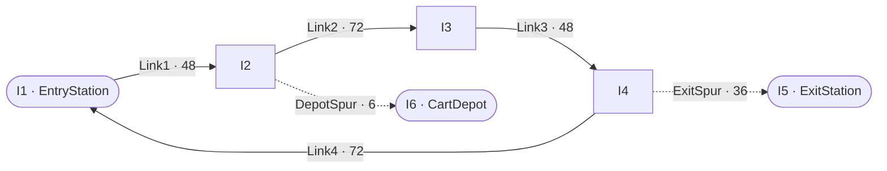
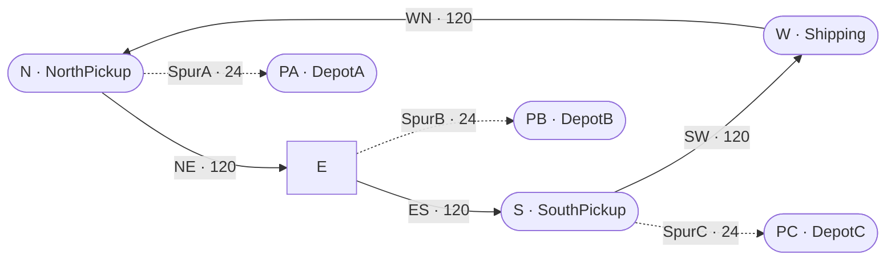
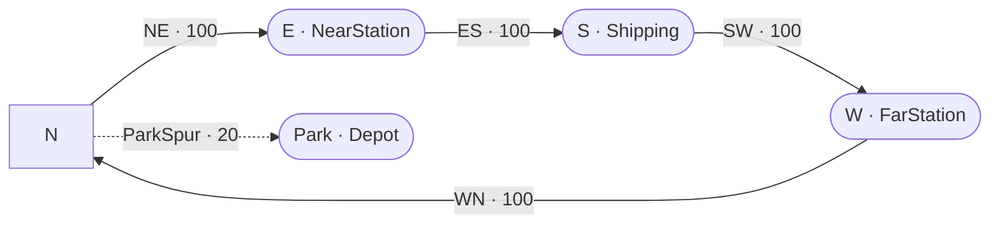
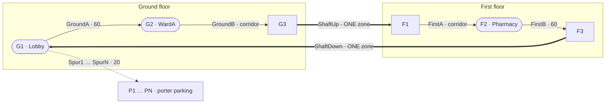
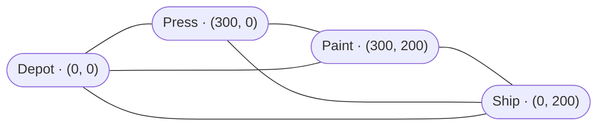

# Vehicles in KSL — a tutorial through the examples

*Ten worked cases.* Each one states a **problem**, describes the **model** with a
figure of the layout, walks through the **code** that expresses it, shows what it
**produced**, and says what that is evidence **for**. Every figure on this page
came from running the example named beside it; none is recalled or estimated, and
every line of code is quoted from the file it names.

If you have not met the four transport subsystems, read
[`ksl-transport`](ksl-transport.md) first — it is one page and it is the map
this tutorial walks over.

---

## How to read this tutorial

The examples are ordered so that each one needs only what came before it.

| # | Case | Run it with |
|---|---|---|
| 1 | [A simple AGV shop](#1-a-simple-agv-shop) | `:KSLExamples:simpleAgvExample` |
| 2 | [The same shop, both paradigms](#2-the-same-shop-modelled-both-ways) | `:KSLExamples:twoParadigmsExample` |
| 3 | [Free path against guide path](#3-free-path-against-guide-path) | *(a model class; see below)* |
| 4 | [Six dispatching rules](#4-six-dispatching-rules) | `:KSLExamples:dispatchingRuleComparison` |
| 5 | [Turning a cart round](#5-turning-a-cart-round) | `:KSLExamples:retaskingExample` |
| 6 | [A hospital on two floors](#6-a-hospital-on-two-floors) | `:KSLExamples:multiFloorHospitalExample` |
| 7 | [A two-lane warehouse](#7-a-two-lane-warehouse) | `:KSLExamples:twoLaneWarehouseExample` |
| 8 | [A dispatcher with no aisles](#8-a-dispatcher-with-no-aisles) | `:KSLExamples:freePathFleetExample` |
| 9 | [What the engine costs](#9-what-the-engine-costs) | `:KSLExamples:guidedPathBenchmark` |
| 10 | [What deciding costs](#10-what-deciding-costs) | `:KSLExamples:agvBenchmark` |

**A note on the output.** Several examples print warnings above their tables —
horizon diagnostics, and in two cases deadlock reports logged at ERROR. Those
are the audit doing its job, not a fault. Read the tables last.

**Reading the code.** Each case has a **The code** section that quotes the example
itself — not a simplification of it — and explains what each construct is doing in
terms of that case's problem. The excerpts are verbatim, elided with `...` where a
detail is beside the point, and a test
(`KSLExamples/src/test/kotlin/.../TransportTutorialCodeTest.kt`) checks that every
quoted line is still in the file the case names. **Read them with the file open**:
the sections quote what is load-bearing and leave the rest, and the rest is often
worth having.

**Reading the figures.** Every case that models a network has a figure of it,
drawn from the code that builds it. The figures are **topological**: an arrow is
a link, and a number on it is that link's *declared length*, which is what
routing reads. Nothing is to scale, and no figure carries coordinates — except
case 8, which is not a guide path at all and where the coordinates *are* the
model.

| In the figures | Means |
|---|---|
| `A ──▶ B` | a one-way link — vehicles travel A to B and never B to A |
| a **dotted** arrow | a **spur**: two-way, one vehicle at a time, and a dead end |
| a **thick** arrow | a lift shaft, which is an ordinary link of exactly one zone |
| a rounded node | an intersection carrying a named **station** |
| a plain node | a bare intersection |
| a line with **no** arrowhead | not a link at all — case 8 is a plane, and its lines only say what is reachable |

Two figures are drawn as **plans** rather than graphs: the warehouse in case 7
and the benchmark grid in case 9. An automatic graph layout draws a rectangular
grid as a diagonal cascade, and in those two cases the shape of the building is
part of the point. Both carry their own key in their captions.

---

## 1. A simple AGV shop

`ksl.examples.general.guidedpath.SimpleAGVExample`

### The problem

Two carts carry parts from an entry station to an exit station in a small shop.
This is the smallest layout that is worth building, and the point of it is that
**the layout is the model**.

### The model


*Figure 1 — the shop. Because the loop turns one way only, entry to exit is 204
feet the long way round while exit back to entry is 108. Loop zones are 12 feet;
the two home spurs get 6.*

A one-way loop with a spur down to the exit station and a parking spur for each
cart. Four properties of that description are load-bearing:

- **The main loop runs one way.** Two carts can queue behind one another but can
  never face each other, so head-on deadlock is impossible rather than merely
  unlikely.
- **The exit station is on a spur.** A spur admits one cart. The second cart
  sent there waits at the mouth, out on the loop, rather than following the
  first in and facing it with neither able to reverse.
- **Each cart has a parking spur of its own.** A stopped cart goes on holding
  the zones it stands on.
- **Zone sizes differ between links.** The loop is discretised at twelve feet so
  two six-foot carts cannot close to less than six; the home spurs are six feet
  and get a zone size of their own. Zone size belongs to a *link* precisely so
  that this is expressible.

### The code

*All of it in `SimpleAGVExample.kt`.*

**Zone size belongs to a link, and this example is why.** The two constants at the
top of the file are not decoration:

```kotlin
const val LOOP_ZONE_LENGTH: Double = 12.0
const val HOME_SPUR_ZONE_LENGTH: Double = 6.0
```

and they are spent one per link, in the builder:

```kotlin
.link("Link1", "I1", "I2", length = 48.0, zoneLength = LOOP_ZONE_LENGTH, beginDirection = 0.0)
.link(
    "Spur", "I4", "I5", length = 36.0, zoneLength = LOOP_ZONE_LENGTH,
    type = LinkType.SPUR, beginDirection = 270.0
)
.link(
    "Link5", "I2", "I6", length = 6.0, zoneLength = HOME_SPUR_ZONE_LENGTH,
    type = LinkType.SPUR, beginDirection = 0.0
)
```

The loop is cut at twelve feet so that two six-foot carts cannot close to less
than six while moving. A home spur is six feet **altogether** — one cart, and half
a loop zone. A network-wide zone size would have to make one of those two wrong,
which is the argument for `zoneLength` sitting where it does. `LinkType.SPUR` is
the other load-bearing argument: it makes a link a dead end entered and left from
the same junction, which is what lets a cart wait at the mouth rather than
following another in.

**Three declarations put a shop on a guide path.**

```kotlin
val network: GuidedPathNetwork = createNetwork()

init {
    // The parts travel on the guide path, so it is their spatial model too.
    spatialModel = network
}

val system = GuidedPathTransportSystem(this, network, name = "AgvSystem")
```

The middle one is the one that is easy to leave out. Assigning `spatialModel` is
what makes `currentLocation` mean *a junction on this network*, and it is why the
part further down can name a station and be understood. The network is the
geometry; `GuidedPathTransportSystem` is the thing that runs vehicles over it.

**The whole experiment is one constructor argument.** Each cart is placed on its
own spur and told to go back to it:

```kotlin
val cart1 = GuidedTransporter(
    system, TransporterPlacement.At(AGV1_HOME), ConstantRV(10.0), 1, EndOfZoneControl(), "Cart1"
).apply { homeBase = AGV1_HOME }
```

and the pool is where the two runs part company:

```kotlin
val carts = GuidedTransporterPoolWithQ(
    this, system, listOf(cart1, cart2),
    ClosestByNetworkDistanceRule(),
    if (sendCartsHome) ReturnToHomeBaseRule() else ParkInPlaceRule(),
    "Carts"
)
```

A pool takes **two** rules, and they answer different questions.
`ClosestByNetworkDistanceRule` decides which cart comes when one is wanted. The
*idle disposition* rule decides where a cart goes when nobody wants it — and only
that one changes between the runs, by way of a single `if` in a single argument
position. `homeBase` is set on both carts either way, so even the declarations are
identical; what differs is whether anything ever reads them.

**The part is where the passive paradigm becomes visible.**

```kotlin
inner class Part : Entity() {
    val delivery = process(isDefaultProcess = true) {
        val arrived = time
        currentLocation = network.requireLocation(ENTRY_STATION)
        guidedTransport(
            carts,
            destination = EXIT_STATION,
            pickupLocation = ENTRY_STATION,
            loadingDelay = ConstantRV(0.5),
            unLoadingDelay = ConstantRV(0.5)
        )
        timeInSystem.value = time - arrived
        completed.increment()
    }
}
```

The part names the pool it wants a cart from — that is what "passive" means here.
One suspending call covers the entire journey: a cart is chosen, drives to
`ENTRY_STATION`, is loaded for half a minute, carries the part round the loop and
down the exit spur, and is unloaded, and only then does the next line run.
`currentLocation` has to be set first because a transporter is summoned to a
*named junction*: the part is collected from the station it says it is standing
at, not from wherever it happens to be.

**And nothing else differs between the two runs.**

```kotlin
fun run(sendCartsHome: Boolean): AgvShop {
    val m = Model(if (sendCartsHome) "SimpleAGVExample" else "SimpleAGVExampleParked")
    val shop = AgvShop(m, sendCartsHome = sendCartsHome)
    m.numberOfReplications = 10
    m.lengthOfReplication = 8_000.0
    m.lengthOfReplicationWarmUp = 1_000.0
    m.simulate()
    return shop
}
```

Same replications, same horizon, same warm-up, same arrival stream. A study that
moved any of those alongside the parking rule would produce a difference it could
not attribute to anything.

### What it shows

The example ships a second run, `runWithoutHomeBases()`, which changes one thing
— the carts are left where they stop — and produces this:

| | carts sent home | carts left in place |
|---|---|---|
| parts delivered | 349.9 | 349.8 |
| time in system | 61.76 | 62.96 |
| **obstructions detected** | **0.0** | **40.5** |
| fraction of fleet blocked | 0.0052 | 0.0742 |

### What to learn

**Neither run fails, and throughput is identical.** This shop is arrival-limited,
so the damage does not reach the headline number. The *only* clear signal is the
obstruction count — which is why that condition is counted into the standard
report rather than merely logged.

> **A destination is a resource.** A transporter that stops goes on holding its
> zones for the rest of the run. Any model in which two vehicles finish in the
> same place will have the first arrival block the second — and the second is not
> delayed, it waits for ever.

This is the single most likely way for a working-looking guide-path model to be
quietly wrong. Watch `numObstructionsDetected`; a positive value means something
in your layout is standing in the way.

---

## 2. The same shop, modelled both ways

`ksl.examples.general.agv.TwoParadigmsExample` — **read this one first if you
read only one.**

### The problem

KSL can model the same vehicles two ways. Under the **passive** paradigm an
entity seizes a cart from a pool; under the **active** paradigm a dispatcher
decides. Are these two models of one world, or two different worlds?

### The model



*Figure 2 — case 1's loop with one cart and one depot. This figure is the whole
physical model, and it is **the same figure for both runs**: the passive shop and
the active shop are built from this one network.*

One shop, built twice. The physical world is identical in both runs — same guide
path, same zones, same routing, same blocking rules — and every line that differs
is a line about *who decides*:

```kotlin
guidedTransport(carts, destination = EXIT, pickupLocation = ENTRY)   // passive
transportByFleet(agv,  destination = EXIT, origin = ENTRY)           // active
```

The two lines look similar and mean something quite different. Under the passive
paradigm the choice of *which* cart is made inside the part's own process, at
the instant it happens to ask, over whatever is free then. There is nowhere else
it could be made, because no other object is running.

### The code

*Both shops are in `TwoParadigmsExample.kt`, one after the other, and the file is
worth opening side by side with this page.*

**They share the layout by construction.** Each class begins the same way, and
calls the same function:

```kotlin
val network = createNetwork()

init {
    spatialModel = network
}
```

Not a copied builder, not two networks that ought to match — one function, called
twice. If the layouts could drift apart, the comparison would be measuring the
drift.

**Four declarations differ.** Passive:

```kotlin
val space = GuidedPathTransportSystem(this, network, name = "Space")

val cart = GuidedTransporter(
    space, TransporterPlacement.At(DEPOT), ConstantRV(CART_SPEED), name = "Cart"
).apply { homeBase = DEPOT }

val carts = GuidedTransporterPoolWithQ(
    this, space, listOf(cart), ClosestByNetworkDistanceRule(), ReturnToHomeBaseRule(), "Carts"
)
```

Active:

```kotlin
val agv = AgvSystem(this, network, name = "Agv")

val cart = AgvVehicle(
    agv, TransporterPlacement.At(DEPOT), ConstantRV(CART_SPEED), name = "Cart"
).apply { homeBase = DEPOT }
```

The active side is *shorter*, which is the first surprise. There is no pool,
because an `AgvSystem` **is** the fleet and the dispatcher: the vehicles register
themselves with it, and the assignment policy is a constructor argument with a
default rather than a separate object the modeller assembles. The placement, the
speed, the home base and the network are word for word the same on both sides.

**And one line inside the process differs.** Passive:

```kotlin
guidedTransport(carts, destination = EXIT, pickupLocation = ENTRY)
```

Active:

```kotlin
transportByFleet(agv, destination = EXIT, origin = ENTRY)
```

Read the receivers. The passive call names `carts` — a **pool**, a container of
candidates, which the part is choosing from at this instant. The active call names
`agv` — a **system**, which will decide on the part's behalf, possibly later,
possibly after weighing work the part cannot see. The parameter renamed from
`pickupLocation` to `origin` is the same fact said from the other end: the part is
no longer arranging its own collection, it is stating where its load is.

Everything around those lines is identical, down to the arrival stream:

```kotlin
inner class Source : Entity() {
    val arrivals = process(isDefaultProcess = true) {
        repeat(NUM_ARRIVALS) {
            delay(timeBetweenArrivals)
            activate(Part().production)
        }
    }
}
```

with `ExponentialRV(MEAN_TIME_BETWEEN_ARRIVALS, ARRIVAL_STREAM)` on both sides.
**Naming the stream is what makes the agreement below meaningful.** Two runs that
drew from different streams could agree to three digits and disagree in the
fourth, and nobody could say whether that was the paradigm or the sampling. Here
the two models see the same arrivals at the same instants, so a difference of any
size would be a difference of substance.

### What it shows

With one cart, "closest idle transporter" and "nearest vehicle" are the same
rule — there is only ever one candidate — so the models should agree. They do:

| | passive | active |
|---|---|---|
| parts delivered | 174.90 | 174.90 |
| time in system | 88.2894 | 88.2894 |
| cart transporting | 0.5096 | 0.5096 |
| cart moving empty | 0.3636 | 0.3636 |

**Exactly, to the digit** — not within a confidence interval.

### What to learn

That agreement is the load-bearing result of the whole subsystem. Had the
answers differed, this would not be a second way of modelling one world; it
would be a different world, and every comparison a researcher wanted to make
between paradigms would be confounded by the modelling choice itself.

The example then prints what **only** the active model can report — the wait
split into *waiting to be assigned* and *waiting for arrival*. A passive pool
has no object that holds a commitment, so there is no instant at which a
decision was made to measure from.

---

## 3. Free path against guide path

`ksl.examples.book.chapter8.TestAndRepairShopWithGuidedTransporters`

This is a model class rather than a runnable study: it is the guide-path twin of
`TestAndRepairShopWithMovableResources`, built so the two can be compared.

### The problem

When does it matter that vehicles must follow aisles?

### The model


*Figure 3 — the aisle the workers walk, zoned at 5, with a parking spur per
worker. The free-path twin of this model holds a **direct** distance for every
pair of stations: TestStation3 to TestStation1 is 80 there and 175 here, because
on this aisle a worker must go round through repair and diagnostics.*

Chapter 8's test-and-repair shop, with its three transport workers moved off a
distance model onto a guide path. **Everything about the work is identical** —
the same four test plans with the same probabilities, the same processing-time
distributions, the same repair times, the same arrival process, the same five
stations, the same three transporters, the same walking speed. Only the *space*
changes.

The leg lengths are taken from the free-path model's own distances along the
cycle, so the two models agree about how far apart things are and disagree only
about what a worker must do to get between them.

### The code

*The guide-path model is `TestAndRepairShopWithGuidedTransporters.kt`; its twin is
chapter 8's `TestAndRepairShopWithMovableResources.kt`. Reading the two processes
against each other is the exercise.*

**The space is a constructor parameter, so the same shop can be run over another
one.**

```kotlin
class TestAndRepairShopWithGuidedTransporters @JvmOverloads constructor(
    parent: ModelElement,
    numTransporters: Int = 3,
    timeBtwArrivals: Double = 20.0,
    name: String? = null,
    aisleNetwork: GuidedPathNetwork? = null,
```

```kotlin
val network: GuidedPathNetwork = aisleNetwork ?: createNetwork(numTransporters)
```

A study that wanted to ask what a different aisle plan is worth supplies one here
and changes nothing else. The parameters beside it — `transporterVelocity`,
`transporterHomes`, `transporterPhysicalLength`, `zoneControlRule`,
`idleDispositionRule` — are the same idea: everything a comparison might want to
vary is an argument with a default, so a sweep is a call rather than an edit.

**The work is untouched; the movement is not.** Here is the guided part's process:

```kotlin
var at = DIAGNOSTIC
var carried = 0.0
currentLocation = network.requireLocation(DIAGNOSTIC)
```

```kotlin
for (tp in plan) {
    val leg = guidedTransport(
        transportWorkers, destination = tp.testStation, pickupLocation = at
    )
    carried += leg.approachTime + leg.rideTime
    at = tp.testStation
    use(tp.testMachine, delayDuration = tp.processTime)
}
```

and here is the same loop in the free-path twin:

```kotlin
transportWith(transportWorkers, toLoc = tp.testStation)
use(tp.testMachine, delayDuration = tp.processTime)
```

**The `var at` is the whole difference, and it is not incidental bookkeeping.** On
a distance model a worker walks to wherever the part *is*, so the part never has
to say. On a guide path a transporter is summoned to a **named junction**, so the
process must track which station the part is standing at and hand it over as
`pickupLocation`. That single obligation is the API surfacing the physical fact
the case is about: on an aisle, where you are is a claim about a place, not a
coordinate that can be read off.

**A leg reports its parts.** `guidedTransport` returns a result rather than a unit:

```kotlin
carried += lastLeg.approachTime + lastLeg.rideTime
```

`approachTime` is the empty run to fetch the part; `rideTime` is the loaded run.
Summing them and no more is deliberate — the wait *for* a worker is queueing,
belongs to the transport pool's own queue statistic, and would double-count if it
were folded into transfer time.

**The transporters are a pool, not named individuals.**

```kotlin
val transportWorkers = GuidedTransporterPoolWithQ(
    this, transportSystem, carts,
    ClosestByNetworkDistanceRule(), idleDispositionRule, "TransportWorkerPool"
)
```

which is exactly how the free-path twin asks for them too. Both models seize *a*
worker from a group; only the space in which that worker travels has changed. That
is the property that makes the table below a comparison rather than two unrelated
runs.

### What it shows

Run on a comparable haul as the fleet grows (the table in
[`ksl-guidedpath` §1](ksl-guidedpath.md#1-what-this-package-is-for)):

| carts | free-path completions | guided | free-path time in system | guided |
|---|---|---|---|---|
| 1 | 64 | 64 | 878.4 | 878.4 |
| 2 | 128 | 128 | 752.4 | 754.6 |
| 4 | 255 | 236 | 498.5 | 538.6 |
| 6 | 380 | **236** | 248.4 | **538.6** |
| 8 | 492 | **236** | 31.0 | **538.6** |

### What to learn

At one and two carts the two models agree — **that is a real range**, and inside
it a free-path model is a fair approximation. Beyond it they part company. The
guide path stops improving at four carts because the exit spur admits one cart
at a time and no size of fleet can put two of them down it. The distance model
has no such notion, so it goes on rewarding every cart added, for ever.

A study that sized this fleet from the free-path answer would buy eight carts,
expect thirty-one minutes, and get five hundred and thirty-eight.

> **The point is not that the free-path number is wrong.** It is that nothing in
> a free-path model is *capable* of being wrong here: there is no statistic it
> could report, however carefully read, that would reveal the aisle it does not
> represent.

---

## 4. Six dispatching rules

`ksl.examples.general.agv.DispatchingRuleComparison`

### The problem

Does the dispatching rule matter, and how would you know?

### The model



*Figure 4 — a one-way ring of four legs of 120, zoned at 12, with a depot spur
for each of the three carts. Note the **two** pickup stations, at opposite
corners.*

One shop, three carts, six rules, common random numbers throughout. Because
deciding is a substitutable object, the study changes the rule and nothing else.

Two pickup points, deliberately: on a single-origin layout every task costs a
given vehicle the same, so rules that rank *tasks* differently cannot be told
apart — the comparison would be unfalsifiable and would quietly report that the
choice does not matter.

### The code

*All in `DispatchingRuleComparison.kt`.*

**The rule is a constructor argument, which is what makes the study a loop rather
than six files.**

```kotlin
class Shop(parent: ModelElement, policy: AssignmentPolicyIfc) : ProcessModel(parent, "Shop") {
```

```kotlin
val agv = AgvSystem(this, network, assignmentPolicy = policy, name = "Agv")
```

```kotlin
val rules = listOf(
    "nearest vehicle" to NearestVehiclePolicy(),
    "furthest vehicle" to FurthestVehiclePolicy(),
    "least used" to LeastUsedVehiclePolicy(),
    "batched (window 30)" to BatchedAssignmentPolicy(30.0),
    "contract net (instant)" to ContractNetAssignmentPolicy(0.0),
    "contract net (deadline 5)" to ContractNetAssignmentPolicy(5.0)
)
```

Six rules, one model class, one substitution point. `AssignmentPolicyIfc` is the
seam: a policy is asked which vehicle should take which task and answers however it
likes, including by taking simulated time over it — which is what
`BatchedAssignmentPolicy(30.0)` and `ContractNetAssignmentPolicy(5.0)` do, and what
no rule evaluated inside an asking entity could.

**Two pickup points, and the reason is in the source.**

```kotlin
inner class Source : Entity() {
    val arrivals = process(isDefaultProcess = true) {
        repeat(NUM_ARRIVALS) {
            delay(timeBetweenArrivals)
            // Alternating origins, so that which task is nearest genuinely varies.
            val from = if (it % 2 == 0) NORTH_PICKUP else SOUTH_PICKUP
            activate(Load(from).production)
        }
    }
}
```

On a single-origin layout every waiting task costs a given vehicle the same, so
rules that rank *tasks* differently cannot be told apart and the comparison
quietly reports that the choice does not matter. Alternating the origin is what
gives the rules something to disagree about.

**Each load reports the wait split the way the active paradigm can.**

```kotlin
val result = transportByFleet(agv, destination = SHIPPING, origin = from)
waitForVehicle.value = result.waitForAssignment + result.waitForArrival
```

Two clocks, not one: how long until somebody decided, and how long until the
vehicle arrived. The batched row in the table is almost entirely the first of
these, and a model that reported only their sum would show the cost without
showing where it came from.

**Imbalance is measured at the horizon, and its type says so.**

```kotlin
val fleetImbalance = Response(this, "Shop:FleetImbalance")
```

```kotlin
override fun replicationEnded() {
    super.replicationEnded()
    val counts = fleet.map { it.numTasksCompleted.value }
    fleetImbalance.value = counts.max() - counts.min()
}
```

Largest minus smallest per-vehicle completions: how unevenly the work fell. It is
a `Response` rather than a `Counter` because it is **one observation of a finished
replication**, not a quantity that accumulated during it — a distinction worth
getting right, since a `Counter` here would report something with no meaning at
all.

### What it shows

```
  rule                        delivered         wait    in system   imbalance
  nearest vehicle                 323.6        11.49        31.51       69.93
  furthest vehicle                323.6        26.54        46.57       46.60
  least used                      323.9        20.53        40.57        1.00
  batched (window 30)             283.8       820.02       860.96        1.13
  contract net (instant)          323.6        11.50        31.53       70.40
  contract net (deadline 5)       323.6        21.33        41.47       50.93
```

### What to learn

**Five of the six deliver within 0.3 loads of one another.** With a fleet this
size the guide path is the constraint, not the decision — so a study that
measured throughput alone would conclude that dispatching does not matter here,
and would be wrong about everything except throughput.

What the rule changes is **who waits and how evenly the fleet is worn**.
Least-used leaves an imbalance of 1.00 against nearest-vehicle's 69.93, at
throughput differing in the second decimal place. Whether that matters depends
on whether the cost being managed is time or wear — a modelling question, not a
library one.

**Batching is the exception, instructively.** It costs 39.8 loads and 820 time
units of waiting against nearest-vehicle's 11. A window pays for itself when a
fleet has slack and the board has choices to weigh; this fleet is saturated, so
the window delays every decision and the delay compounds. The rule is not broken
— it is being asked to do the thing it is worst at, which is what a comparison
is for.

**And one check rather than a coincidence:** the instant auction reproduces
nearest-vehicle almost exactly, 11.50 against 11.49. With distance bidding the
vehicles quote what the rule would have computed, so the negotiation machinery
is shown not to be changing the answer by itself. The deadline row then shows
what it costs once negotiating is charged for.

**`FurthestVehiclePolicy` is deliberately poor** and exists so that "nearest is
better" can be a finding rather than an assertion.

---

## 5. Turning a cart round

`ksl.examples.general.agv.RetaskingInFlightExample`

### The problem

A cart is on its way to a far pickup when a nearer job appears. Should it turn
round — and what stops a fleet that can from doing it constantly?

### The model



*Figure 5 — a one-way ring of four legs of 100, zoned at 10, with the cart
parked on a spur of 20 off N. The arithmetic below is in the picture: because
the ring runs one way, from N the near pickup at E is one leg ahead and the far
pickup at W is three.*

A one-way ring of four legs of 100 with the cart parked on a spur. The
arithmetic is made unambiguous: at **t = 2** the cart has travelled 20 and
stands at a junction; its own pickup is 300 ahead, the new one 100. The swap
saves 200.

Three runs: no re-tasking; re-tasking with the near job at t = 2; and
re-tasking with the near job at t = 15, by which point the swap would *cost*
200.

### The code

*All in `RetaskingInFlightExample.kt`, and it is the shortest of the ten.*

**Three runs, two policies, one number moved.**

```kotlin
report(
    "Without re-tasking: the cart commits at t=0 and finishes what it started.",
    run(NearestVehiclePolicy(), nearArrivesAt = 2.0)
)
report(
    "With re-tasking, near job at t=2 (worth 200 units): the cart is turned round.",
    run(ReassigningPolicy(improvementThreshold = 20.0), nearArrivesAt = 2.0)
)
report(
    "With re-tasking, near job at t=15 (would cost 200): the rule declines the swap.",
    run(ReassigningPolicy(improvementThreshold = 20.0), nearArrivesAt = 15.0)
)
```

The first run establishes that the layout does what the arithmetic says without any
re-tasking in it. The second is the capability. The third is the same policy with
the near job arriving thirteen units later, and it is the one that makes the second
a finding: a policy that always swapped would produce run two's numbers and run
three's would be wrong.

**The arrival time is a constructor parameter, and the scenario is set up in
`initialize`.**

```kotlin
override fun initialize() {
    delivered.clear()
    activate(Load("far", FAR_PICKUP).production)
    activate(Load("near", NEAR_PICKUP).production, timeUntilActivation = nearArrivesAt)
}
```

Two loads, no arrival process, no randomness anywhere: the cart's speed is
`ConstantRV(10.0)`, the legs are 100 each, and

```kotlin
m.numberOfReplications = 1
m.lengthOfReplication = 2_000.0
```

**One replication is the right number here**, and that is a statement about what is
being demonstrated. The claim is not "re-tasking is better on average"; it is "at
t = 2 the swap saves exactly 200 and the rule takes it, and at t = 15 it costs
exactly 200 and the rule refuses". A confidence interval would obscure an
arithmetic fact rather than support it.

**What a transport returns is kept, not discarded.**

```kotlin
val delivered = linkedMapOf<String, FleetTransportResult>()
```

```kotlin
delivered[label] = transportByFleet(agv, destination = SHIPPING, origin = from)
```

so the report can print, per load, `r.totalTime`, `r.waitForAssignment +
r.waitForArrival` and `r.numReassignments`. That last field is the point of the
whole example: the load that was put back keeps the wait it had already
accumulated, because its task never left the queue, and the fact that it was passed
over is **reported** rather than absorbed. Re-queueing it would have reset its clock
and made the load that had waited longest look as though it had just arrived —
corrupting both the statistic and any age-based rule reading it.

The revocation count is read off the dispatcher, which is an object that exists in
this paradigm and not in the other:

```kotlin
shop.agv.dispatcher.numAssignmentsRevoked.value
```

### What it shows

```
  With re-tasking, near job at t=2 (worth 200 units): the cart is turned round.
    near   delivered at    60.0   waited   50.0   reassignments 0
    far    delivered at   102.0   waited   72.0   reassignments 1
    revocations: 1

  With re-tasking, near job at t=15 (would cost 200): the rule declines the swap.
    far    delivered at    62.0   waited   32.0   reassignments 0
    near   delivered at    87.0   waited   77.0   reassignments 0
    revocations: 0
```

### What to learn

**The middle case is the capability; the third is what makes it a rule rather
than a reflex.** A policy that always swapped would produce the middle result
and the wrong third one, and on a busy floor it would churn — revoking and
re-revoking as the board shifts, with carts spending their time changing their
minds. `ReassigningPolicy` therefore requires a positive `improvementThreshold`
and refuses zero at construction.

Two details worth noticing:

- **The cart never reverses.** A redirect takes effect at the next zone
  boundary, because something between two places cannot stop and turn. That is
  the same code the passive subsystem has always used.
- **The put-back load keeps its accumulated wait**, because the task never left
  the queue. A load that has been waiting longest still looks like one, and the
  fact that it was passed over is reported (`numReassignments`) rather than
  absorbed.

And the reason this is an *active*-paradigm example at all: it is not that the
movement machinery cannot redirect a moving transporter — it always could. It is
that under the passive paradigm a transporter belongs to the entity that seized
it, so **the decision has nowhere to live**.

---

## 6. A hospital on two floors

`ksl.examples.general.agv.MultiFloorHospitalExample`

### The problem

How do you model a lift?

### The model

You do not. A guide path routes on **declared link lengths**, never on
coordinates, so nothing in the network knows that two of its intersections are
one above the other. A lift is therefore expressible as what it physically is: a
one-way link of a single zone. The zone rule already says one zone admits one
vehicle, so the shaft excludes everybody else for the duration of a ride without
a line being written to make it do so.



*Figure 6 — one one-way circuit of 400 that happens to climb. F1 sits directly
above G3 and F3 above G1; the heights are carried for the drawing and the engine
never reads them. The two corridor legs absorb whatever the shafts do not use,
which holds the circuit at 400 across every configuration studied. The thick
links are the lifts: ordinary links whose zone length equals their length, so
each contains exactly one zone.*

A one-way circuit climbs one shaft and descends the other, so **every delivery
cycle rides each shaft exactly once**. Three studies run on it.

### The code

*All in `MultiFloorHospitalExample.kt`.*

**The lift is a link, and one line makes it a lift.**

```kotlin
// The lift: one zone, so exactly one porter may be inside it at a time.
.link("ShaftUp", "G3", "F1", length = shaftLength, zoneLength = shaftLength, beginDirection = 90.0)
```

`zoneLength = shaftLength` — the zone is the whole link, so the link contains
exactly one zone, so it admits exactly one vehicle. The exclusion is not
implemented; it is the general rule applied to a link of a particular shape.

**The circuit is held constant so that the studies are comparable.**

```kotlin
val corridor = (CIRCUIT - 2.0 * shaftLength - 120.0) / 2.0
require(corridor > 0.0) { "the shafts leave no room for corridors" }
```

This is the arithmetic that makes the two fleet tables readable against each other.
Shorten the shafts and the corridors lengthen to absorb it, so a single porter
travels the same 400 whichever lift it has and delivers at the same rate in both
tables. Every difference further down the tables is therefore about how many
porters the shaft will pass, and about nothing else. The `require` is there because
a study that swept `shaftLength` past 140 would otherwise build a network with
negative corridors and report something.

**The population is closed, which is what makes cycle time mean something.**

```kotlin
inner class Order : Entity() {
    val delivery: KSLProcess = process(isDefaultProcess = true) {
        val placed = time
        currentLocation = network.requireLocation(PHARMACY)
        delay(preparation)
        transportByFleet(agv, destination = WARD, origin = PHARMACY)
        cycleTime.value = time - placed
        delivered.increment()
        // The shelf is never the constraint: the next order is ready the moment this one
        // is delivered, which is what holds the outstanding work constant.
        activate(Order().delivery)
    }
}
```

```kotlin
override fun initialize() {
    repeat(ordersInCirculation) { activate(Order().delivery) }
}
```

```kotlin
fun ordersFor(numPorters: Int): Int = numPorters + 2
```

An order that completes activates its own successor, so the number outstanding
never changes for the whole run. That is why Little's law can be checked against
the table — orders outstanding = throughput × cycle time — and why cycle time here
is a number about the hospital rather than about how long the run was. `+ 2` is
enough that a porter never waits for work and no more, so the fleet is the thing
being measured.

**The watcher, and a mistake worth inheriting.**

```kotlin
var t = 0.5
while (t < horizon) {
    schedule(::sampleShaft, t)
    t += 1.0
}
```

```kotlin
val shaft = network.link("ShaftUp")!!.zones
// `isHeld`, not `isOccupied` -- see the note in this file's header.
val inside = shaft.count { it.isHeld }
```

Two details, both learned the hard way. Sampling is on the **half-tick** because
with a constant velocity and equal zone lengths every zone transition here lands on
a whole number, and an observer scheduled at those same instants sees whichever
side of them event priority happens to put it on — which once reported an unused
lift in a model that was plainly using one. And `isHeld` rather than `isOccupied`
because the zone is claimed from the moment it is **reserved**, not from the moment
a porter is inside it, and it is the reservation that does the excluding.

### What it shows

With an 8-unit ride, throughput scales cleanly to four porters — 2.486, 4.971,
7.486, 10.000 per 100 units, essentially 2.5 apiece — then **stops dead at
12.486** for six porters and for eight.

That ceiling is not an artefact of the fleet or the rule: an 8-unit ride passes
at most 12.50 deliveries per 100 units, which is five porters' worth.

What the surplus porters do instead is exact:

| porters | blocked | porters' worth standing still |
|---|---|---|
| 6 | 0.1667 | 6 × 0.1667 = **1** |
| 8 | 0.3750 | 8 × 0.3750 = **3** |

Precisely the surplus over the five the shaft will carry. Cycle time rises to
match, 60.0 at four porters to 80.0 at eight. With a 2-unit ride instead, eight
porters deliver 19.94 per 100 against the 20.00 perfect scaling would give — the
fleet never comes near that shaft's 50 per 100. **Same circuit, same porters,
same rule, same code; a different lift.**

### What to learn

**Buying porters buys queue.** Past a constraint, added vehicles convert into
blocked time at a rate you can predict from the constraint's capacity.

The example also checks its own columns against **Little's law**: orders
outstanding = throughput × cycle time. Eight porters with the slow lift,
0.12486 × 80.00 = 9.99 against 10 orders out; with the fast lift, 0.19943 ×
49.98 = 9.97. It holds because the system is closed — which is also why cycle
time here is a number about the hospital rather than about the length of the
run.

> **What none of this needed:** an elevator class, a floor attribute, a capacity
> semaphore, or a branch anywhere in the dispatcher or the vehicle control loop.

Heights are carried for the picture only — the engine never reads them — so
placing the floors changed not one number.

---

## 7. A two-lane warehouse

`ksl.examples.general.agv.TwoLaneWarehouseExample`

### The problem

A rectangular warehouse of pick aisles and cross-aisles, each wide enough for
traffic both ways. Is that one network or two? What is the second lane worth?

### The model

```text
   T0 ══════ 40 ══════ T1 ══════ 40 ══════ T2
   ║                   ║                   ║
  120                 120                 120
   ║                   ║                   ║
   B0 ══════ 40 ══════ B1 ══════ 40 ══════ B2 ══ 40 ══ K0 ══ 40 ══ K1 … K(n-1)
   ┆ 10                                                ┆ 10        ┆ 10
   D                                                   P0          P1 … P(n-1)
   Dock                                                park        park
```

*Figure 7 — the building, in plan. Three pick aisles of 120 between a bottom and
a top cross-aisle of 40, a dock spur off B0, and a parking row running east from
B2 with one spur per cart. **Every `═══` is drawn as two lines because it is two
links** — one lane each way, sharing the junction at each end — and the same is
true of the `║` pick aisles. `┆` is a spur. The single-lane study replaces each
of those pairs with a single two-way link and changes nothing else about the
building.*

**A lane is a link.** Two lanes on one span are two links, opposed — and it is
**one network**. Nothing keys on the pair of endpoints, so a second link between
the same junctions is not a duplicate of anything. Two networks would be worse
than redundant: routing, blocking and deadlock detection are per network, so a
vehicle on one could not see a vehicle on the other, and the whole point of a
road layout is that the directions share the junctions.

A vehicle changes direction by taking the return lane, which is ordinary routing
rather than a manoeuvre.

**Demand is set above what the building can serve on purpose**, so that the
layout rather than the arrival stream is what limits the answer.

### The code

*All in `TwoLaneWarehouseExample.kt`.*

**One function is the entire experimental factor.**

```kotlin
fun span(from: String, to: String, length: Double) {
    if (twoLane) {
        b.link("$from-$to", from, to, length = length, zoneLength = ZONE)
        b.link("$to-$from", to, from, length = length, zoneLength = ZONE)
    } else {
        b.link("$from~$to", from, to, length = length, zoneLength = ZONE,
            type = LinkType.BIDIRECTIONAL)
    }
}
```

That is the answer to "is it one network or two?", written out: a two-way span is
**two calls to `link` on one builder**, so both lanes end at junctions the other
lane also touches. The single-lane arm of the study is the same span expressed as
one `LinkType.BIDIRECTIONAL` link, and the naming convention marks which is which:
`B0-T0` and `T0-B0` against `B0~T0`.

**The building is then written once and reads the same either way.**

```kotlin
for (i in 0 until NUM_AISLES) span("B$i", "T$i", AISLE_LENGTH)          // the pick aisles
for (i in 0 until NUM_AISLES - 1) {
    span("B$i", "B${i + 1}", AISLE_SPACING)                              // bottom cross-aisle
    span("T$i", "T${i + 1}", AISLE_SPACING)                              // top cross-aisle
}
```

Two loops and the building is laid out. Because `span` hides the lane question,
the layout code contains no `if` at all — which is what lets the two studies claim
to be the same building rather than two buildings that resemble each other.

**A spur per cart, sized by the fleet.**

```kotlin
for (k in 0 until numCarts) {
    b.intersection("K$k", x = (NUM_AISLES + k) * AISLE_SPACING, y = 0.0)
    b.intersection("P$k", x = (NUM_AISLES + k) * AISLE_SPACING, y = -SPUR)
    b.link("K$k-P$k", "K$k", "P$k", length = SPUR, zoneLength = SPUR, type = LinkType.SPUR)
}
```

The network is built *for* a fleet size, because a shared parking area would stage
one vehicle and leave the rest standing on the approach — available in the fleet's
eyes and stuck in the building's. Case 1's lesson, applied before it could bite.

**Demand is above capacity on purpose.**

```kotlin
/** Demand deliberately above what the building can serve, so that the layout is the constraint. */
private const val MEAN_TBA: Double = 3.0
```

The comment is load-bearing. With demand *below* capacity the throughput column
flattens at the arrival rate, and a reader concludes the aisles bind when nothing
of the sort has been shown — the trap this tutorial's closing section names in
three of these ten cases.

**A deadlock is a result, and is recorded as one.**

```kotlin
} catch (e: GuidedPathDeadlockException) {
    // A domain outcome, not a defect: this layout cannot carry this fleet. The report names
    // every participant in the cycle, which is what says whether it closed through a lane or
    // through the junctions.
    Outcome(Double.NaN, Double.NaN, Double.NaN, deadlockedAmong = e.report.participants.size)
}
```

The sweep catches the exception, marks that design point infeasible, and carries
on. Note what is *not* done: detection is not switched off. A run with detection
disabled would still deadlock — it would simply stop saying so, and the row would
read as a slow configuration rather than an impossible one.

### What it shows

Two-lane, sweeping the fleet:

| carts | delivered | in system | blocked |
|---|---|---|---|
| 2 | 443.7 | 2007.78 | 2.2% |
| 4 | 834.7 | 1132.61 | 8.0% |
| 6 | 1109.4 | 525.30 | 18.6% |
| 8 | 1111.0 | 522.16 | 38.9% |
| 10 | 1111.0 | 523.06 | 51.1% |
| 12 | **DEADLOCK** | — | — |

The same building with single two-way aisles **deadlocks at two carts**.

### What to learn

**Three findings, and the third is the one to take away.**

1. **Throughput ceilings at six carts.** Where the reward stops is the number a
   fleet-sizing study exists to find.
2. **The carts added past it are not idle — they are blocked.** 6 → 10 carts
   moves deliveries 1109.4 → 1111.0 while fleet time blocked goes 18.6% → 51.1%.
3. **The grid gridlocks at twelve**, among six transporters:

```
Cart5 holds [T1]           awaits T1-T0.Zone1
Cart3 holds [T1-T0.Zone1]  awaits T1-T0.Zone2
Cart9 holds [T1-T0.Zone2]  awaits T0
Cart7 holds [T0]           awaits T0-T1.Zone1
Cart6 holds [T0-T1.Zone1]  awaits T0-T1.Zone2
Cart8 holds [T0-T1.Zone2]  awaits T1
```

Both lanes of one span full nose to tail, and the junction at each end held by a
vehicle wanting the lane the others are standing in. **Blocking the box** —
ordinary traffic gridlock.

> **Paired one-way lanes are not deadlock-proof.** They remove the head-on
> meeting *on a link*. They do nothing about a cycle closing through the
> junctions at each end of a span. A second lane raises the fleet a layout can
> carry — one cart to ten, here — but it does not remove the ceiling.

**A run that deadlocks raises**, which is deliberate: the model is valid and the
answer is "this configuration deadlocks", often the finding a study is after.
Both sweeps catch it and record the design point as infeasible. Do not "fix" it
by disabling detection — the run would still deadlock and would simply stop
saying so.

---

## 8. A dispatcher with no aisles

`ksl.examples.general.fleet.FreePathFleetExample`

### The problem

You want a fleet that decides for itself, and your vehicles do **not** contend
for space — a fork-lift yard, a porter pool, a field-service crew. They queue
for *work*, never for *aisles*.

### The model



*Figure 8 — **not a network.** Four named points on a Euclidean plane. The lines
carry no direction and no arrowheads because there are no aisles: a vehicle goes
from any point to any other in straight-line distance ÷ velocity — 200 or 300 on
the sides, 360.6 across a diagonal — and two vehicles may stand on the same
ground. Compare it with any figure above: what is missing is the whole of what a
guide path adds.*

Two lines name the substrate:

```kotlin
val fleet = FreePathFleet(this, plane, places, ...)
val cart  = FreePathVehicle(fleet, "Depot", ConstantRV(30.0), ...)
```

Everything else — the batching window, the consolidating policy, the load
capacity, the `transportByFleet` call, every statistic — is the fleet layer, and
is written exactly as it would be over a guide path. Exchanging those two lines
for `AgvSystem`/`AgvVehicle` and a network is all it takes to run the same study
on aisles that push back.

Two cart capacities against two batching windows.

### The code

*All in `FreePathFleetExample.kt`.*

**The substrate is two declarations and a list of named points.**

```kotlin
private val plane = Euclidean2DPlane()

// A fleet is written in named places; the spatial model supplies the geometry between them.
private val places = listOf(
    plane.Point(0.0, 0.0, "Depot"),
    plane.Point(300.0, 0.0, "Press"),
    plane.Point(300.0, 200.0, "Paint"),
    plane.Point(0.0, 200.0, "Ship")
)
```

```kotlin
init {
    spatialModel = plane
}
```

There is no network to build, no zones to size and no link directions to get right
— which is the free path's actual advantage, and it is an advantage in *modelling
effort*, not in fidelity. What you give up is written into the results table below
as a column of exact zeroes.

**The fleet layer is written exactly as it would be over a guide path.**

```kotlin
val fleet = FreePathFleet(
    this, plane, places,
    assignmentPolicy = BatchedAssignmentPolicy(window = batchWindow, inner = ConsolidatingPolicy(NearestVehiclePolicy())),
    name = "Yard"
)

val carts = List(numCarts) { i ->
    FreePathVehicle(
        fleet, "Depot", ConstantRV(30.0), name = "Cart${i + 1}",
        loadCapacity = cartCapacity, stepSize = 10.0
    ).apply { homeBase = "Depot" }
}
```

Read the policy from the inside out: `NearestVehiclePolicy` is the rule,
`ConsolidatingPolicy` wraps it to fill a cart that still has room, and
`BatchedAssignmentPolicy` wraps *that* to hold decisions open for a window so there
is something to consolidate. All three are ordinary fleet-layer policies and none
of them knows what it is running over. Swap the two constructor calls above for an
`AgvSystem` and an `AgvVehicle` over a network and this composition is untouched.

**Two knobs, and the second is what makes the first a finding.** `loadCapacity` is
what lets a cart take several pallets; `batchWindow` is what collects several tasks
for it to take. With `loadCapacity = 1` the consolidating policy has nothing to
consolidate and the inner rule decides everything — which is why the capacity-one
row is a fair baseline rather than a differently-configured model — and the window
becomes pure delay. The study runs both against both:

```kotlin
val cells = listOf(
    Cell("capacity 1, window 25", run(1, "C1W25", window = 25.0)),
    Cell("capacity 4, window 25", run(4, "C4W25", window = 25.0)),
    Cell("capacity 1, window 40", run(1, "C1W40", window = 40.0)),
    Cell("capacity 4, window 40", run(4, "C4W40", window = 40.0))
)
```

**And the load's process is the same line it would be anywhere.**

```kotlin
inner class Pallet : Entity() {
    val movement = process(isDefaultProcess = true) {
        val arrived = time
        currentLocation = fleet.space.requireLocation("Press")
        // States what it needs and suspends. It never chooses a cart.
        transportByFleet(fleet, destination = "Ship", origin = "Press")
        timeInSystem.value = time - arrived
        delivered.increment()
    }
}
```

`fleet.space.requireLocation` rather than `network.requireLocation` is the only
tell, and it is the same call through the same seam: a fleet asks its space for a
named place and for the distance between two of them, and a plane can answer both.

### What it shows

| | delivered | in system | blocked | loads/move |
|---|---|---|---|---|
| capacity 1, window 25 | 350.4 | 43.84 | 0.0000 | — |
| capacity 4, window 25 | 350.3 | 35.80 | 0.0000 | 1.332 |
| capacity 1, window 40 | 342.9 | **224.82** | 0.0000 | — |
| capacity 4, window 40 | 350.8 | 43.42 | 0.0000 | 1.581 |

### What to learn

**Read the throughput column first.** At window 25 the two rows deliver the same
load, so the times beside them are comparable and carrying up to four cuts time
in system by 18%. At window 40 the capacity-one fleet delivers 342.9 against
350.8 — it has fallen behind, so its 224.82 is a number about the loads it
*managed* rather than about the fleet.

> **Before comparing times, check that the configurations served the same load.**

**A batching window is a cost paid by every load and redeemed only by capacity.**
Widening it from 25 to 40 makes the capacity-one fleet much worse and the
capacity-four fleet only slightly worse, because only the latter can use what
the window collected.

**And the blocked column is zero, on purpose.** `FracTimeBlocked` is registered
on a free-path vehicle and reads exactly zero for the whole run. It is flat by
design: a free path's central assumption is that a vehicle never waits for
another, and this is that assumption appearing in the same row a guide-path run
fills in — rather than being left to be remembered.

---

## 9. What the engine costs

`ksl.examples.general.guidedpath.GuidedPathThroughputBenchmark`

### The problem

How finely can you afford to discretise a guide path?

### The model

```text
            c = 0       c = 1       c = 2       c = 3       c = 4
   r = 0     N0_0  ──▶   N0_1  ──▶   N0_2  ──▶   N0_3  ──▶   N0_4  ──▶  (N0_0)
               │           │           │           │           │
               ▼           ▼           ▼           ▼           ▼
   r = 1     N1_0  ──▶   N1_1  ──▶   N1_2  ──▶   N1_3  ──▶   N1_4  ──▶  (N1_0)
               │           │           │           │           │
               ▼           ▼           ▼           ▼           ▼
   r = 2     N2_0  ──▶   N2_1  ──▶   N2_2  ──▶   N2_3  ──▶   N2_4  ──▶  (N2_0)
               │           │           │           │           │
               ▼           ▼           ▼           ▼           ▼
   r = 3     N3_0  ──▶   N3_1  ──▶   N3_2  ──▶   N3_3  ──▶   N3_4  ──▶  (N3_0)
               │           │           │           │           │
               ▼           ▼           ▼           ▼           ▼
            (N0_0)      (N0_1)      (N0_2)      (N0_3)      (N0_4)
```

*Figure 9 — four rows by five columns. Every intersection has exactly **two**
out-links, east and south, each 100 long and cut into ten zones of ten. A name
in parentheses is where a wrap-around link lands: the last column runs back into
the first, the last row back into the top. Nothing ever runs against the
traffic, so no two vehicles can meet head on, and every intersection stays
reachable from every other.*

Twenty intersections, forty links, four hundred zones, twenty vehicles under
saturated demand — every vehicle given a fresh destination the instant it
arrives, so none is idle and the engine does nothing but move things.

**This is deliberately not a test.** It measures wall-clock time, so its answer
belongs to the machine it ran on and has no business failing a build on somebody
else's laptop. Run it, record the figure alongside the hardware, compare like
with like.

### The code

*All in `GuidedPathThroughputBenchmark.kt`.*

**The torus is two modulos.**

```kotlin
b = b.link(
    "E${r}_$c", nodeName(r, c), nodeName(r, (c + 1) % COLUMNS),
    length = length, zoneLength = ZONE_LENGTH, beginDirection = 0.0
)
b = b.link(
    "S${r}_$c", nodeName(r, c), nodeName((r + 1) % ROWS, c),
    length = length, zoneLength = ZONE_LENGTH, beginDirection = 270.0
)
```

`% COLUMNS` and `% ROWS` are the wrap-around links in Figure 9, and they are the
reason the layout needs no special cases: every intersection has exactly two
out-links and every intersection is reachable from every other, with nothing ever
running against the traffic. The workload is `ROWS × COLUMNS × 2` links of
`ZONES_PER_LINK` zones each, so the size of what is being measured is set by
`ROWS`, `COLUMNS`, `ZONES_PER_LINK` and `NUM_VEHICLES` — four constants at the top
of the file, and nothing else.

**The fleet is spread so that it does not begin in a queue.**

```kotlin
val r = i / COLUMNS
val c = i % COLUMNS
GuidedTransporter(
    system, TransporterPlacement.OnZone("E${r}_$c.Zone1"),
    ConstantRV(VELOCITY), 1, EndOfZoneControl(), "V$i"
)
```

`TransporterPlacement.OnZone` names a zone rather than a station — twenty vehicles,
one at the head of each of the first twenty links, so no two share a zone at time
zero. A benchmark that started its fleet in a heap would spend its first seconds
measuring congestion recovery.

**Saturation is a listener, and it is the mechanism that makes the number mean
"engine".**

```kotlin
init {
    for (v in vehicles) {
        v.attachArrivalListener { dispatch(v) }
    }
}
```

```kotlin
private fun dispatch(vehicle: GuidedTransporter) {
    // Keep trying until the vehicle is actually sent somewhere: a destination it already
    // stands on is refused, and a vehicle left undispatched would quietly stop and make the
    // benchmark measure a smaller fleet than it claims.
    repeat(8) {
        val target = network.intersections[stream.randInt(0, network.intersections.size - 1)]
        if (vehicle.sendTo(target.name)) return
    }
}
```

That listener is the whole of the saturation: an arrival produces the next
destination, so a vehicle's journey ends and the next one begins in the same
instant. The retry loop beneath it is not defensive padding: `sendTo` refuses a destination the vehicle already stands on, and a single
silent refusal would park that vehicle for the rest of the run — the benchmark
would then report the throughput of a nineteen-vehicle fleet under a
twenty-vehicle heading.

**What transfers between machines is a ratio, not seconds.** The run reads
wall-clock time alongside `zoneTraversals` and `eventsScheduled`, and reports

```kotlin
val eventsPerTraversal: Double
    get() = if (zoneTraversals > 0.0) eventsScheduled / zoneTraversals else Double.NaN
```

which is the figure that actually transfers between machines. Seconds do not; a
ratio of events to traversals does.

### What to learn

**One zone traversal is one scheduled event**, so traversals per second is very
nearly events per second — and that is the figure that decides whether a fine
discretisation is affordable.

> **Halving the zone size doubles the events for the same motion.**

A modeller choosing zone size for the smoothness of an animation rather than for
the granularity of the control system is spending throughput on the picture, and
this is the exchange rate.

The invariant harness and link statistics are off, as the reference
configuration specifies — both walk every zone, and leaving them on would
measure them rather than the engine. Deadlock detection is left **on**, because
that is the configuration a model actually runs in, and a benchmark of a
configuration nobody uses is not worth having.

---

## 10. What deciding costs

`ksl.examples.general.agv.AgvThroughputBenchmark`

### The problem

A dispatcher is strictly more machinery than a pool's allocation rule. What does
it cost?

### The model

**Figure 9 again, unaltered.** The same layout, zone count, fleet size,
velocity and saturation as case 9 — this file **imports** that benchmark's
layout rather than restating it, so the two cannot drift apart.

### The code

*All in `AgvThroughputBenchmark.kt`, which is deliberately thin.*

**The layout is imported, not restated.**

```kotlin
fun createNetwork(networkName: String = "BenchmarkTorus"): GuidedPathNetwork =
    GuidedPathThroughputBenchmark.createNetwork(networkName)
```

```kotlin
val r = i / GuidedPathThroughputBenchmark.COLUMNS
val c = i % GuidedPathThroughputBenchmark.COLUMNS
AgvVehicle(
    agv, TransporterPlacement.OnZone("E${r}_$c.Zone1"),
    ConstantRV(GuidedPathThroughputBenchmark.VELOCITY), 1, EndOfZoneControl(), "V$i"
).apply { dispositionPolicy = ParkInPlaceDisposition() }
```

The network, the zone count, the fleet size, the velocity and the starting
placements are all read from the passive benchmark rather than copied, so the two
cannot drift apart. If they could, the traversal-count agreement below would be a
coincidence rather than a check.

**Saturation has to be expressed from the other end, and that is the interesting
part.** The passive benchmark commands each vehicle again the instant it arrives,
because a transporter is a thing you command. Here nobody commands a vehicle — work
exists because a load asked for it — so the *load* side saturates:

```kotlin
/** Loads in circulation. More than vehicles, so the board is never empty. */
const val NUM_LOADS: Int = 40
```

```kotlin
private inner class Load : Entity() {
    val circulating = process(isDefaultProcess = true) {
        currentLocation = network.requireLocation(somewhere())
        while (true) {
            val there = somewhere()
            if (there != currentLocation.name) {
                transportByFleet(agv, destination = there, origin = currentLocation.name)
            } else {
                // Asking to be carried where it already stands would be refused, and a load
                // that stopped asking would quietly shrink the population this claims to run.
                delay(0.0)
            }
        }
    }
}
```

Forty loads against twenty vehicles, each asking again the moment it arrives, so no
vehicle is ever idle for want of a task — the same condition the passive benchmark
creates, reached from the opposite side. The `delay(0.0)` guard is the same class of
care as the passive benchmark's retry loop: a load that stopped asking would silently
reduce the population the run claims to be measuring.

**`ParkInPlaceDisposition` is a choice about what is being measured.** With the board
never empty, a vehicle is re-assigned the moment it declares itself available, so no
disposition rule ever actually runs. Choosing one that sent vehicles home would put a
repositioning journey into the measurement that a saturated fleet never performs —
and the passive benchmark, which parks in place because a pool has nothing else to do
here, would then be running a different workload.

The invariant harness is off for the same reason it is off in case 9 — it walks every
zone, and leaving it on would benchmark the harness. Deadlock detection is left **on**,
because that is the configuration a model actually runs in.

### What it shows

```
                                     active            passive
  zone traversals                 4,379,794          4,379,615
  events scheduled                4,412,310          4,412,312
  events / traversal                  1.007              1.007
  wall clock (s)                       5.06               4.77
  traversals / minute            51,964,070         55,041,395
  tasks completed                    55,564                 --
```

### What to learn

Two things, and only the second is about speed.

**The traversal counts agree to 0.004%.** That is the check that the two
subsystems are moving the same vehicles over the same aisles. A large gap would
mean every other comparison between the paradigms was suspect.

**Events per traversal is 1.007 in both.** Deciding costs *nothing* in engine
events, because a dispatching pass is not a zone traversal. The ~6% in wall
clock is the dispatcher's and the vehicle agents' coroutines — which is what an
object that can hold an opinion costs.

Saturation is expressed differently on the two sides, necessarily. The passive
benchmark re-dispatches each vehicle the instant it arrives, which it can do
because a transporter is a thing you command. Here nobody commands a vehicle, so
the *load* side saturates instead.

---

## What the ten have in common

**Four of them exist to prevent a false conclusion**, not to demonstrate a
feature — and that is the habit worth carrying into your own models:

| Example | The false conclusion it prevents |
|---|---|
| 1, no home bases | "Throughput is fine, so the layout is fine" |
| 4, a deliberately poor rule | "Nearest is better" as an assertion |
| 7, demand above capacity | "Throughput flattened, so the aisles bind" |
| 8, the throughput column first | "It's faster" when it served fewer loads |

**Two are explicitly not tests** (9 and 10), because a wall-clock number should
not fail somebody else's build.

**And one rule recurs across three of them** — cases 6, 7 and 8 all meet it:

> **Before comparing times, check that the configurations being compared served
> the same load.** A fleet that gave up on more work will look faster on every
> per-load statistic you have.

---

## See also

- [`ksl-transport`](ksl-transport.md) — the map: four subsystems, two axes.
- [`ksl-guidedpath`](ksl-guidedpath.md) — zones, links, blocking, routing,
  deadlock.
- [`ksl-fleet`](ksl-fleet.md) — the dispatcher, tours, stops, lines, multi-load.
- [`ksl-spatial`](ksl-spatial.md) — the substrate beneath all of it.
